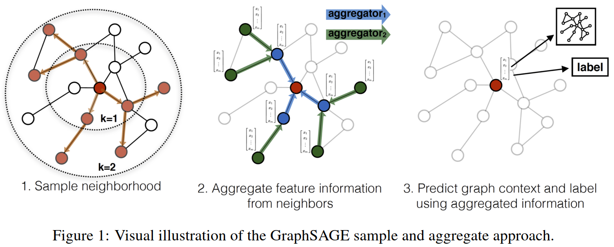
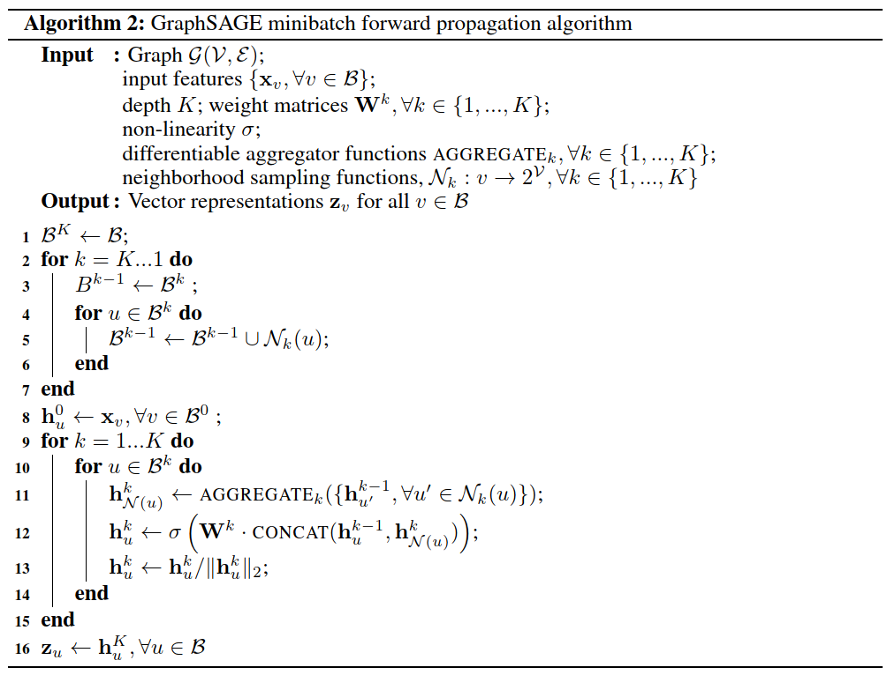
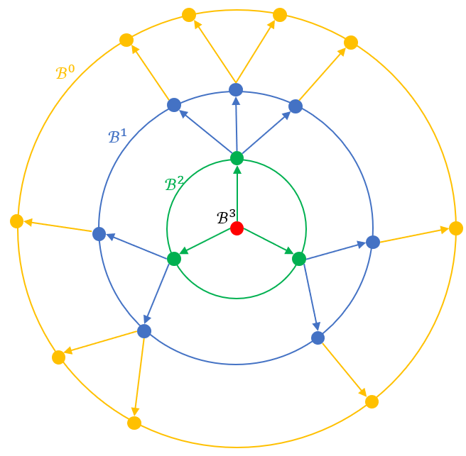
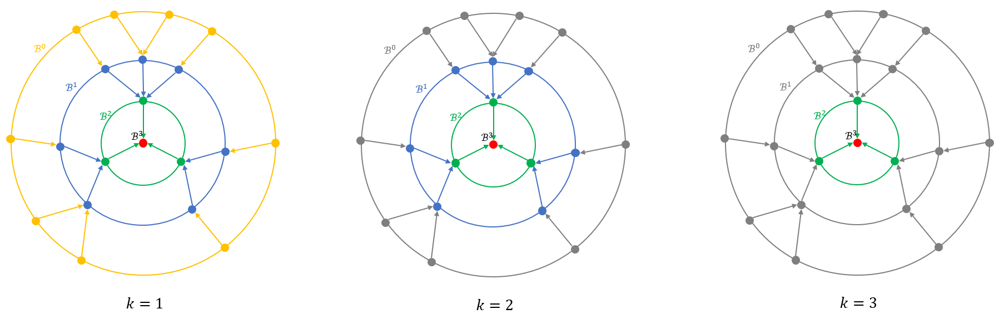
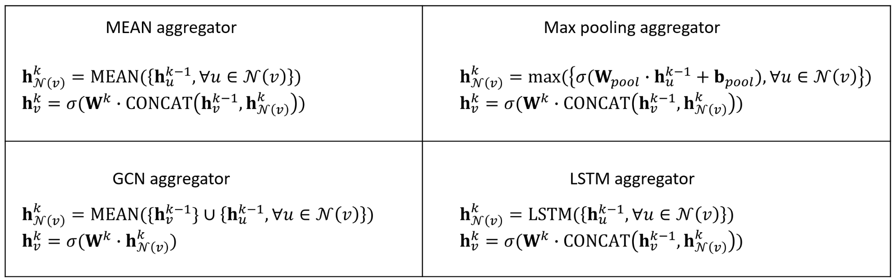
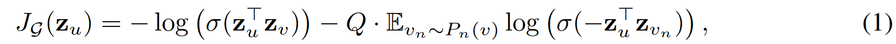
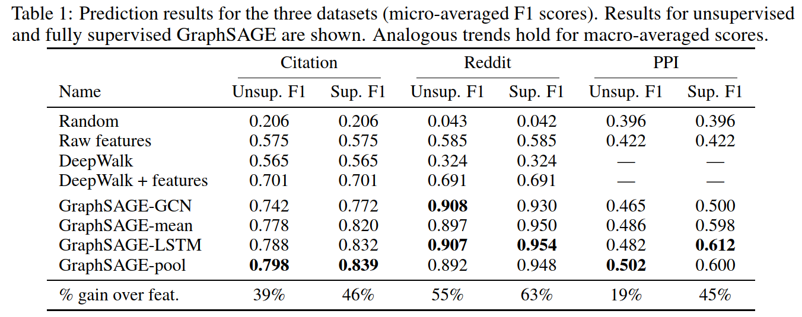

# 摘要

大规模图网络的节点嵌入对很多任务有很重要的作用，比如在推荐系统领域、蛋白质网络研究领域等。然而，目前大多数节点嵌入方法要求所有节点都在训练集中，且难以泛化到未见过的新节点上，这些方法称为直推式（transductive）方法。本文提出了一个归纳式（inductive）的节点嵌入方法GraphSAGE，它利用节点属性**生成**未见过节点的embedding。GraphSAGE并不直接训练节点embedding本身，而是训练生成embedding的函数，这个函数通过采样并聚合节点邻居的特征来生成自身节点的embedding。在三个数据集上的实验结果表明，GraphSAGE的性能显著强于其他方法。

# 简介

Graph embedding很重要，然而大多数工作只能在一个固定的图上学习节点embedding，无法泛化到训练期间未见过的节点上，是直推式（transductive）方法。

但是，现实世界中的图网络往往是动态变化的，比如社交网络、用户和商品的交互网络、蛋白质相互作用网络等。归纳式（inductive）的方法训练完之后，可以泛化到未见过的节点上，甚至泛化到未见过的图上，比如在蛋白质相互作用研究中，使用某个器官的蛋白质网络训练的模型，可以泛化到另一个器官的蛋白质网络中，只要这两个网络中的蛋白质的属性有相同的格式。

本文的GraphSAGE就是一种归纳式（inductive）的方法，它的特点如下：
- 利用节点的属性特征（node features）生成节点的embedding，所以学习的是embedding生成函数，而不是embedding本身
- 因此，只要未见过节点的属性值域与训练集中的属性值域相同，就可以将embedding生成函数泛化到未见过的节点上，从而生成未见过节点的embedding
- GraphSAGE在生成embedding时，聚合了邻居的属性信息，所以既学到了邻居的拓扑结构，又学到了邻居的属性分布，一举两得
- 虽然GraphSAGE主要针对属性图，但由于它仍然利用了结构信息，所以也适用于无属性的图
- GraphSAGE既可以用在有监督任务中，也可以用在无监督任务中

# 方法

GraphSAGE的全称是Graph SAmple and aggreGatE，所以其核心步骤就两步，采样（sample）与聚合（aggregate）。

如下图Fig1所示，先形象地理解一下GraphSAGE的过程。例如为了得到图中红色节点（目标节点target node）的embedding，第1步采样时，k=1采样的是其1-hop邻居；第2步采样时，k=2采样的是其2-hop的邻居。采样的过程是从由内到外进行的。

采样完成之后，开始聚合，聚合的过程是从外到内聚合的，即先聚合2-hop邻居到1-hop邻居上，再聚合1-hop邻居到目标节点上。由此我们得到的目标节点的embedding。

最后参数优化与损失函数有关，利用节点embedding，可以构造有监督或者无监督的loss，然后梯度下降进行优化。

接下来我们来详细看一下其伪代码，正文Algorithm 1给出了所有节点的前向过程，但是当图很大的时候，往往采用mini-batch的方式，我们直接看mini-batch的前向算法吧，如上图Algorithm 2所示。

大的流程仍然是采样与聚合，其中第1\~7行为采样过程，第8\~16行为聚合过程。

## 采样

以下图为例，假设网络层数\(K=3\)，当前batch中只有红色节点。初始的时候令\(B^3\)只包含红色节点；采样的时候是从\(B^3\)到\(B^0\)进行的。\(B^2\)采样的是\(B^3\)的1-hop邻居，同时加上\(B^3\)本身，所以\(B^2\)包括图中的绿色+红色节点。类似的，\(B^1\)采样的是\(B^2\)的1-hop邻居，同时加上\(B^2\)本身，所以\(B^1\)包括图中的蓝色+绿色+红色节点。类似的，\(B^0\)包括图中的黄色+蓝色+绿色+红色节点。

其实在采样的时候，每个节点都只采样它自己的1-hop邻居，但是由于存在第5行求并集的操作，所以对于初始的红色节点来说，最终采样到的\(B^0\)包含了其最多\(K=3\)-hop的邻居。

另外一个值得提醒的是，采样的过程是从\(B^3\)到\(B^0\)降序进行的，主要是为方便后续聚合的时候从从\(B^0\)到\(B^3\)进行。

采样的目的有两个：
- 不同节点的邻居数目相差很大，如果不进行采样的话，热门节点的数目会非常多，导致训练有偏，而且不同batch的样本量大小也相差很大，不方便预估每个batch的训练时间
- 采样之后，每个batch训练时只跟当前采样的\(B^0\)里面的节点有关，网络参数更新时也只需要更新与\(B^0\)相关的参数，而不需要更新所有参数，可以大幅缩减训练时间

## 聚合

聚合操作就是聚合邻居的embedding，来更新自身的embedding。聚合与采样类似，也是分层进行的，只不过方向和采样相反。比如\(K=3\)时，需要聚合3层，每层又需要聚合多次。下图展示了\(k=1,2,3\)时的聚合情况。

以\(k=1\)为例，此时，所有在\(B^1\)里的节点都是目标节点，都需要聚合邻居的信息，包括如下聚合过程：
1. 黄色节点→蓝色节点
1. 蓝色节点→绿色节点
1. 绿色节点→红色节点

上面→表示聚合方向。注意所有→左边的embedding都是\(h^{k-1=0}\)的embedding，即上一个循环时的embedding。比如第2步用的蓝色节点并不是第1步聚合得到的蓝色节点，而是上一个循环得到的蓝色节点（上一个循环为初始\(h^0\)）。所以，上述三次聚合互不影响，可以并行进行。

当所有节点聚合完成之后，→右边的embedding变成了\(h^{k=1}\)的embedding，作为下一层\(k=2\)时的左边embedding。

如上图所示，当\(k=2\)时，最外层的黄色节点已经不参与计算了，此时包括如下聚合过程：
1. 蓝色节点→绿色节点
1. 绿色节点→红色节点

虽然绿色节点还是只聚合其直接邻居蓝色节点，但是由于蓝色节点在上一轮中聚合了黄色节点，所以绿色节点在这一轮中能够通过蓝色节点间接聚合到黄色节点，即绿色节点聚合到了其2-hop邻居。类似的，红色节点也聚合到了其2-hop邻居即蓝色节点。

当\(k=3\)时，蓝色节点也已经不参与计算了，此时包括如下聚合过程：
1. 绿色节点→红色节点

根据上面的分析，红色节点能间接聚合到其3-hop邻居，即最远聚合到黄色节点的信息。

三层聚合结束之后，最终我们得到了红色节点的embedding。可以看到，为了得到红色这一个节点的embedding，如果网络层数为3的话，其最终聚合了三层节点的信息。在GraphSAGE中需要设置采样参数，例如fanouts=[20,10,5]，就表示第一层每个节点采样20个邻居，第二层每个节点采样10个邻居，第三层每个节点采样5个邻居。这样每个节点最终聚合了20\*10\*5=1000个邻居节点的信息。可见，邻居聚合的威力很大，只需要少数几层就可以聚合大量邻居节点。GraphSAGE文中说只需要两层，fanouts=[25,10]就取得了很好的效果。

## 聚合函数

上述操作只是把红色节点的邻居聚合到一起了，相当于收集到了红色节点的邻居，怎样根据邻居embedding来生成自身节点的embedding呢，这就需要聚合函数来完成了。

有关聚合函数的描述，我觉得原文有点描述不清楚，我这里总结一下，可分为四种聚合函数，如下图所示：

所有聚合函数都有两步，第一步是聚合邻居信息，第二步是进行非线性激活，差别在于邻居的定义，以及聚合操作。

Mean aggregator是最简单的聚合操作，即把邻居（不包含v本身）求均值，然后和自身concat起来，最后非线性激活。

GCN aggregator和mean aggregator非常像，它们的区别是，GCN aggregator在聚合邻居的时候，也聚合了它本身，即GCN认为v也是v的邻居之一（相当于有自回路）。但是它在非线性激活的时候，没有和自身上一个状态concat，而这个caoncat操作类似ResNet中的短路原则，可以避免长距离信息丢失的问题。因此，GCN aggregator的网络不能太深，而且往往效果不如Mean aggregator。

Pooling aggregator对所有邻居先过一个MLP（公式中的\(W_{pool}\)和\(b_{pool}\)），然后进行element-wise的max pooling，接着把pooling结果和自身concat，最后非线性激活。作者测试发现这里使用max pooling和mean pooling的效果相当。

LSTM aggregator是一个比较奇怪的聚合方式，前面几种聚合方式都对邻居的顺序不敏感，但LSTM是序列模型，它天然对顺序敏感，但作者发现，对邻居进行随机排序，然后输入给LSTM，仍然能取得很好的效果。。。

这里很容易想到的改进是，使用attention聚合邻居，也就是GAT。

## 目标函数

通过上面的采样与聚合操作，可以得到任意一个节点的embedding，如何进行反向传播更新网络参数呢？需要一个目标函数。

事实上，得到节点embedding之后，后续可以接很多任务，比如如果是有监督任务，则可以接分类或者回归损失；如果是无监督任务，可以自行设计自监督任务。

Graph embedding常用于无监督或自监督任务上，在这种情况下，通常有三类节点：target nodes、positive nodes（context nodes）、negative nodes。其中target node是目标节点，positive node是target node的临近节点，而negative nodes是全局采样的节点。

根据常识，距离越近的节点，它们的embedding表示向量也越接近，所以优化目标是使target node和positive node越接近越好，使target node和negative node越远离越好。目标函数如下：

其中\(u\)为目标节点，\(v\)为正样本，\(v_n\)为负样本，负样本通过某种策略采样得到。

注意，任何节点都可能成为：target nodes、positive nodes、negative nodes中的任意一种身份。

# 实验

作者在三个数据集上进行了对比实验，包括WOS的citation网络、Reddit评论网络、PPI网络。其中前两个数据集测试GraphSAGE泛化到未见过节点上的能力，最后一个数据集测试GraphSAGE泛化到没见过的网络上的能力。

结果如上图所示，主要结论如下：
- DeepWalk加节点特征之后，性能相比只用网络结构（DeepWalk）或只用节点特征（Raw features）都提升显著，说明在图任务中，网络结构和节点属性都很重要
- 大多数情况下，GraphSAGE-mean比GraphSAGE-GCN性能好，如前所述，GraphSAGE-mean比GraphSAGE-GCN多了concat操作（ResNet）
- GraphSAGE-LSTM虽然是对邻居随机排序，但效果居然意外的好

# 总结

GraphSAGE是GNN领域非常经典的文章，现在看来感觉所有想法都很自然啊，图不就应该聚合邻居来更新自身吗，但当时想出这个方法可能还是有其历史难度。

另外，文中提到GraphSAGE受到Weisfeiler-Lehman Isomorphism Test方法的启示，是的，大家可以看看[作者在CS224W上有关Weisfeiler-Lehman Isomorphism Test的介绍](https://zhuanlan.zhihu.com/p/518350047)，GraphSAGE和WL test的思想几乎是一样的，只不过把其中的hash函数换成了可以训练的聚合函数。

最后，论文居然受到了华为的资助，神奇。

---
附录：有关几个聚合函数的实现，可以参考京东伽利略的开源实现：[https://github.com/JDGalileo/galileo/blob/main/galileo/framework/tf/python/layers/aggregators.py](https://github.com/JDGalileo/galileo/blob/main/galileo/framework/tf/python/layers/aggregators.py)