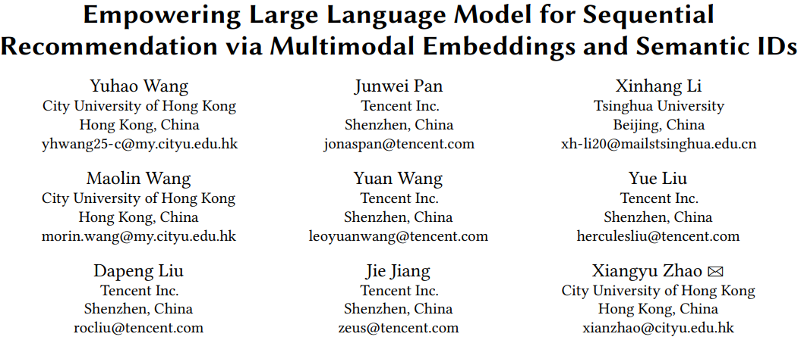
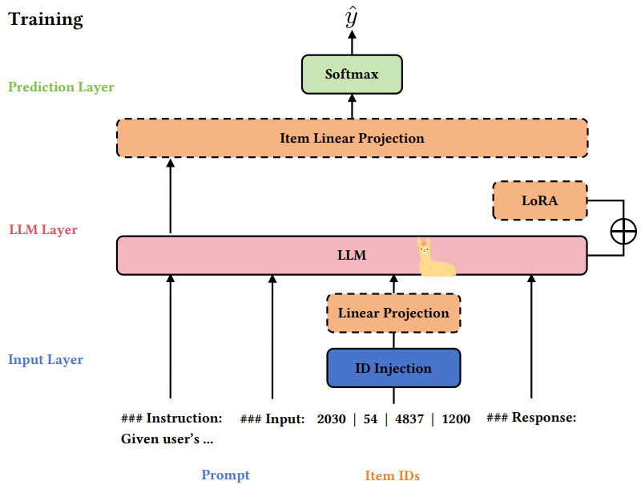
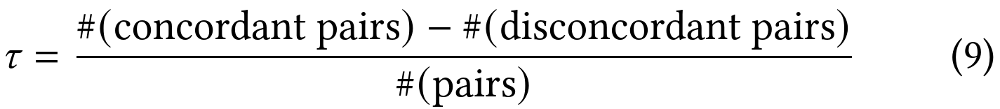
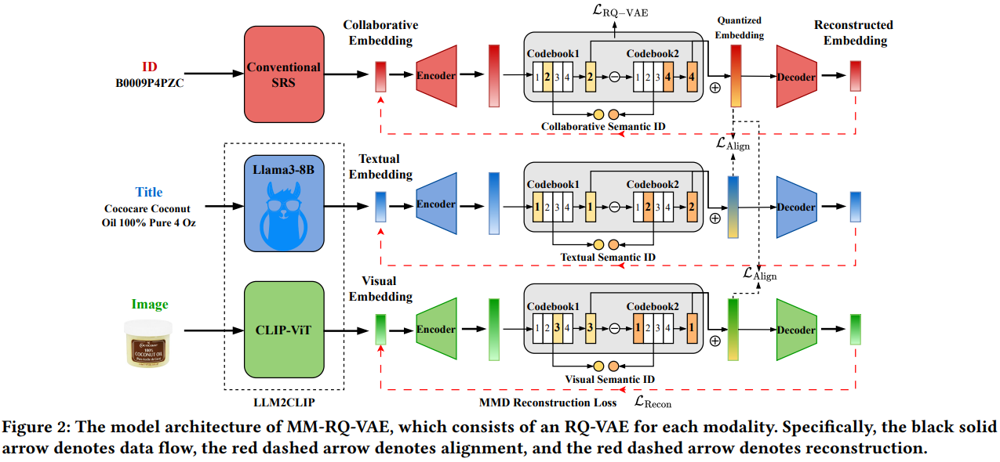
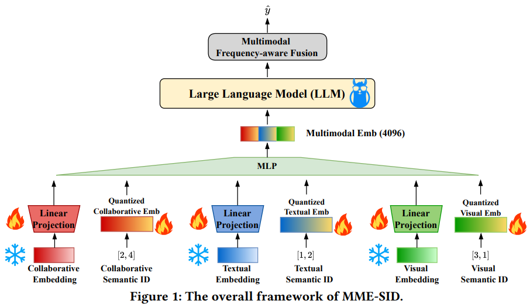
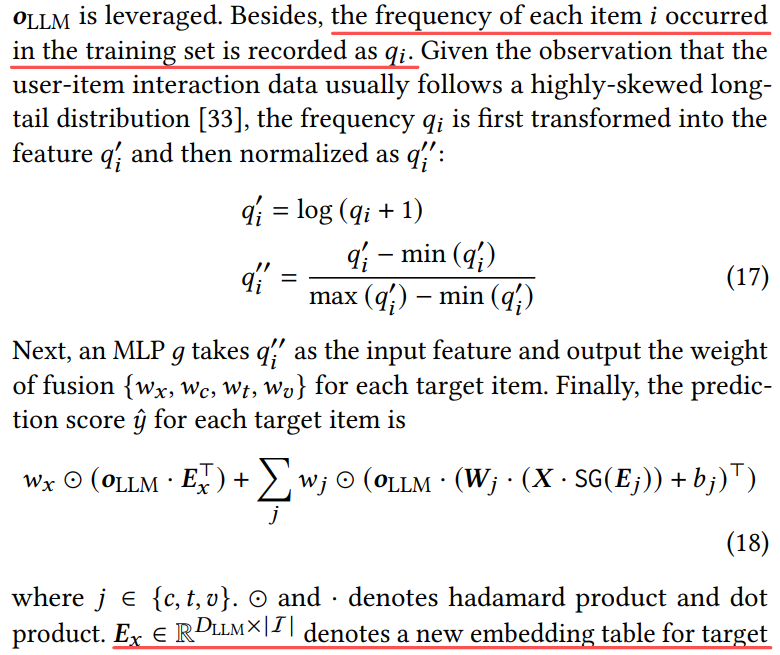

# 基本信息

* 论文标题：Empowering Large Language Model for Sequential Recommendation via Multimodal Embeddings and Semantic IDs
* 作者单位：香港城市大学&腾讯
* 论文链接：[https://arxiv.org/pdf/2509.02017](https://arxiv.org/pdf/2509.02017)
* 来源：CIKM 2025

# Motivation：论文要解决的问题是什么

LLM4SR的基本范式如下，即用LLM直接来做搜推的范式（这种方式在学术界常见，但在工业界不常见）。由于LLM的输入词表范围是有限的（通常比较小），因此其token emb dim通常比较大，比如2048或者4096；而搜推场景的item量级很大，而且在不断更新，因此工业界经典的id-based的搜推模型的item emb dim通常比较小，比如64或128。经典的id-based的搜推模型能比较好地学习到搜推场景的协同信号，为了让LLM模型也能感知这种信息，LLM4SR范式通常会先预训练一个id-based的经典搜推模型，然后将其中的item id emb通过下图的Linear Projection的映射层，映射到LLM token emb的空间，让LLM也能感知搜推的协同信号。

上述LLM4SR范式存在两个问题：

* **维度坍缩**：id-based训出来的id emb dim比较小（如64），LLM token emb dim比较大（如4096），在由id emb通过Linear Projection映射到toen emb的过程中，虽然64映射到4096空间了，但扩维后的矩阵存在低秩问题，即还是只利用了4096中的64维的空间。
    * 论文中，作者分两种情况进行了分析，如果Linear Projection只是一个线性层的话，通过公式推导能得出上述结论；如果Linear Projection包含非线性变换，作者通过实验分析也发现了维度坍缩的现象。

* **灾难遗忘**：除了使用id-based模型产出的id emb，LLM4SR也常用多模态模型产出item emb表征，然后转换成semantic id输入到LLM4SR中。在这种情况下，产出的semantic id通过会遗忘多模态item emb的信息，导致下游LLM4SR的效果不佳。
    * 论文中，作者用公式9来衡量semantic id保留pretrain多模态emb的信息量。具体来说，如果行为流中的商品序列是{A,B,C,D}，target item是E。使用pretrain多模态emb能计算出E和A\~D的相似度，例如相似度<E,A> > <E,B>。如果将pretrain多模态emb转换成semantic id，然后由semantic id恢复出新的A\~E的emb之后，再计算E和A\~D的相似度，如果仍然有<E,A> > <E,B>，则认为一致（concordant），否则不一致（disconcordant）。这个分析方法挺好的，通过这个指标能估算出转换成semantic id之后，仍然保留原有pretrain多模态emb对搜推场景的**序**关系的保留程度。
    * 作者发现，转换成semantic id之后，信息只保留了37.14%；进一步，如果semantic id是在下游任务中端到端训练的，则信息只保留了5.5%，也就是说94.5%的pretrain emb的序的信息都丢掉了，也就是灾难遗忘。

# Semantic id构建方法
* 3套emb来源，一套id-based经典搜推模型产出的包含协同信号的emb，另外两套是LLM2CLIP产出的多模态文本和图片emb。作者提到传统CLIP对长文本处理能力较弱，所以升级到LLM2CLIP，能更好地处理长文本。
* Semantic id构建方法是经典的RQ-VAE的方法，但有如下两个改进点：
* 将emb的重构loss由MSE升级成MMD (maximum mean discrepancy)，MSE是计算原始emb和重构emb的欧式距离的误差，而MMD是计算两个分布的diff，实验表明能MMD比MSE能保留更多的pretrain多模态emb信息（即上述公式9），保留44.36%
* 对量化后的emb做了对齐，因为LLM2CLIP本身进行了图文模态的对齐，所以文中只新增了id emb分别和文本、图片模态的对齐
* 此外，还有一点论文没提但可能和常规RQ-VAE不同之处，就是原始emb在进行RQ-VAE之前，有一个Encoder升维的操作，在重构loss前对应有一个Decoder降维的操作，而semantic id量化恢复emb是Decoder之前的那个。这一升一降，估计也有助于缓解维度坍缩。

# 主模型

* 为了缓解维度坍缩，使用3套emb，一套id-based协同信号emb，另外两套是文本和图片的多模态emb
* 每套emb既包含原始emb过Linear Projection投影之后的表征（低维投影到高维，存在维度坍缩问题）；也包含由原始emb训练产出的semantic id重构回来的emb（天然高维emb）
* 为了避免灾难遗忘，semantic id使用上述优化的MMD loss训练产出，并且semantic id emb使用在训练semantic id emb产出的codebook emb进行初始化，然后随着LLM4SR finetuning，而不是完全随机初始化然后端到端训练
* 最后在LLM4SR输出层，有一个Multimodal Frequency-aware Fusion模块，next token prediction任务相当于一个n分类任务。在这个模块中，对target item也会新增一套emb talbe，这样总共就有4套emb table了。然后词表中每个item会根据热度过一个函数得到四种模态的emb的权重，然后4个emb进行融合。通过这种方式也能一定程度上缓解维度坍缩。

# 评论

* 可借鉴
    * 论文的分析方法值得借鉴，例如对维度坍缩的推理分析、灾难遗忘的量化分析等
    * semantic id训练时的MMD loss缓解灾难遗忘
    * semantic id emb在下游应用时，使用训练的codebook emb进行初始化，而不是随机初始化，能缓解灾难遗忘
    * 使用多套emb及semantic id，缓解维度坍缩
    * 融合多套emb时，考虑item热度信息，动态调整融合权重
* 可改进
    * LLM4SR主要用于学术场景，没有考虑工业场景item id数据量巨大，而且不断更新的情况，因此在工业场景不常见
    * 即使用上MMD loss，pretrain emb信息页只保留了44.36%，如果目标是100%的话，这个绝对差距还很大
    * 没有论证semantic id emb遗忘pretrain emb信息对下游任务的影响，虽然遗忘信息了，但端到端训练也学到新知识了，功过相抵，也许效果不一定差？
    * semantic id通常通过两阶段训练得到，先预训练emb，然后训练semantic id，两阶段过程天然容易使semantic id遗忘预训练emb的信息，如果将两者合并成一阶段的，即把训练semantic id的网络模块加入到预训练emb的网络中，在预训练emb的过程中，就完成semantic id的训练，那么semantic id遗忘的信息会不会更少？类似的思想在召回双塔模型Poeem（[https://arxiv.org/abs/2105.03933](https://arxiv.org/abs/2105.03933)）中就有过。