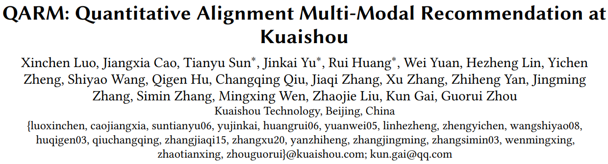
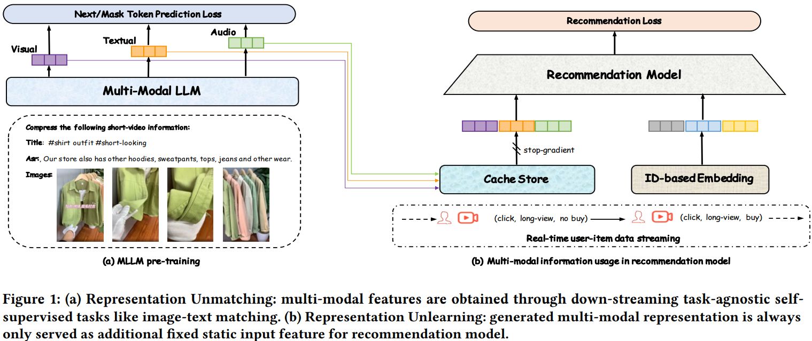
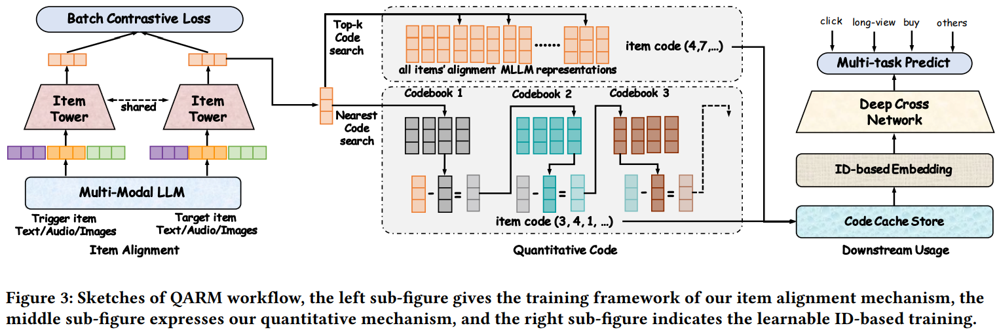

# 基本信息
* 论文标题：QARM: Quantitative Alignment Multi-Modal Recommendation at Kuaishou
* 作者单位：快手
* 论文链接：[https://arxiv.org/pdf/2411.11739](https://arxiv.org/pdf/2411.11739)
* 来源：CIKM 2025

# Motivation：论文要解决的问题是什么

多模态emb在搜推场景应用时通常采用如下图的两阶段方式，先预训练多模态emb，然后作为一个冻结特征放到搜推模型中。这种方式存在2个问题：
* **表征不对齐**：多模态emb预训练的任务通常是图片分类或者文本的MLM，和下游搜推任务不对齐
* **表征不更新**：多模态emb在搜推任务中作为冻结特征，没有更新

本文的方法就是想要解决上述2个问题。

# 对齐搜推任务的多模态emb预训练

为了解决多模态emb表征不对齐的问题，本文提出的多模态emb预训练任务直接对齐搜推场景，使用U2I和I2I召回模型，挖掘出相似item pair，然后通过对比学习微调多模态大模型。

具体来说，通过U2I和I2I模型，能够拿到item emb；然后用每一个target item emb去行为流中检索出最相似的商品，作为trigger item emb。<trigger, target>构成一对正样本，然后进行对比学习训练。

通过召回模型构造的训练样本，和搜推场景的协同信号对齐了，解决了开头提到的第一个问题，即表征不对齐的问题。

# Semantic id生产方法

Semantic id的生产方法如上图右半部分所示，有两种方式：

* **VQ**：直接圈定一定数量（如N）的item emb作为底池，编号1\~N，然后任意来一个item emb，通过对底池emb进行KNN搜索，找出top-k相似商品，假设是(a,b,...,k)，则VQ编码的semantic id就是(a,b,...,k)。文中取k=25，感觉挺大的。。。
* **RQ-Kmeans**：对圈定的N个item emb不断进行Kmeans聚类、求残差、残差继续Kmeans聚类的过程。文中取迭代次数为L=6，但是没说每次聚到多少个类。

注意：文中的RQ-Kmeans方法和RQ-VAE还不一样，RQ-Kmeans没有训练过程，也没有重构loss，纯粹是每次进行聚类，然后选聚类中心作为码本的过程。文中也没有对比过为啥不用RQ-VAE。

产出两套semantic id之后，直接在下游排序任务中进行端到端更新，解决开头提到的表征不更新的问题。具体建模方法比较常规，不是本文的重点，略讲。

# 评论

* 可借鉴
    * 多模态emb预训练任务是i2i的，直接和下游搜推任务对齐
    * semantic id有两种产出方式，VQ和RQ-Kmeans，尽可能多地保留原始多模态emb的信息
* 可改进
    * 多模态emb预训练和下游任务对齐，在2025年不算新鲜事了，常规操作。而且文中i2i的构造过程依赖U2I和I2I召回模型，有外部依赖，不够漂亮
    * VQ的方法，k=25这也太长了吧，相当于一个小型行为流了，会导致下游任务的特征处理更复杂
    * 为什么用RQ-Kmeans而不是RQ-VAE，没有任何说明与对比
    * 从pretrain emb量化成semantic id的过程中，存在严重的信息丢失，这在[Empowering Large Language Model for Sequential Recommendation via Multimodal Embeddings and Semantic IDs](https://bitjoy.net/posts/2025-10-04-mme-sid-paper-reading/)论文中有讨论