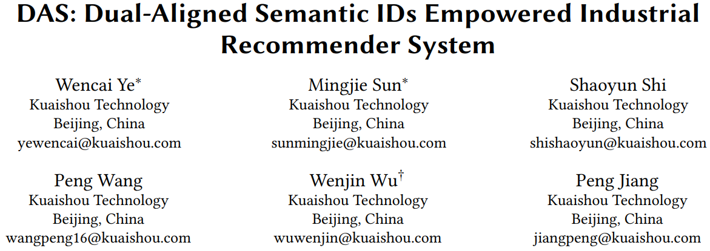
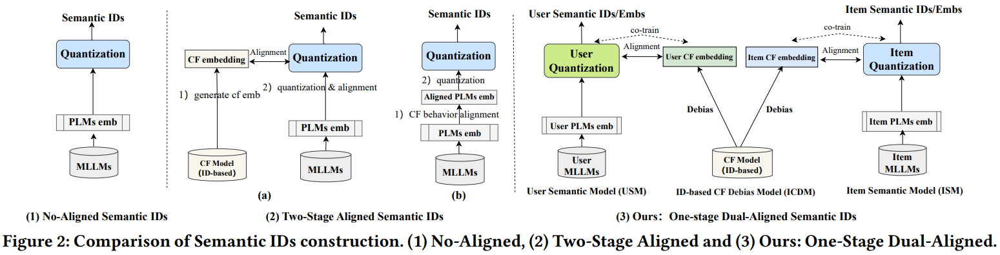
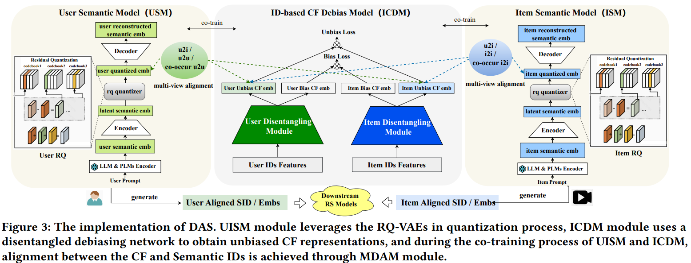

# 基本信息

* 论文标题：DAS: Dual-Aligned Semantic IDs Empowered Industrial Recommender System
* 作者单位：快手
* 论文链接：[https://arxiv.org/pdf/2508.10584](https://arxiv.org/pdf/2508.10584)
* 来源：CIKM 2025

# Motivation：论文要解决的问题是什么

Semantic id生产时，要么没有和协同信号对齐（fig2(1)），要么是两阶段对齐方式（fig2(2)）：
* 例如[LETTER](https://arxiv.org/abs/2405.07314)先生成协同emb，然后和semantic id对齐
* 或者例如[QARM](https://arxiv.org/pdf/2411.11739)，先协同对齐emb，再生产semantic id

把协同对齐和生产semantic id分成两个阶段，天然有信息损失，不是最优的。本文的目的就是把生产协同emb，以及semantic id的协同对齐放到一个模型中联合训练完成，尽量减少信息损失（fig2(3)）。

# 主模型

主模型如上图所示，中间的ICDM是user和item的双塔模型，用于学习user和item的协同id-based emb；两边分别是生产user和item的semantic id的量化模型。

中间的ICDM就是经典的召回双塔模型，使用点击样本进行训练，唯一不同的是，在user和item塔都有流行度去偏模块，用于学习user和item的无偏emb，后续user和item的semantic id协同对齐用的也是无偏的emb。

两边分别是user和item的semantic id量化模型，两者比较类似，以item为例：
1. 先把item的各种信息，如title、desc、ocr等信息用文本构造成prompt，输入到LLM，借助LLM的summary和reasoning能力，产出item的详细描述
2. 然后把LLM产出的描述再输入到一个预训练的embedding模型PLM，文中用的是bge m3模型，得到item emb
3. 后续就是标准的RQ-VAE过程了

需要注意的是，上述前两步，分别用到了LLM和PLM两个大模型，而且看图上这两个模型都是freeze的，也就是说并不微调这两个大模型。后续协同对齐用的emb是RQ-VAE重构emb的中间层结果，即图中的item quantized emb。

semantic id的协同对齐方面，有三大类对齐任务：
* U2I对齐：量化user emb和协同item emb对齐、量化item emb和协同user emb对齐
* U2U和I2I对齐：量化user emb和协同user emb对齐、量化item emb和协同item emb对齐
* U2U和I2I的共现对齐：点击相同item的两个量化user emb对齐、同一个user点击的两个item的量化item emb对齐

由于fig3中的协同模型和semantic id模型是联合训练的，总共有3大类loss：
* 中间的ICDM的双塔召回模型的loss
* 两边的产semantic id的loss
* 三个模块的对齐loss

# 评论
* 可借鉴
    * 把semantic id的生产和协同信号对齐统一成一阶段的模式，信息损失更少
    * 中间的ICDM模型生产协同emb时进行了去偏，协同对齐的时候用的是去偏的emb，这是其他论文很少提到的
* 可改进
    * 太复杂了！3个模块，3大类loss，每类loss又有很多个小loss，总loss数量加起来有十多个。。。
    * 任务太多，各种去偏、对齐loss，真的不会互相影响吗？
    * 中间的ICDM模块有必要吗？我理解ICDM本质是为了训练产出协同emb，但是因为训练样本本身是点击样本，样本本身已经包含了搜推场景的协同信号，也就是ICDM本身没必要存在了，直接用相同的样本训练两边的semantic id量化模型就行了，也能实现在训练semantic id的过程中，完成协同信号的对齐
    * 生产semantic id的emb来自LLM和PLM，但是这两个大模型都是freeze的，如果把这两个模型也sft，效果会不会更好？其实我原本以为的一阶段就是这样的，这也是我在[【论文阅读：Empowering Large Language Model for Sequential Recommendation via Multimodal Embeddings and Semantic IDs】](https://bitjoy.net/posts/2025-10-04-mme-sid-paper-reading/)中提到的一阶段方法。
