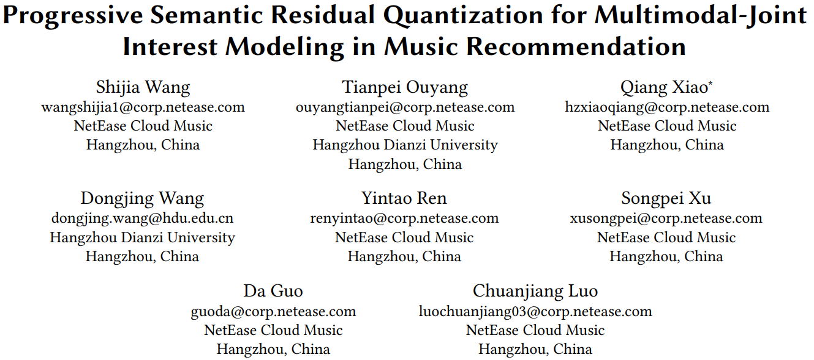
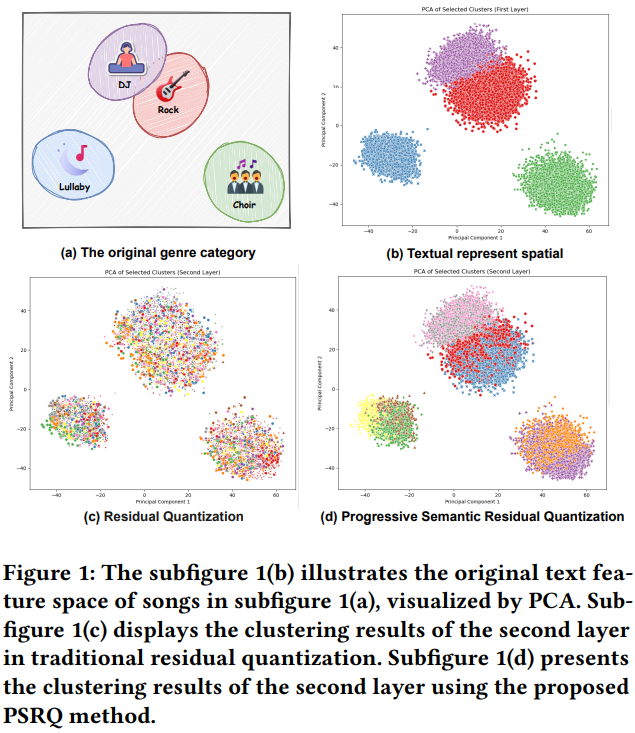
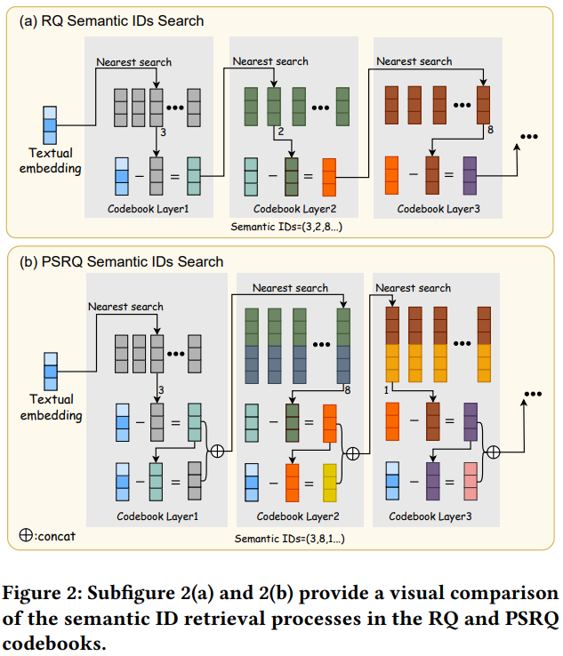
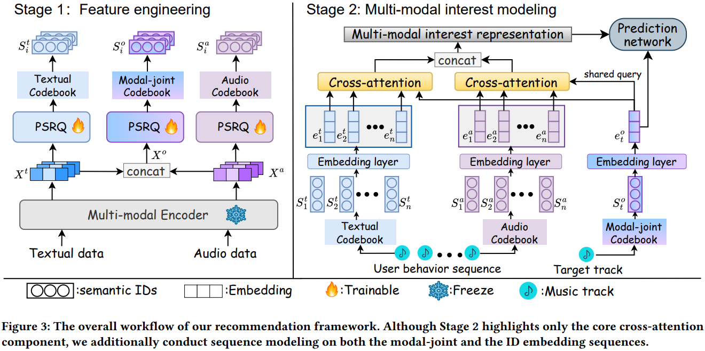

# 基本信息

* 论文标题：Progressive Semantic Residual Quantization for Multimodal-Joint Interest Modeling in Music Recommendation
* 作者单位：网易云音乐
* 论文链接：[https://arxiv.org/pdf/2508.20359](https://arxiv.org/pdf/2508.20359)
* 来源：CIKM 2025

# Motivation：论文要解决的问题是什么

多模态emb在搜推的应用方式，通常是先将多模态emb转换成semantic id，然后把semantic id用到搜推模型中，这种方式有如下两个问题：

* **模态内语义退化**：多模态emb转换成semantic id通常使用RQ-VAE或者RQ-KMeans的方法，这种方法在不断残差的过程中，后续残差聚类结果已经不能反映初始emb的聚类效果了。其实就是semantic id的沙漏问题，具体可以看[这篇文章](https://arxiv.org/abs/2407.21488)，后续有空再分享这个问题。
    * 简单来说，如下图所示，初始有DJ、Rock、Lullaby、Choir四个类，但是对残差emb（即RQ-VAE的第二层）聚类的话，初始的四个类的item就打散了，会聚到不同的簇中，也就是RQ-VAE的后续层的聚类效果已经和初始emb的聚类效果很不一样了，这就是文中说的语义退化问题
* **模态间建模差异**：搜推场景的item通常有多种模态特征，比如文本、图像、音频等，传统方法在多模态融合方面比较简单，不能很好地捕捉多模态之间的关系。

# PSRQ生产semantic id

本文是音乐推荐场景，主要用到两种模态：text和audio，分别用百川和MERT提取text和audio的模态emb。

生产semantic id的方法如下图所示：
* fig2a是传统的RQ-KMeans的方法，每一层都用上一层的残差进行聚类。如上文所述，由于沙漏问题，会导致后续层次的semantic id存在语义退化问题
* fig2b是本文新提出的PSRQ量化方法，在RQ-KMeans基础上，每一层除了有上一层的残差向量，还会concat上初始emb减去残差emb后的向量。**这样就能区分出残差相似，但初始emb不同的item了**，也就避免了RQ方法的沙漏问题，后续semantic id也能保留初始emb的语义信息。fig1d能看出来第二层semantic id仍然能够反映初始emb的分类效果。

# Semantic id在下游的应用方法

如下图所示：
* 每个item有两套多模态emb：text和audio，但是有三套semantic id，除了text和audio各自产一套semantic id之外，还会把text和audio的emb concat起来，再产一套semantic id，相当于多模态融合的semantic id
* semantic id的emb在排序模型中随机初始化，然后端到端训练
* semantic id在用户建模时，使用DIN模型，query用的是多模态融合的semantic id emb，行为流分别用text和audio的semantic id emb。作者说这种方法既能捕捉到单模态细粒度的信息，又能建模跨模态的交互信息

# 评论

* 可借鉴
    * PSRQ的semantic id生产方法确实很有意思，在每一层都用上原始emb，这样不同簇的item在每一层都能分开，不会出现沙漏问题，使得每一层的semantic id都能保留原始emb的语义聚类信息
    * 产了多套semantic id，单模态semantic id是常规操作；多模态emb concat后也产一套semantic id，是个创新点
    * 用户建模时query用多模态semantic id，行为流用单模态semantic id，也是个创新点，虽然论文说这种方法效果最好，但是有点存疑
    * 论文有个实验结果对比了不同semantic id量化方法的效果，结论是：PSRQ > RQ-KMeans = RQ-VAE > VQ > PQ
* 可改进
    * pretrain emb和semantic id的生产都没有对齐协同信号
    * semantic id在下游应用时直接端到端训练，而没有使用codebook初始化，会不会丢失信息比较多？
    * 产semantic id的过程中，模态内语义退化的问题，描述了现象，但是没有用定量的指标来说明问题，感觉可以借鉴[【论文阅读：Empowering Large Language Model for Sequential Recommendation via Multimodal Embeddings and Semantic IDs】](https://bitjoy.net/posts/2025-10-04-mme-sid-paper-reading/)的方法，定量说明后续层的semantic id的聚类效果或者说区分能力相比初始emb已经相差甚远了
    * fig2b中，第一层的codebook的dim=d，后续层的codebook的dim=2d，那么后续层的残差dim也是2d，那么初始emb怎么和后续的残差emb相减呢，维度对不上啊？我理解可能是这样的，后续层聚类的时候用的是concat的dim=2d的emb，但是算聚类中心的时候只用了残差本身的emb，这样就能解释得通了，但是文中对这部分的细节没有解释。