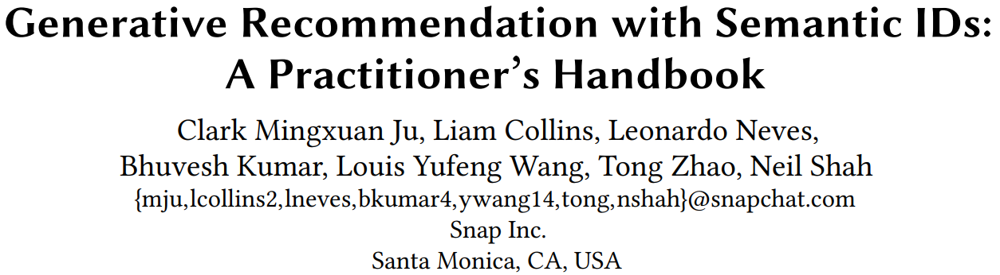
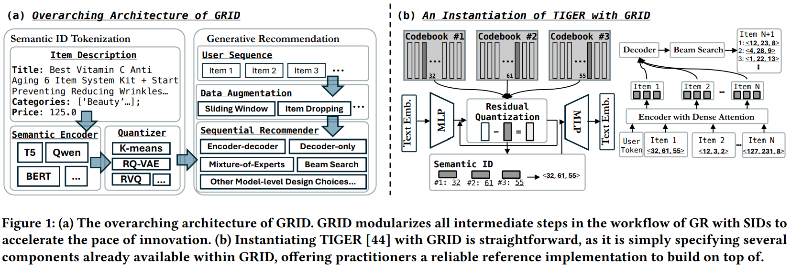

# 基本信息

* 论文标题：Generative Recommendation with Semantic IDs: A Practitioner’s Handbook
* 作者单位：Snap
* 论文链接：[https://arxiv.org/pdf/2507.22224](https://arxiv.org/pdf/2507.22224)
* 来源：CIKM 2025

这是CIKM 2025的一篇resource文章，比较简单。核心内容是开源了一个基于semantic id的生成式推荐框架GRID，可以很方便地做各种消融对比实验。

# 主要内容

主要结论如下：
* 对于semantic id生成算法，简单的RQ-KMeans效果反而是最好的，好于R-VQ和RQ-VAE
* 生产pretrain emb的LLM模型参数量越大，效果越好，但是提升幅度有限
* 生产semantic id的codebook size和网络层数并不是越大越好，常规的3层，每层256个id效果反而最好
* 生成式推荐时，是否需要在用户行为序列基础上增加一个user id，实验发现增加user id效果反而变差，不增加user id效果最好
* 生成式网络结构encoder-decoder对比decoder-only，发现前者效果更好，因为前者能充分学习到行为序列完整的信息
* 对行为流进行滑动窗口数据增强能提升模型的泛化能力
* 当semantic id到item存在映射冲突时，随机选一个item的效果和对冲突item追加一个区分标识（digit），两者效果差不多
* 在生成式beam search的时候，限制只输出合法semantic id和不增加限制，两者效果差不多

# 评论

看这篇文章主要是想看看不同semantic id生产方法的对比，发现RQ-KMeans居然比RQ-VAE更好。个人感觉这两个方法效果应该差不多，后者应该更好点才对。首先，RQ-VAE的量化loss本质上和KMeans聚类是一个意思；其次，RQ-VAE还增加了一个重构loss，感觉产出来的semantic id和原始emb的信息损失应该更少。

此外，本文的所有实验都是基于亚马逊的公开数据集，数据量肯定不能和真正的工业数据集相提并论，所以文中很多结论有可能只适用于本文的设定，换一个场景估计结论就变了，所以看看就好。

最后，文中很多结论只写了现象，要是能增加原因分析就好了。