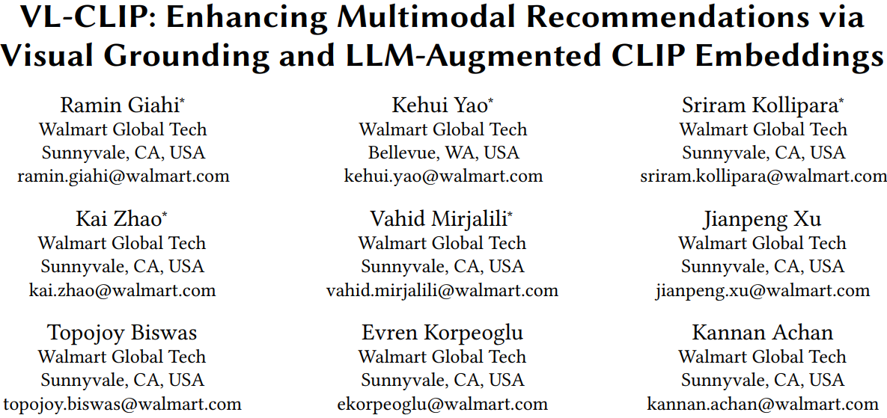
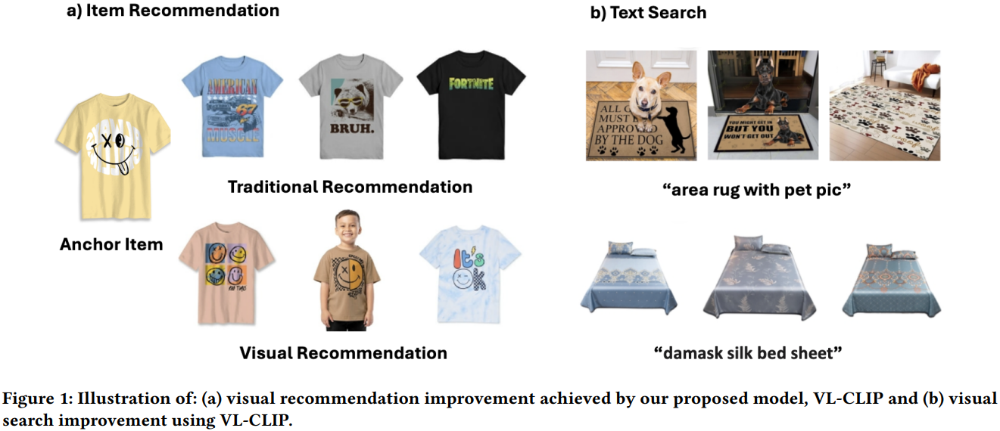
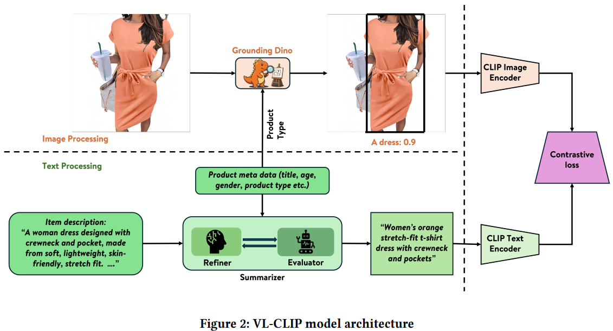
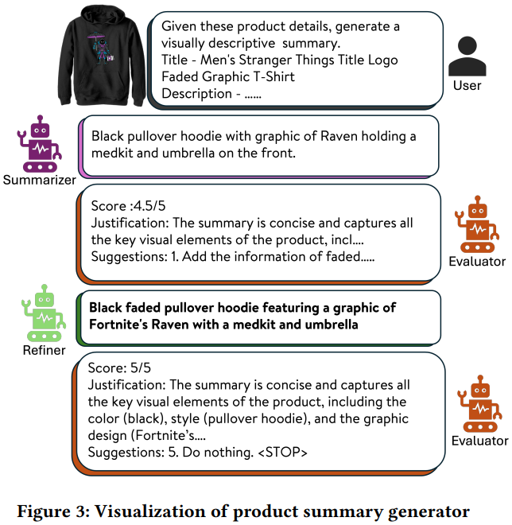

# 基本信息

* 论文标题：VL-CLIP: Enhancing Multimodal Recommendations via Visual Grounding and LLM-Augmented CLIP Embeddings
* 作者单位：沃尔玛
* 论文链接：[https://arxiv.org/pdf/2507.17080](https://arxiv.org/pdf/2507.17080)
* 来源：RecSys 2025

# Motivation：论文要解决的问题是什么

多模态q2i召回通常使用CLIP的对比学习方式进行训练，在电商场景下存在2个问题：
* CLIP这种方式通常是对图片整体的表征，缺乏细粒度的目标检测能力，尤其在电商场景，比如fig1，卖衣服场景，传统CLIP只能识别整张图片是一件T恤，难以关注T恤上的图案等细节特征；另外，电商图片往往存在很多附加背景、道具、模特等元素，会影响主体物体的表征
* 电商标题、属性等文本描述通常参差不齐，存在错误、堆砌、图文不符等问题，导致CLIP训练时图文对齐效果不佳

# VL-CLIP解决方案

针对图片的处理：
* 将图片和商品类型（product type）输入到开源模型[Grounding DINO](https://github.com/IDEA-Research/GroundingDINO)中，让模型进行目标检测，将可信度超过某个阈值且可信度最高的区域抠出来，输入到CLIP的图像encoder中。通过这步预处理，相当于对电商图片进行了关键主体识别和提取，只提取和商品最相关的主体进行图像表征。文中使用的图像编码器是ViT-B/32。

针对文本的处理：
1. 将商品的类型、标题、描述、性别、年龄等文本描述以及图片本身输入到Summarizer多模态大模型，让大模型产出精简、准确的文本描述\(q_0\)
2. 将\(q_0\)和商品图文信息输入到Evaluator多模态大模型，让大模型对\(q_0\)的质量进行评判，如果\(q_0\)质量很好，则直接输出\<STOP\>；否则指出\(q_0\)的问题所在，并说明改进方法
3. 如果第2步输出不是\<STOP\>，则将第2步的输出再输入到Refiner大模型，让大模型根据第2步的结果继续调整并输出更优的文本描述\(q_i\)
4. 不断重复第2、3步，直到输出\<STOP\>，或者最多重复5遍
5. 将产出的精准的文本描述q输入到CLIP的文本encoder中，文中使用的是BERT系列。产出的emb维度是512
6. 上述Summarizer、Evaluator、Refiner都是VLM，文中使用的是GPT-4o，三个任务的prompt设计参考论文附录Table 9

上述对图片和文本的处理本质上是去噪，提取图片的主体物品、让文本描述更加精准。

产出多模态emb之后，后续的操作就是常规的召回流程了，使用HNSW进行ANN召回。

# 评论

* 可借鉴
    * 使用Grounding DINO对图片进行主体识别，值得借鉴
    * 使用VLM对商品标题、描述等文本信息进行去噪，值得借鉴
    * 但如果商品量级很大的话，这两个步骤估计会很耗时
* 可改进
    * 如果是q2i场景，直接用query文本是不是更真实，更接近搜索日子的真实数据分布？