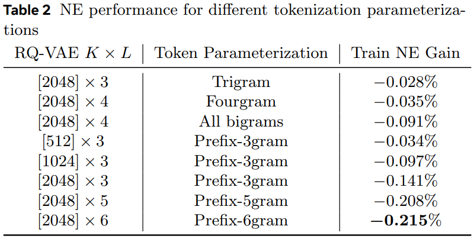
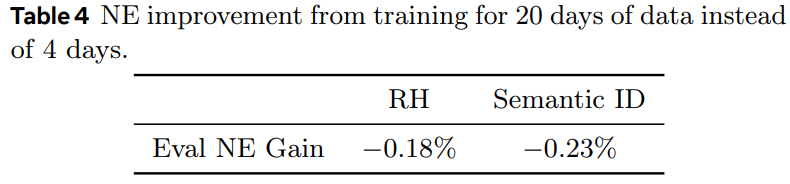

# 基本信息

* 论文标题：Enhancing Embedding Representation Stability in Recommendation Systems with Semantic ID
* 作者单位：Meta
* 论文链接：[https://arxiv.org/pdf/2504.02137](https://arxiv.org/pdf/2504.02137)
* 来源：RecSys 2025

# Motivation：论文要解决的问题是什么

搜推广的模型严重依赖于item id embedding的表征质量，但在工业场景下，搜推广的id表征存在如下挑战：
* id量级非常大，常常是数十亿甚至是百亿的规模。因此，通常不可能给每个id一个单独的embedding（即文中的individual embedding, IE），IE的成本太高
* id分布非常不均匀，马太效应严重。文中统计：0.1%的头部item占据了25%的曝光量；5.5%的腰部item占据了50%的曝光量；94.4%的尾部item只占据了25%的曝光量
* id分布漂移严重：搜推广场景中item的变化非常频繁，无时无刻不在发生着新id的产生和旧id的退出，而且不同id存活的时间周期也不尽相同，所以id的准入准出策略很难完美适配所有item

|||
|:-:|:-:|

针对上述问题，常见的做法是对item id采用hash然后查emb的方式（即文中的random hash，RH），将所有id hash到一个固定大小的空间，然后查emb。但是RH方式有如下缺点：
* 存在hash冲突，把不相关的id hash到一个桶里，导致语义混乱，学习效果不佳
* 无法解决id分布漂移的问题，比如hash到同一个桶的A、B两个id，如果B出现频率变高，则会带偏A的分布，影响了A的效果
* 无法进行知识共享，例如新出了商品iphone15，iphone15无法共享到老的iphone14的emb知识，iphone15的id emb必须完全重新学习。针对这种情况，作者做了一个更加极端的AA实验，就是copy一个完全相同的商品，只换item id，如果是IE或者RH策略，则新商品由于id emb是随机初始化的，效果不佳，这是id-based的通病

# 基于前缀n-gram的semantic id表征方法

针对上述问题，作者沿用了semantic id的思路，首先使用内容理解团队产出的文本、图片等多模态emb，然后基于过去3个月的item多模态emb，训练RQ-VAE模型，并产出所有item的semantic id。

上述过程都是常规操作，重点在于如何基于semantic id得到item emb表征。假设semantic id是L层，每层的codebook size是K：
* 最常规的做法：每层都初始化一个K*d的emb table，每层sid查各自的emb table，然后把L层的sid emb加起来。但是本文完全没有提这种方法，也没有和这种方法比较，非常奇怪。
    * 为了比较，我个人再详细描述下这种常规做法。比如老item A的sid是(c1,c2,c3)；新来一个item B，它的sid是(c1,c2,c4)。用常规方法，A的emb是c1+c2+c3，B的emb是c1+c2+c4。两者c1、c2是可以共享的，所以常规方法也能起到一定的知识共享的效果，共享项有2项：c1、c2。但是因为[RQ-VAE的沙漏问题](https://arxiv.org/abs/2407.21488)，c2很有可能是沙漏瓶颈，信息量不足。
* 作者对比了Table 1中的几种方法：
* Trigram和Fourgram差不多，如果L=3用Trigram、L=4用Fourgram的话，本质上是把L个sid映射成了一个无冲突的int。但是这种方法映射出来的int数量太多了，是\(K^L\)。如果K=1024、L=3，则\(K^L\)就已经超过10亿了，这和直接无冲突的IE方法一样了，而且存在新id无法共享老id学到的知识的问题
* All bigrams，就是所有的sid的2-gram。还是上面的例子，A的emb相当于\(c_1c_2+c_2c_3\)，B的emb相当于\(c_1c_2+c_2c_4\)，两者可共享\(c_1c_2\)项，相比于常规方法，虽然共享项数变少了，但粒度更精细了，孰好孰坏未可知。由Table 2可知，All bigrams的效果至少比Trigram和Fourgram好很多了，而且如果层数L越大，可共享项越多
* Prefix-ngram（简称Prefix-SID方法），本文提出的新方法，把所有前缀组合成新id查emb，然后所有emb再求和。还是上面的例子，A的emb相当于\(c_1+c_1c_2+c_1c_2c_3+c_2+c_2c_3+c_3\)，B的emb相当于\(c_1+c_1c_2+c_1c_2c_4+c_2+c_2c_4+c_4\)，两者可共享\(c_1, c_1c_2, c_2\)三项，比之前的所有方法可共享的信息都多，而且如果层数L越大，可共享项越多，因此这种方法的效果最好，训练也最稳定

|||
|:-:|:-:|

实验结果很丰富，做了很多分析，Prefix-SID方法有如下优势：
* 相比于IE和RH方法，Prefix-SID方法对中长尾item的提升尤其显著，因为新id和老id的表征有了知识共享
* 对id分布漂移问题更不敏感：由于电商模型训练时消费数据的顺序是和数据的时间一致的，比如一个月的数据，按照1号、2号、...31号这样的时间先后顺序依次训练，理论上4号的模型在4号的测试集上的效果是最好的。作者做了一个实验，分别用20号和4号的模型都在4号的测试集上进行评测，看看20号的模型指标相比4号降低了多少。作者发现，使用Prefix-SID方法和IE方法，两者的指标降低幅度都差不多，都比较小。首先IE方法由于不存在hash冲突，所以20号的模型仍然能比较好地预测4号的数据；其次，Prefix-SID方法虽然有hash冲突，但是因为冲突的item都是语义相似的，可以进行新老item的知识共享，所以这个冲突反而是好事，对模型效果无影响。但是作者发现RH方法的20号的模型在4号数据上评测指标下降比较多，因为有hash冲突，而且冲突是随机的，20号的分布已经变化很大了，导致在4号数据上效果不佳。Table 4的指标越小越好。

* 基于Prefix-SID方法虽然也有hash冲突，但是冲突到同一个semantic id的item表征更相似，而RH冲突到同一个桶里的item是完全随机的，相似度差。作者以IE为base，把Prefix-SID和RH都各自都冲突到同一个桶的IE emb提取出来，计算类内相似度和类间相似度，发现基于Prefix-SID的类内相似度方差小，类间距离大，说明Prefix-SID确实能把相似item聚到一起。

# 评论

* 可借鉴
    * 基于Prefix-SID方法确实能提高新item和老item的信息共享数量，方法值得借鉴
    * 论文实验分析很丰富
* 可改进
    * 基于Prefix-SID方法居然没有和最常规的加和方法比较，是本文最大的不足