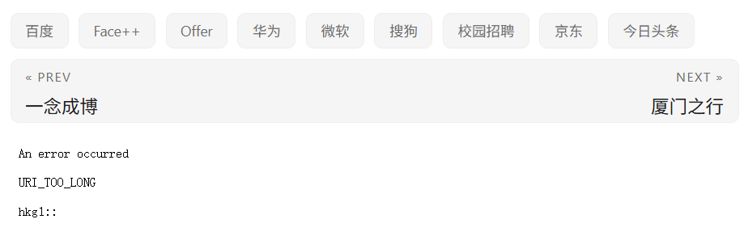
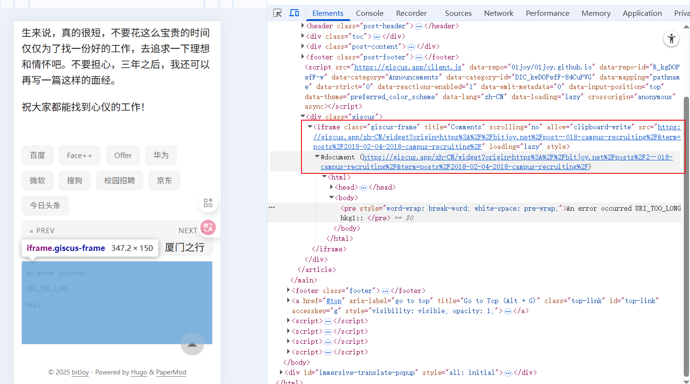

本博客使用的评论系统是[Giscus](https://github.com/giscus/giscus)，日常使用没啥问题，但是当博客内容很长的时候，就会出现`URI_TOO_LONG`的问题：
```
An error occurred

URI_TOO_LONG

hkg1::
```

例如下面两篇博客：
* [2017年国庆旅行——郑州、杭州](https://bitjoy.net/posts/2017-10-08-2017-solo-travel-in-zhengzhou-and-hangzhou/)
* [伪·2018届校招面经](https://bitjoy.net/posts/2018-02-04-2018-campus-recruiting/)

正常Giscus评论  |  异常Giscus评论
:-------------------------:|:-------------------------:
  |  

针对这个问题，网上搜`URI_TOO_LONG`说的都是网页请求的URI太长导致的，但都没找到和Giscus相关的内容。

后来在Giscus的Github Issue里找到一个相同的问题：[https://github.com/giscus/giscus/issues/1340](https://github.com/giscus/giscus/issues/1340)，里面一个人提到和Hugo所用的主题有关，另一个人提到和博客的`meta name="description"`内容太长有关。但都蜻蜓点水，说的不是很详细，也没有给出一个通用的解决办法。

后来怀疑这个报错可能是在加载Giscus评论系统的时候，发起的URI请求太长有关。因此针对出问题的博客，通过Chrome右键`检查`，找到Giscus模块出现的URI链接，如下图所示。



光这么看看不出来这个URI的长度，可以把这个URI拷贝出来，粘贴到Word中，你会发现这个URI真的非常非常长，而且包含了完整的博客正文！进一步分析发现是URI中的`description`字段非常长，包含完整的博客正文。

定位到问题之后，解决办法就很简单了，目标就是如何缩短博客html代码中的`description`字段长度。这里有很多种方法，最简单的方法就是，在每篇博客的头信息区域，增加自定义配置的`description`内容，简短一点就行，我就直接复用了博客标题。通过这种方法就缩短了Giscus发起URI中的`description`字段长度了。


此外，还可以在主题中搜一下`meta name="description"`出现的位置，把里面的代码改掉或者注释掉，都能解决这个问题。