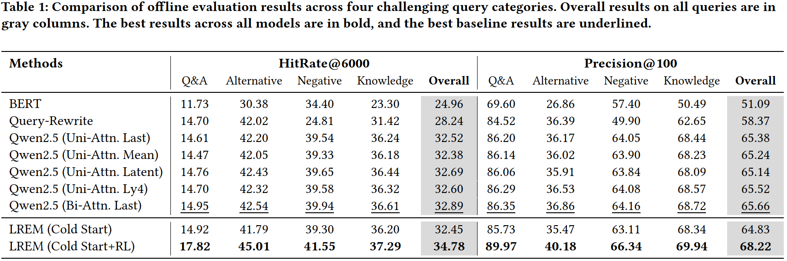

# 基本信息

* 论文标题：Large Reasoning Embedding Models: Towards Next-Generation Dense Retrieval Paradigm
* 作者单位：阿里巴巴
* 论文链接：[https://arxiv.org/abs/2510.14321](https://arxiv.org/abs/2510.14321)
* 来源：arxiv

# 一、问题

电商emb召回场景，目前的方法都是直接字面语义上的对比学习训练（direct-embedding methods），即q2i的对比学习训练。对于复杂、困难的query，语义理解能力不足，比如下图Fig1中的query="比茶更提神的饮料"，仍然会召回很多茶，因为字面理解没有理解query背后的深层含义。

# 二、方法

使用LLM强大的推理能力（reasoning），先推理出CoT，然后基于CoT再产emb。比如上面的例子中，经过LLM推理之后，推理出咖啡、红牛等关键词，通过这些关键词再去产emb然后召回，效果就好很多。

## 2.1 训练样本构造方法

如下图Fig2中的Data Construction部分：
* 收集线上query，尤其是那种困难query，就是在现有direct-embedding表现不好的query
* 把这些query喂给现有召回模型，得到召回商品集合①
* 然后使用强大的Qwen3-30B-A3B-Instruct生产CoT扩展信息
    * Unconstrained Reasoning：首先不加任何限制地生产CoT，尽可能利用大模型的世界知识和推理能力，生产充分完全的CoT信息
    * Information Extraction：由于上一步产出的CoT信息太长了，不利于线上推理，因此把上一步产出的CoT和原始query再次输入给大模型，让大模型抽取其中的关键信息，以keyword list形式输出
    * Post Processing：最后对上一步抽取的关键词进行后处理，去除重复词，去除query中已有的词等，得到精简、干净的关键词列表，列表最大长度是16
* 接着把query和CoT喂给已有的向量召回模型，得到扩展的召回商品集合②
    * 由于要训练模型的Reasoning能力，所以只取出集合②-①的差集部分，这部分是CoT带来的增益商品集合
* 最后使用相关性模型对商品集合②-①进行过滤，过滤出相关的商品
* 通过上述步骤，产出约7.5kw的\<query, CoT, item>三元组
* 把上述样本划分成两部分，7.1kw的\<query, CoT, item>三元组用于Cold start预训练；剩余400w的\<query, item>用于RL微调

## 2.2 Cold Start预训练

对应图Fig2左下角部分，该模块通过大规模的\<query, CoT,item>三元组数据预训练，想要达到两个目的：一是让基础模型具备think能力；二是让基础模型产出的emb和下游q2i任务对齐。

这里使用的基础模型是Qwen2.5-3B-Instruct，比生产CoT的模型（Qwen3-30B-A3B-Instruct）小，其实也有点蒸馏的感觉，把大模型的CoT能力蒸馏到小模型中。

训练任务包括两个，一个是CoT的NTP loss（对应图中的SFT loss），另一个是q2i的对比学习InfoNCE loss。query塔和item塔共享参数，他们的emb都是最后一个特殊token \<emb> 的emb。

Loss组合：

## 2.3 RL微调

上一步的SFT主要进行模仿学习，模仿更大的大模型的think能力，小模型本身的reasoning能力受限，接下来需要用GRPO对小模型进行RL微调。RL微调同时对生产CoT和生产emb两个任务都有作用，具体看下面的reward：

RL微调设计了3个reward：
* Format Reward：产出的CoT格式符合“\<think> Specific CoT \</think>\<emb>”就得1分，否则得0分
* Length Reward：产出的CoT格式符合长度限制（<=16）就得1分，否则得0分
* Retrieval Accuracy Reward：联合原始query和产出的CoT产出的增强query emb，与batch内所有的item emb求相似度，正确item所在的排名为\(rank(d_i)\)，再根据公式12计算一个排名的reward。核心思想是：正确的item与query的相似度排名越高则reward越大（即rank值越小则reward越大）。

最后，上述3个reward通过三个β系数组合起来：

RL的训练目标，GRPO loss如下：

在RL阶段，除了有GRPO loss，原有的InfoNCE对比学习loss也还在，两个loss通过系数γ组合起来，如公式16所示。

## 2.4 训练细节

* 产CoT的推理模型：Qwen3-30B-A3B-Instruct
* emb基座模型：Qwen2.5-3B-Instruct
* 训练资源：128 GPUs
* 预训练阶段：
    * CoT最大长度：16
    * loss系数：\(\lambda_1=0.1, \lambda_2=1\)，也就是InfoNCE loss是主导的，NTP的loss权重很小
    * batchsize=128
    * lr=1e-5，cosine scheduler with a warmup ratio of 0.03
    * 训练1个epoch
* RL阶段：
    * GRPO每次采样8个CoT
    * length reward长度阈值16
    * 三个reward系数：\(\beta_1=0.5, \beta_2=0.2, \beta_3=1\)，\(\beta_3\)最大，即准度的reward最重要
    * loss系数\(\gamma_1=1,\gamma_2=0.1\)，即GRPO的loss权重最大
    * batchsize=256，RL阶段的batchsize是预训练阶段的2倍
    * lr=1e-6，cosine scheduler with a warmup ratio of 0.03，RL阶段的lr比预训练小
    * 训练1个epoch

# 三、结果

* 如下图所示，最后一行LREM(Cold Start+RL)效果最好，但是LREM(Cold Start)效果很差啊，比Qwen2.5的好几个base都差。。。这就很奇怪了，理论上LREM(Cold Start)去掉CoT和SFT loss的结构和Qwen2.5 (Uni-Attn. Last)的结构是完全一样的，但是前者的指标比后者差很多，难道是加了CoT和SFT loss有负向影响？
* LREM(Cold Start+RL)比LREM(Cold Start)提升非常大，也能说明LREM(Cold Start)效果很差。但是不应该呀，RL的几个reward，理论上在预训练阶段都有训练到，即使对于准度的reward3，其实也相当于positive在in-batch内的相似度要大于其他negative，本质上和InfoNCE loss的目的是一致的，为啥换成RL的形式后提升这么大？

* 作者还分析了CoT的作用，把CoT换成空的、随机字符串、或者单纯重复query，效果都下降很多，说明CoT很重要。

# 四、评价

* 问题切入点很好，特别是在相关性、召回场景，query更加多样，困难的query也更多，而且本文主要就是解决困难query的场景，但是这种情况在线上的占比应该很小？作者没讲
* CoT数据的生产经过了很多步骤，看得出来经过了多轮迭代优化，也说明这个环节有很多坑，直接用更大模型产出的无约束的CoT可能效果不行。。。
* 本文只针对query进行了CoT扩张，能不能对item也扩展一下呢？
* 本文最终效果提升很大，但是这个提升真的来自RL吗，感觉有点怀疑呀。个人感觉CoT的信息可能更重要一点，需要补充一个对比实验，即用emb基座模型直接加入本文产出的CoT进行对比学习预训练，不加后面的RL，看看效果怎么样。就是CoT只作为附加特征，相当于LREM(Cold Start)基础上去掉SFT loss，感觉这样就能取得不错的效果吧。

