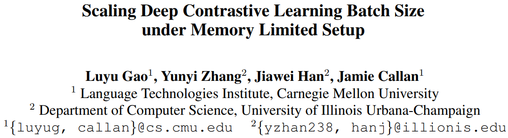
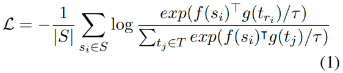
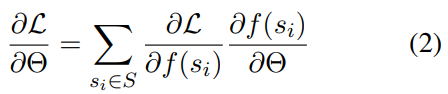
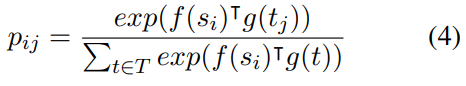
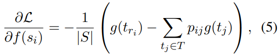
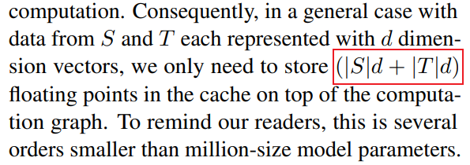
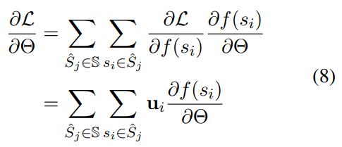

# 基本信息

* 论文标题：Scaling Deep Contrastive Learning Batch Size under Memory Limited Setup
* 作者单位：CMU
* 论文链接：[https://arxiv.org/pdf/2101.06983](https://arxiv.org/pdf/2101.06983)
* 来源：arxiv

# 一、问题

对比学习通常使用InfoNCE loss进行训练，公式如下（1）：



其中：
* \(s_i\)是anchor，\(f(s_i)\)是anchor embedding，\(f\)是anchor encoder
* \(t_{r_i}\)是\(s_i\)对应的positive，\(g(t_{r_i})\)是positive embedding，\(g\)是positive encoder
* \(t_j \in T\)是batch内其他\(s\)对应的positives，作为\(s_i\)的in-batch negatives。在没有hard negative的情况下，即每条样本是<anchor, positive>这种二元组的情况下，\(|T|\)等于batchsize
* \(\tau\)是温度系数，通常是一个常数，为讨论方便，后续省略该参数
* 在经典的双塔对比学习场景下，函数\(f\)和\(g\)通常是两个不同的网络（比如CLIP）；在LLM/VLM emb场景下，函数\(f\)和\(g\)通常是共享参数的

对于对比学习，通常有in-batch negatives数量\(|T|\)越大，效果越好。但\(|T|\)越大，意味着batchsize也越大，训练时占用的显存也越多。如何在增大\(|T|\)的情况下不显著增加显存占用，是个很大的挑战。

# 二、方法

通常我们会使用梯度累积的方法在不增加显存的情况下增大batchsize，但梯度累积只适用于instance-wise loss，即每条样本的loss计算是独立的，这样可以把大batch拆成多个小batch分别计算梯度，然后累加起来。

但是由于对比学习loss计算时涉及到anchor和in-batch negative的运算，即对比学习loss是batch-wise loss，直接把大batch拆成多个小batch不加额外处理的话，小batch内的in-batch negatives就少了，影响对比学习效果。

本文的核心思想是，把公式1中的 对比学习loss 对 模型参数 的梯度求解过程拆分成：loss对表征\(f(s)\)的梯度 乘以 表征 对 模型参数 的梯度。由于只有loss计算需要batch-wise的运算，故上述拆解只有前半部分需要batch-wise运算，后半部分仍然可以instance-wise的计算然后梯度累加。下面来看具体过程。

为方便讨论，我们只看loss对\(f\)的参数的梯度求解过程（比如在\(f\)和\(g\)共享参数的情况下），对\(g\)的梯度求解过程的分析类似。

根据链式法则，对比学习loss \(\mathcal{L}\)对\(f\)的参数\(\Theta\)的梯度求解过程如下：把它拆解成第一项是\(\mathcal{L}\) 对表征\(f(s_i)\)的梯度，第二项是表征\(f(s_i)\)对模型参数\(\Theta\)的梯度，两项相乘就是loss \(\mathcal{L}\)对模型参数\(\Theta\)的梯度。


通过上述拆解为什么能显著降低显存呢，详细分析如下：

* 对于公式(2)右边第一项\(\frac{\partial \mathcal{L}}{\partial f\left(s_{i}\right)}\)，根据公式(1)可以得到第一项的梯度如下公式(5)。也就是说第一项的梯度只与batch内所有的表征\(f(s)\)和\(g(t)\)有关，而与模型参数\(\Theta\)无关。所以我们可以先进行一次不含梯度的前向过程，拿到batch内所有的表征\(f(s)\)和\(g(t)\)，由此可计算出公式(5)，即loss \(\mathcal{L}\)对表征的梯度。由于这次前向不包含梯度（类似inference过程），所以不用记录各种中间激活值（activations）和梯度，可以大大节省显存，详细可看[https://mingchao.wang/4KTgtnFc](https://mingchao.wang/4KTgtnFc) 的分析（即模型训练过程中activations是占显存的大头）。

* 计算完公式(5)之后，可以把这部分梯度缓存起来，用于后续计算。这部分缓存的梯度只需要额外占用\((|S|d+|T|d)\)的显存，显著小于海量的模型参数和中间activations的参数量。

  |   | 
:-------------------------:|:-------------------------:|:-------------------------:

* 对于公式(2)右边第二项\(\frac{\partial f\left(s_{i}\right)}{\partial \Theta}\)，这部分梯度就是表征\(f(s_i)\)对模型参数\(\Theta\)的梯度，和常规梯度没什么两样，是instance-wise的，即每个样本的这个梯度计算是独立的。因此可以像常规梯度累积一样，进行mini-batch的计算，然后累加起来。为了完成这第二个过程，需要对每个样本\(s_i\)重新进行一次前向计算，由于需要对参数\(\Theta\)求梯度，所以这一次前向需要记录所有梯度和activations中间值。但是由于这个过程每个样本\(s_i\)可以独立计算，所以可以像梯度累积一样，把大batch拆分成多个小batch，每个mini-batch进行前向计算并进行梯度反向传播，所以显存峰值由mini-batch size决定，也不会太大。

* 最终的梯度求解过程如下公式(8)，第一个累加和是mini-batch wise的，第二个累加和是在mini-batch内部进行instance-wise计算，其中的\(u_i\)就是需要缓存的loss对表征的梯度。



# 三、代码实现

论文本身提供了开源实现：[https://github.com/luyug/GradCache](https://github.com/luyug/GradCache)，也集成到了sentence-transformers中，叫做CachedMultipleNegativesRankingLoss，下面以CachedMultipleNegativesRankingLoss的源代码实现进行讲解：[https://github.com/huggingface/sentence-transformers/blob/main/sentence_transformers/losses/CachedMultipleNegativesRankingLoss.py](https://github.com/huggingface/sentence-transformers/blob/main/sentence_transformers/losses/CachedMultipleNegativesRankingLoss.py)

```python
from __future__ import annotations

from collections.abc import Iterable, Iterator
from contextlib import nullcontext
from functools import partial
from typing import Any

import torch
import tqdm
from torch import Tensor, nn
from torch.utils.checkpoint import get_device_states, set_device_states

from sentence_transformers import util
from sentence_transformers.models import StaticEmbedding
from sentence_transformers.SentenceTransformer import SentenceTransformer
from sentence_transformers.util import all_gather_with_grad


class RandContext:
    """
    Random-state context manager class. Reference: https://github.com/luyug/GradCache.

    This class will back up the pytorch's random state during initialization. Then when the context is activated,
    the class will set up the random state with the backed-up one.
    """

    def __init__(self, *tensors) -> None:
        self.fwd_cpu_state = torch.get_rng_state()
        self.fwd_gpu_devices, self.fwd_gpu_states = get_device_states(*tensors)

    def __enter__(self) -> None:
        self._fork = torch.random.fork_rng(devices=self.fwd_gpu_devices, enabled=True)
        self._fork.__enter__()
        torch.set_rng_state(self.fwd_cpu_state)
        set_device_states(self.fwd_gpu_devices, self.fwd_gpu_states)

    def __exit__(self, exc_type, exc_val, exc_tb) -> None:
        self._fork.__exit__(exc_type, exc_val, exc_tb)
        self._fork = None


def _backward_hook(
    grad_output: Tensor,
    sentence_features: Iterable[dict[str, Tensor]],
    loss_obj: CachedMultipleNegativesRankingLoss,
) -> None:
    """A backward hook to backpropagate the cached gradients mini-batch by mini-batch."""
    assert loss_obj.cache is not None
    assert loss_obj.random_states is not None
    with torch.enable_grad():
        for sentence_feature, grad, random_states in zip(sentence_features, loss_obj.cache, loss_obj.random_states):
            for (reps_mb, _), grad_mb in zip(
                loss_obj.embed_minibatch_iter(
                    sentence_feature=sentence_feature,
                    with_grad=True,
                    copy_random_state=False,
                    random_states=random_states,
                ),
                grad,
            ):
                # TODO: This if-statement is for if the model does not require gradients, which may happen if the model
                # contains a Router where one of the routes is frozen. It should be possible to not have to call
                # embed_minibatch_iter in that case, as it's unnecessarily expensive.
                if reps_mb.requires_grad:
                    surrogate = torch.dot(reps_mb.flatten(), grad_mb.flatten()) * grad_output
                    surrogate.backward()


class CachedMultipleNegativesRankingLoss(nn.Module):
    def __init__(
        self,
        model: SentenceTransformer,
        scale: float = 20.0,
        similarity_fct: callable[[Tensor, Tensor], Tensor] = util.cos_sim,
        mini_batch_size: int = 32,
        gather_across_devices: bool = False,
        show_progress_bar: bool = False,
    ) -> None:
        """
        Boosted version of MultipleNegativesRankingLoss (https://huggingface.co/papers/1705.00652) by GradCache (https://huggingface.co/papers/2101.06983).

        Constrastive learning (here our MNRL loss) with in-batch negatives is usually hard to work with large batch sizes due to (GPU) memory limitation.
        Even with batch-scaling methods like gradient-scaling, it cannot work either. This is because the in-batch negatives make the data points within
        the same batch non-independent and thus the batch cannot be broke down into mini-batches. GradCache is a smart way to solve this problem.
        It achieves the goal by dividing the computation into two stages of embedding and loss calculation, which both can be scaled by mini-batches.
        As a result, memory of constant size (e.g. that works with batch size = 32) can now process much larger batches (e.g. 65536).

        In detail:

            (1) It first does a quick embedding step without gradients/computation graphs to get all the embeddings;
            (2) Calculate the loss, backward up to the embeddings and cache the gradients wrt. to the embeddings;
            (3) A 2nd embedding step with gradients/computation graphs and connect the cached gradients into the backward chain.

        Notes: All steps are done with mini-batches. In the original implementation of GradCache, (2) is not done in mini-batches and
        requires a lot memory when the batch size is large. One drawback is about the speed. Gradient caching will sacrifice
        around 20% computation time according to the paper.

        Args:
            model: SentenceTransformer model
            scale: Output of similarity function is multiplied by scale value. In some literature, the scaling parameter
                is referred to as temperature, which is the inverse of the scale. In short: scale = 1 / temperature, so
                scale=20.0 is equivalent to temperature=0.05.
            similarity_fct: similarity function between sentence embeddings. By default, cos_sim. Can also be set to dot
                product (and then set scale to 1)
            mini_batch_size: Mini-batch size for the forward pass, this denotes how much memory is actually used during
                training and evaluation. The larger the mini-batch size, the more memory efficient the training is, but
                the slower the training will be. It's recommended to set it as high as your GPU memory allows. The default
                value is 32.
            gather_across_devices: If True, gather the embeddings across all devices before computing the loss.
                Recommended when training on multiple GPUs, as it allows for larger batch sizes, but it may slow down
                training due to communication overhead, and can potentially lead to out-of-memory errors.
            show_progress_bar: If True, a progress bar for the mini-batches is shown during training. The default is False.

        References:
            - Efficient Natural Language Response Suggestion for Smart Reply, Section 4.4: https://huggingface.co/papers/1705.00652
            - Scaling Deep Contrastive Learning Batch Size under Memory Limited Setup: https://huggingface.co/papers/2101.06983

        Requirements:
            1. (anchor, positive) pairs or (anchor, positive, negative pairs)
            2. Should be used with large `per_device_train_batch_size` and low `mini_batch_size` for superior performance, but slower training time than :class:`MultipleNegativesRankingLoss`.

        Inputs:
            +-------------------------------------------------+--------+
            | Texts                                           | Labels |
            +=================================================+========+
            | (anchor, positive) pairs                        | none   |
            +-------------------------------------------------+--------+
            | (anchor, positive, negative) triplets           | none   |
            +-------------------------------------------------+--------+
            | (anchor, positive, negative_1, ..., negative_n) | none   |
            +-------------------------------------------------+--------+

        Recommendations:
            - Use ``BatchSamplers.NO_DUPLICATES`` (:class:`docs <sentence_transformers.training_args.BatchSamplers>`) to
              ensure that no in-batch negatives are duplicates of the anchor or positive samples.

        Relations:
            - Equivalent to :class:`MultipleNegativesRankingLoss`, but with caching that allows for much higher batch sizes
              (and thus better performance) without extra memory usage. This loss also trains roughly 2x to 2.4x slower than
              :class:`MultipleNegativesRankingLoss`.

        Example:
            ::

                from sentence_transformers import SentenceTransformer, SentenceTransformerTrainer, losses
                from datasets import Dataset

                model = SentenceTransformer("microsoft/mpnet-base")
                train_dataset = Dataset.from_dict({
                    "anchor": ["It's nice weather outside today.", "He drove to work."],
                    "positive": ["It's so sunny.", "He took the car to the office."],
                })
                loss = losses.CachedMultipleNegativesRankingLoss(model, mini_batch_size=64)

                trainer = SentenceTransformerTrainer(
                    model=model,
                    train_dataset=train_dataset,
                    loss=loss,
                )
                trainer.train()
        """
        super().__init__()
        if isinstance(model[0], StaticEmbedding):
            raise ValueError(
                "CachedMultipleNegativesRankingLoss is not compatible with a SentenceTransformer model based on a StaticEmbedding. "
                "Consider using MultipleNegativesRankingLoss instead."
            )

        self.model = model
        self.scale = scale
        self.similarity_fct = similarity_fct
        self.mini_batch_size = mini_batch_size
        self.gather_across_devices = gather_across_devices
        self.show_progress_bar = show_progress_bar

        self.cross_entropy_loss = nn.CrossEntropyLoss()
        self.cache: list[list[Tensor]] | None = None
        self.random_states: list[list[RandContext]] | None = None

    def embed_minibatch(
        self,
        sentence_feature: dict[str, Tensor],
        begin: int,
        end: int,
        with_grad: bool,
        copy_random_state: bool,
        random_state: RandContext | None = None,
    ) -> tuple[Tensor, RandContext | None]:
        """Do forward pass on a minibatch of the input features and return corresponding embeddings."""
        grad_context = nullcontext if with_grad else torch.no_grad
        random_state_context = nullcontext() if random_state is None else random_state
        sentence_feature_minibatch = {
            key: value[begin:end] if isinstance(value, torch.Tensor) else value
            for key, value in sentence_feature.items()
        }
        with random_state_context:
            with grad_context():
                random_state = RandContext(*sentence_feature_minibatch.values()) if copy_random_state else None
                reps = self.model(sentence_feature_minibatch)["sentence_embedding"]  # (mbsz, hdim)
        return reps, random_state

    def embed_minibatch_iter(
        self,
        sentence_feature: dict[str, Tensor],
        with_grad: bool,
        copy_random_state: bool,
        random_states: list[RandContext] | None = None,
    ) -> Iterator[tuple[Tensor, RandContext | None]]:
        """Do forward pass on all the minibatches of the input features and yield corresponding embeddings."""
        input_ids: Tensor = sentence_feature["input_ids"]
        bsz, _ = input_ids.shape
        for i, b in enumerate(
            tqdm.trange(
                0,
                bsz,
                self.mini_batch_size,
                desc="Embed mini-batches",
                disable=not self.show_progress_bar,
            )
        ):
            e = b + self.mini_batch_size
            reps, random_state = self.embed_minibatch(
                sentence_feature=sentence_feature,
                begin=b,
                end=e,
                with_grad=with_grad,
                copy_random_state=copy_random_state,
                random_state=None if random_states is None else random_states[i],
            )
            yield reps, random_state  # reps: (mbsz, hdim)

    def calculate_loss_and_cache_gradients(self, reps: list[list[Tensor]]) -> Tensor:
        """Calculate the cross-entropy loss and cache the gradients wrt. the embeddings."""
        loss = self.calculate_loss(reps, with_backward=True)
        loss = loss.detach().requires_grad_()

        self.cache = [[r.grad for r in rs] for rs in reps]  # e.g. 3 * bsz/mbsz * (mbsz, hdim)

        return loss

    def calculate_loss(self, reps: list[list[Tensor]], with_backward: bool = False) -> Tensor:
        """Calculate the cross-entropy loss. No need to cache the gradients."""
        anchors = torch.cat(reps[0])  # (batch_size, embedding_dim)
        candidates = [torch.cat(r) for r in reps[1:]]  # (1 + num_neg) tensors of shape (batch_size, embedding_dim)
        batch_size = len(anchors)
        offset = 0

        if self.gather_across_devices:
            # Gather the positives and negatives across all devices, with gradients, but not the anchors. We compute
            # only this device's anchors with all candidates from all devices, such that the backward pass on the document
            # embeddings can flow back to the original devices.
            candidates = [all_gather_with_grad(embedding_column) for embedding_column in candidates]
            # (1 + num_negatives) tensors of shape (batch_size * world_size, embedding_dim)

            # Adjust the range_labels to account for the gathered candidates
            if torch.distributed.is_initialized():
                rank = torch.distributed.get_rank()
                offset = rank * batch_size

        candidates = torch.cat(candidates, dim=0)
        # (batch_size * world_size * (1 + num_negatives), embedding_dim)

        # anchor[i] should be most similar to candidates[i], as that is the paired positive,
        # so the label for anchor[i] is i, but adjusted for the rank offset if gathered across devices
        labels = torch.arange(offset, offset + batch_size, device=anchors.device)

        losses: list[torch.Tensor] = []
        for b in tqdm.trange(
            0,
            batch_size,
            self.mini_batch_size,
            desc="Preparing caches",
            disable=not self.show_progress_bar,
        ):
            e = b + self.mini_batch_size
            scores: Tensor = self.similarity_fct(anchors[b:e], candidates) * self.scale
            loss_mbatch: torch.Tensor = self.cross_entropy_loss(scores, labels[b:e]) * len(scores) / batch_size
            if with_backward:
                loss_mbatch.backward()
                loss_mbatch = loss_mbatch.detach()
            losses.append(loss_mbatch)

        loss = sum(losses)
        return loss

    def forward(self, sentence_features: Iterable[dict[str, Tensor]], labels: Tensor) -> Tensor:
        # Step (1): A quick embedding step without gradients/computation graphs to get all the embeddings
        reps = []
        self.random_states = []  # Copy random states to guarantee exact reproduction of the embeddings during the second forward pass, i.e. step (3)
        for sentence_feature in sentence_features:
            reps_mbs = []
            random_state_mbs = []
            for reps_mb, random_state in self.embed_minibatch_iter(
                sentence_feature=sentence_feature,
                with_grad=False,
                copy_random_state=True,
            ):
                reps_mbs.append(reps_mb.detach().requires_grad_())
                random_state_mbs.append(random_state)
            reps.append(reps_mbs)
            self.random_states.append(random_state_mbs)

        if torch.is_grad_enabled():
            # Step (2): Calculate the loss, backward up to the embeddings and cache the gradients wrt. to the embeddings
            loss = self.calculate_loss_and_cache_gradients(reps)

            # Step (3): A 2nd embedding step with gradients/computation graphs and connect the cached gradients into the backward chain
            loss.register_hook(partial(_backward_hook, sentence_features=sentence_features, loss_obj=self))
        else:
            # If grad is not enabled (e.g. in evaluation), then we don't have to worry about the gradients or backward hook
            loss = self.calculate_loss(reps)

        return loss

    def get_config_dict(self) -> dict[str, Any]:
        return {
            "scale": self.scale,
            "similarity_fct": self.similarity_fct.__name__,
            "mini_batch_size": self.mini_batch_size,
            "gather_across_devices": self.gather_across_devices,
        }

    @property
    def citation(self) -> str:
        return """
@misc{gao2021scaling,
    title={Scaling Deep Contrastive Learning Batch Size under Memory Limited Setup},
    author={Luyu Gao and Yunyi Zhang and Jiawei Han and Jamie Callan},
    year={2021},
    eprint={2101.06983},
    archivePrefix={arXiv},
    primaryClass={cs.LG}
}
"""
```

核心主逻辑在L286行的`forward`函数中，主要包括3个步骤：
* L290-L301，Step (1): 执行第一次不记录中间梯度的前向过程，拿到所有emb表征
    * 由于后续的Step (3)在进行第二次前向的时候需要分mini-batch计算，为了保证Step (1)和Step (3)的表征能严格一致对应，所以Step (1)前向的时候也分了mini-batch，并且严格记录了每个mini-batch当时的random_states状态
    * L298行计算得到的表征`reps_mb`先后经过了`detach`和`requires_grad_`。先`detach`是为了把表征和底层的模型参数\(\Theta\)从计算图中分隔开，然后又`requires_grad_`是为了重新从表征`reps_mb`开始要计算梯度了。其实就是对应公式(2)右边第一项\(\frac{\partial \mathcal{L}}{\partial f\left(s_{i}\right)}\)，让loss \(\mathcal{L}\)的反向梯度传播只传播到表征`reps_mb`。
* L305，Step (2): 计算对比学习loss，以及loss对表征的梯度，也即公式(2)右边第一项\(\frac{\partial \mathcal{L}}{\partial f\left(s_{i}\right)}\)
    * L234传入`with_backward=True`，即梯度需要反传，但是又L298的`reps_mb.detach().requires_grad_()`，故loss梯度反传只会反传到表征处`reps_mb`，不会再继续反传到模型参数。L237把反传到表征的梯度缓存下来了，也即缓存了公式(2)右边第一项\(\frac{\partial \mathcal{L}}{\partial f\left(s_{i}\right)}\)
    * L235把loss从计算图中隔离出来了，这个在后面Step (3)会用到
* L308，Step (3): 计算loss \(\mathcal{L}\)对模型参数\(\Theta\)的梯度
    * 根据公式(2)，Step (2)已经计算并缓存了公式(2)右边第一项梯度，Step (3)的目的就是计算公式(2)右边第二项梯度，并把这两项梯度乘起来
    * L50：为了计算表征对模型参数的梯度，需要进行第二次前向传播，这一次前向传播需要记录梯度信息，故L50有`with torch.enable_grad()`
    * L65-L66：这是核心代码，把Step (2)缓存的梯度`grad_mb`乘以表征`reps_mb`，然后L66进行梯度反传，合起来就是\{\(\partial\)`grad_mb`*`reps_mb`/\(\partial\Theta\)\}，其实就是公式(2)了
