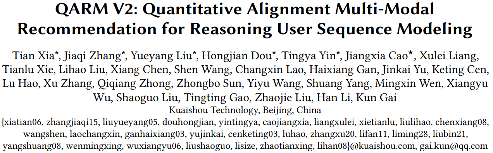
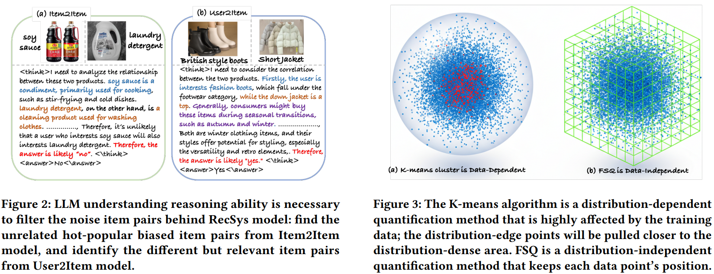
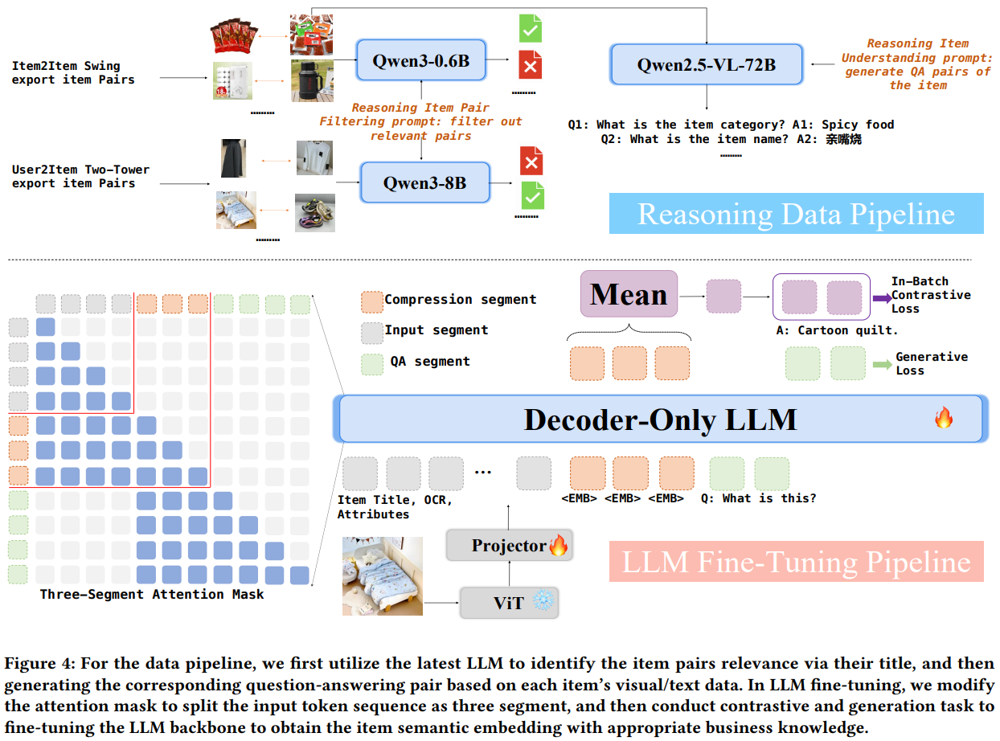
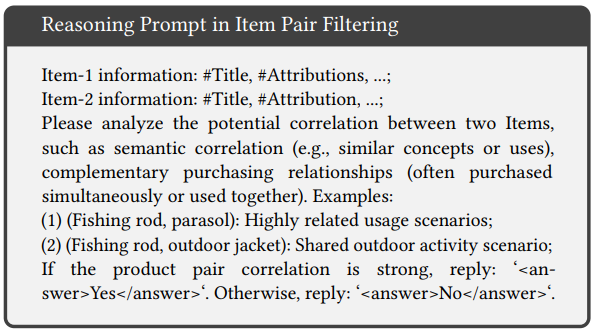
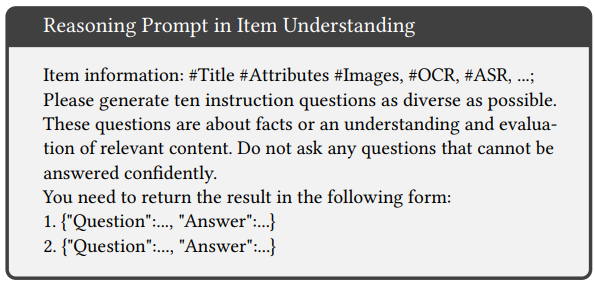
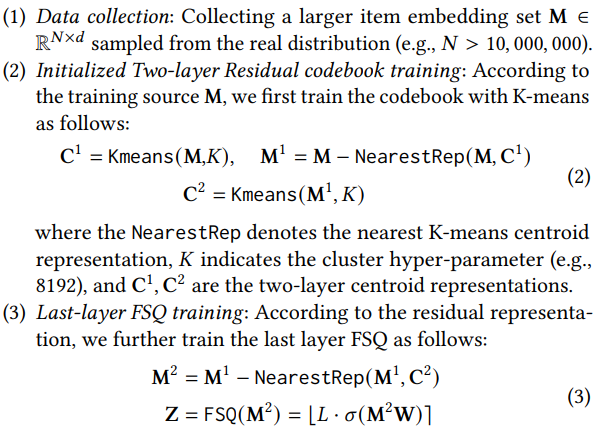

这篇论文是[QARM V1](https://arxiv.org/pdf/2411.11739)的升级版，建议先看[QARM V1的阅读总结](https://bitjoy.net/posts/2025-10-04-qarm-paper-reading/)。

# 基本信息

* 论文标题：QARM V2: Quantitative Alignment Multi-Modal Recommendation for Reasoning User Sequence Modeling
* 作者单位：快手
* 论文链接：[https://arxiv.org/abs/2602.08559](https://arxiv.org/abs/2602.08559)
* 来源：arxiv

# Motivation：论文要解决的问题是什么

QARM V1确定了“LLM微调→生产SID→排序模型应用”的多模态在排序场景应用的范式，本文发现QARM V1存在如下不足：

（1）QARM V1用于LLM微调的i2i训练数据有很多噪声

QARM V1有2种生产i2i样本的方法：
* 使用swing这种i2i召回模型收集i2i pair。这个方式容易受到商品热度的偏置，如Fig2a所示，酱油和洗衣液被swing判定为i2i正样本，只不过是因为他们都很热门，并不是因为他们在多模态语义上相似。
* 使用U2I召回模型收集i2i pair。这个方式召回的i2i正样本pair灵活多变，很容易出bad case。

总之，QARM V1构造的i2i正样本有很多噪声，需要去噪。

（2）QARM V1使用RQ-KMeans生产的SID序列冲突率太高

QARM V1使用3层RQ-KMeans训练产出SID序列，作者发现电商商品的分布非常不均匀，甚至是二八分布的情况，即少数几类商品量非常大，大多数类目的商品数量很少。如果只用RQ-KMeans进行分层残差聚类，在商品分布不均匀的情况下，产出的SID序列的冲突率很高。如图Fig3a所示，KMeans聚类严重依赖于数据分布，当数据分布本身不均匀的时候，聚类结果本身也是不均匀的，这就会导致SID序列冲突。

# 使用推理大模型去噪的I2I样本构造方法

如下图Fig4所示，针对QARM V1的i2i样本噪声多的问题，本文分别使用Qwen3-0.6B和Qwen3-8B对swing和u2i模型召回的i2i样本进行清洗，清洗的prompt如下图所示，就是让大模型判断i2i pair的两个商品是否是相似或者相关商品，输出yes或no。作者认为u2i模型召回的i2i pair更加灵活多变，所以使用了更大的8B模型对这部分数据进行清洗。经过作者的清洗，发现QARM V1的i2i样本中有10%的swing召回的i2i和70%的U2I召回的i2i都是噪声，这噪声的比例也太大了吧。。。

除此之外，为了增强emb对商品的理解能力，作者又使用更大的多模态大模型Qwen2.5-VL-72B，对商品进行理解，生成针对该商品的QA pair，作为后续NTP任务的训练数据。如上图Fig4右上角部分，针对那个辣条，Qwen2.5-VL-72B生成的QA会问这个商品名称是啥，回答是：亲嘴烧。这一步使用的prompt如下图所示。

# 微调LLM产出多模态表征

微调结构如Fig4下图部分，LLM输入包括标题、图片、属性等特征，此外还新增了3个特殊token \<EMB\>，用这3个特殊token的输出mean pooling得到最终的多模态emb，然后进行对比学习训练。不理解为啥需要用3个特殊token，1个足够了吧？

上述对比学习结构都比较常规，本文新增的是对QA pair的NTP任务，就是在三个特殊token后面，让LLM继续以NTP的形式生成QA pair，即样本构造环节通过大模型产出的QA pair。

而且这个NTP任务是以三个特殊token为起点的，因为LLM都是decoder-only结构，为了让NTP任务只看到前面三个特殊token，而不看到开头的标题、图片等商品信息，作者设计了Three-Segment Attention Mask，即NTP任务最多看到三个特殊token往后的token。作者这么设计的原因，是希望通过NTP训练，让特殊token产出的商品表征，能够蕴含QA pair里面的信息。

# 基于Res-KmeansFSQ的SID序列生产

QARM V1是直接使用3层RQ-KMeans残差聚类生产SID序列，作者在Fig3a中认为电商数据天然的不均匀性，会导致KMeans聚类出来的sid存在很大的冲突。为了缓解这个问题，作者将最后一层的KMeans替换成FSQ。其实正如Fig3a所示，KMeans是对向量空间的柔性的量化，而FSQ直接就是四舍五入，是刚性的量化，在码本空间比较大的情况下，FSQ的冲突率比KMeans低。

如下图所示，M^2就是第二层的残差，在公式(3)中，先通过σ函数把残差映射到0~1之间，然后乘以量化值域L，相当于把残差投影到长度为L的线段上，Fig3b的网格等宽网格很好理解。有关FSQ的介绍可以参考这篇博客：[https://spaces.ac.cn/archives/9826](https://spaces.ac.cn/archives/9826)

# 基于多模态表征及SID序列的用户行为建模方法

多模态emb和SID序列在排序模型中的应用也比较常规。整体还是TWIN或者说SIM的先GSU进行soft-search，然后在ESU进行target attention。具体来说，作者在GSU使用的是原始多模态emb进行soft-search，在ESU使用的是SID序列和排序模型进行端到端训练。最终离在线效果都有很大的提升。

# 其他分析

## 如何评价emb本身的效果

因为QARM V1和V2本身的训练数据就不一样了，所以不能用各自的emb在各自的测试集上评估，需要找一个公共的第三方测试集评测两个方法的emb效果。作者使用的是用户行为数据，把用户历史50个item用不同emb进行ann搜索，每个保留top10，总共会得到500个该用户感兴趣的item集合，如果用户第51个点击item在这个500个item集合中，则认为命中，由此可以计算HitRate。

## 多模态emb进行GSU soft-search的量化分析

使用多模态emb进行soft-search，比用e2e训练的id emb效果好，除了从最终auc指标以及case进行验证之外，作者还做了一个简单的分析，即统计了多模态emb soft-search出来的item数量相比e2e id emb soft-search出来的item数量额外多出来的比例，这个比例高达50%~60%，说明多模态emb能soft-search出来更多语义相关的历史行为。

# 评论

* 可借鉴
    * 使用推理大模型对训练样本进行清洗，可以借鉴，但是是否可以在i2i构造环节就使用更细粒度、更精细的构造方法和样本清洗流程
    * 使用FSQ量化代替KMeans，减小SID序列冲突率。但是在码本比较小的情况下，FSQ效果应该比KMeans差，本文没有给出分析
    * Emb本身的评估、SID序列冲突率、GSU soft-search等有比较多的分析实验
* 可改进
    * 相比QARM V1的改进有限，i2i样本构造完之后再接大模型清洗，是后处理的逻辑，更好的方法应该是改进样本构造方法本身，看有没有更好的方法
    * 使用更大的模型产出商品的QA pair，这个没提产出QA pair如何评估数据质量的问题
    * 模型结构设计为啥用3个特殊token，没理解，用一个token不行吗？也没讲
    * 如果把QA pair直接作为特征加进去效果会怎么样？
    * 缺少实现细节，比如decoder-only LLM具体用了哪个模型？batchsize多大？工业数据集具体如何构造的？
    * 缺少必要的消融实验，比如数据清洗、QA pair、特殊token、FSQ等各自贡献有多少等

