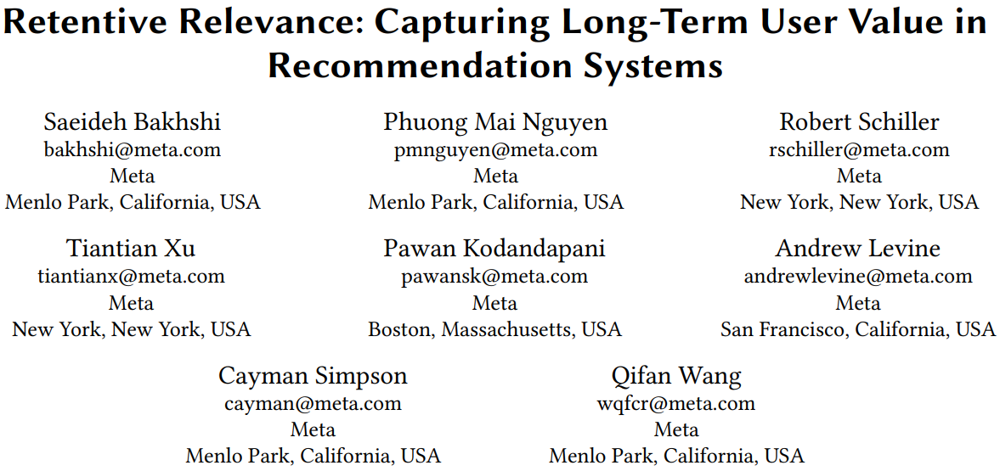
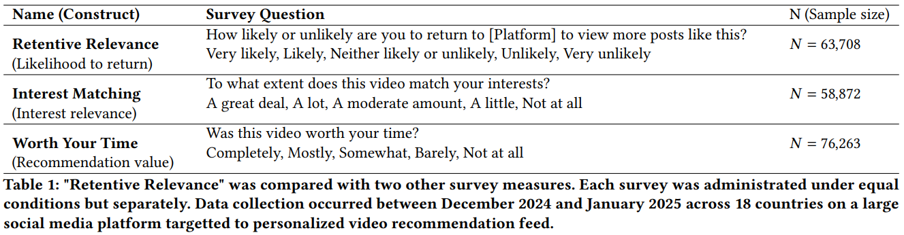
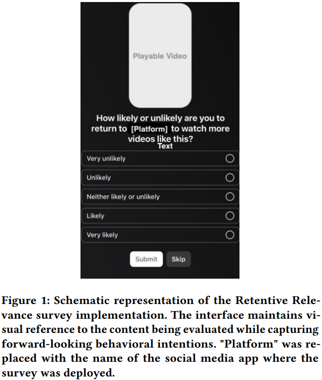
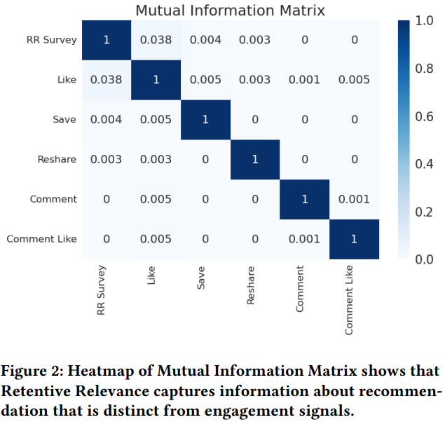
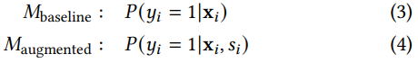
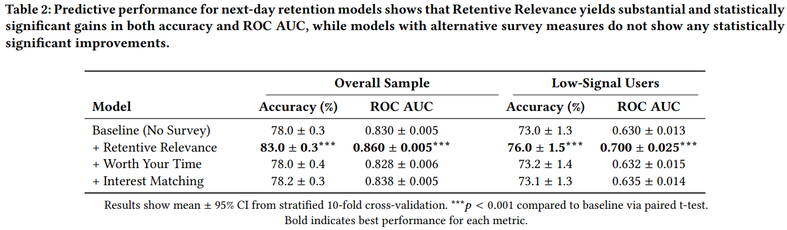
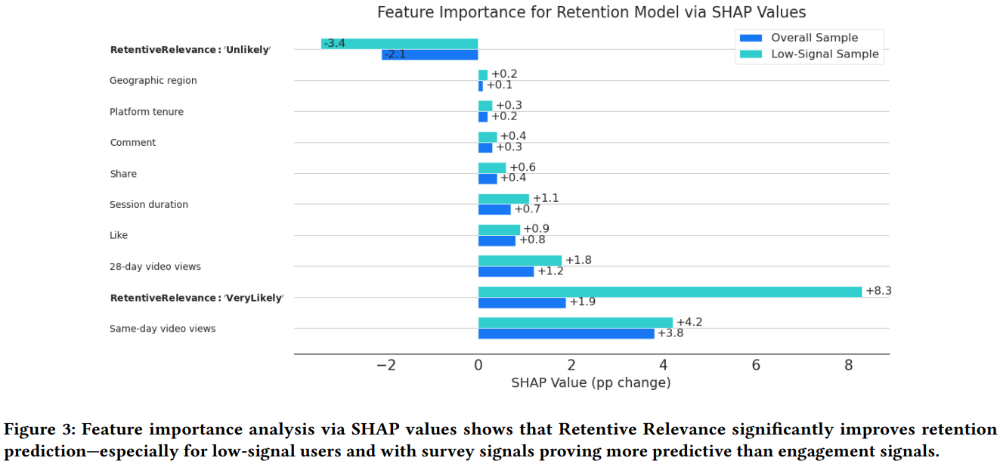
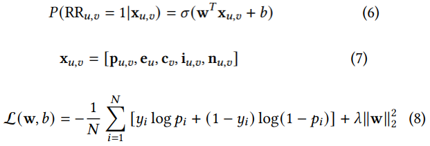
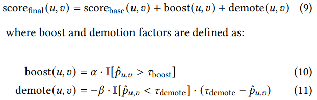
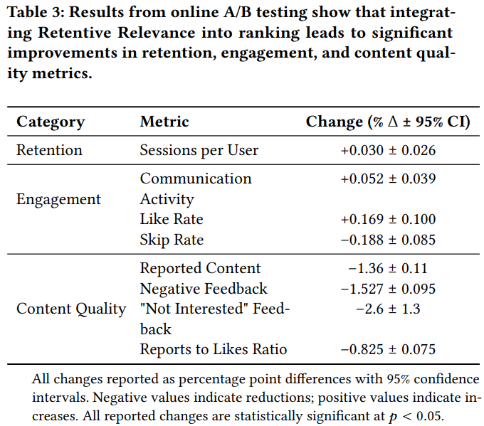

# 基本信息
* 论文标题：Retentive Relevance: Capturing Long-Term User Value in Recommendation Systems
* 作者单位：Meta
* 论文链接：[https://arxiv.org/abs/2510.07621](https://arxiv.org/abs/2510.07621)
* 来源：arxiv

# Motivation：论文要解决的问题是什么

现有推荐系统通常以用户的短期行为作为优化目标，例如用户的click、like等。但是这些短期信号通常存在噪声，且比较稀疏，而且难以捕捉用户的长期需求和留存情况。

本文提出了一种基于调查问卷的留存相关性模型（Retentive Relevance），通过设计针对后续留存的调查问卷，直接获得用户的长期留存信号。并据此训练了一个长期留存模型，用此模型的打分来校准排序模型的打分，由此让推荐系统更加关注用户的长期留存价值。

举个我自己脑补的例子：比如你刷抖音的时候点了一个段子手的搞笑视频，你看完了但是觉得并不搞笑，由于没有显式负反馈，推荐系统只能获取到你点击了这个视频，并且也看完了的正向信号，所以推荐系统在后续训练的时候会把这个搞笑视频当做正样本，再给你推荐类似的搞笑视频。这种以短期行为作为优化目标的方法，无疑是误导了推荐系统，对用户的长期留存是有害的。

如果此时APP弹出来一个调查问卷，问你看完这个视频之后，你以后还会回来看类似的视频吗？你如果点击了是或者否，则系统就能显式获取到你的长期留存label，也就是你对此类视频的真实兴趣情况，这种真实反馈比click或者完播更加可靠，而且是和长期价值高度相关的（复访）。有了这种标注数据，则可以训练一个长期留存的模型，预估用户u对商品i的长期留存概率。用这个打分来修正传统的以即时行为为优化目标的推荐系统的打分。让推荐系统在推荐视频的时候能更多地关注用户的长期留存指标。

# 调查问卷设计方案

作者对比了3种不同的问卷方案：
* Retentive Relevance：问以后是否会再回来看类似视频（看未来，长期价值）
* Interest Matching：问当前视频是否符合用户兴趣（问当下，即时兴趣）
* Worth Your Time：问当前视频是否值得看（问当下，即时价值）

注意：Interest Matching和Worth Your Time并不等价，感兴趣的视频并不一定值得花这么多时间去看（例如没有营养的搞笑视频），有价值的视频并不一定感兴趣（例如枯燥无味的高数视频）。并且这两者都是对当前观看视频的即时反馈，而Retentive Relevance则更加宽泛一些，它不问用户对当前视频是否感兴趣或者是否有价值，而是问用户以后还会不会回来看类似的视频，非常巧妙，如果用户觉得感兴趣或者有价值，以后都有可能会回来看类似的视频，所以Retentive Relevance能一定程度上覆盖Interest Matching和Worth Your Time，并且是对未来的长期价值的直接提问。

论文中还展示了调查问卷的app界面：

# 调查问卷结果的分析

## 一致性分析

三种问卷调查结果的一致性比较高，说明三种调查问卷有比较大的overlap，结果比较可靠。
> Retentive Relevance showed substantial correlations with Worth Your Time (r = 0.63, p < 0.001, 95%CI [0.71, 0.75]) and Interest Matching (r = 0.58, p < 0.001, 95% CI [0.66, 0.70]).

## 差异性分析

* 对于DIY、学习类视频，Retentive Relevance和Worth Your Time的相关性比和Interest Matching的相关性更大，即这类视频比较有价值，但用户并不一定感兴趣
* 对于娱乐、时尚、科技类视频，Retentive Relevance和Interest Matching的相关性比和Worth Your Time的相关性更大，即这类视频有意思，但并不一定值得花很多时间去看

上述结果表明，Retentive Relevance能捕捉更加广泛的推荐价值

## 正交性分析

Retentive Relevance调查问卷结果和用户的即时反馈行为的互信息分析结果如图Fig 2所示，调查问卷结果和其他反馈行为（例如Like、Save等）的互信息相关性都比较低，说明调查问卷结果能提供增量信息，对下游推荐系统有额外帮助。

# 调查问卷结果对“用户留存模型”的增益分析

用户留存模型是根据用户前N天的行为数据，预估用户第N+1天是否会继续回访的模型。作者为了评估基于调查问卷的结果对用户留存模型的帮助，设计了一个简单的XGBoost模型，base是不加入调查问卷结果的模型，test是在base基础上增加调查问卷结果的模型：

作者对比发现加入Retentive Relevance的调查问卷结果能显著提升用户留存模型的预估准确的，如Table 2所示，说明这个特征非常重要。

此外，作者还使用SHAP工具分析了“Retentive Relevance调查问卷结果”这个特征在所有特征中的重要性，作者发现与调查问卷相关的2个特征：UnLikely、VeryLikely非常重要，在长尾用户上的重要性甚至是最大的。说明本文的调查问卷结果对用户留存模型非常重要。

# 调查问卷结果工业落地方案

通过上面的分析，已经能说明本文提出的调查问卷方案和结果对用户长期留存有帮助，且是增益信息了。那么如果把这个信号融入到现有的推荐系统中呢？

## 调查问卷代理模型（Survey Signal Proxy Model）

调查问卷的数量毕竟是有限的，而且获取成本比较高。因此，作者首先训练了一个调查问卷的代理模型，基于前面Table1中的六万多人工标注的调查问卷结果，训练了一个LR模型，用于预估用户u对视频v是否留存的概率。如下面公式6-8所示，输入特征\(\mathbf{x}_{u,v}\)包括用户特征、视频特征、交叉特征等。由于调查问卷是五档结果：Very likely, Likely, Neither likely or unlikely, Unlikely, Very unlikely，作者把Very likely, Likely标注成1，把Unlikely, Very unlikely标注成0，并且排除了Neither likely or unlikely的数据，因为作者发现把Neither likely or unlikely这一档数据加进去有损模型效果。

## 集成方法

上面的调查问卷代理模型是一个只预测用户留存的相对单纯且简单的模型，作者使用模型集成的方法将其集成到现有的推荐系统排序模型中。

如下面的公式(9)所示，作者在原有base打分基础上，增加2个调权项：加权项boost(u,v)和降权项demote(u,v)。
* 公式(10)表示，当调查问卷代理模型预估分\(\hat{p}_{u,v}\)大于阈值\(\tau_{boost}\)时，则增加权限\(\alpha\)。即如果用户u对视频v的未来留存意愿很高，则需要对该视频进行适当加权。
* 公式(11)表示，当调查问卷代理模型预估分\(\hat{p}_{u,v}\)小于阈值\(\tau_{demote}\)时，则适当降低权重，且预估分\(\hat{p}_{u,v}\)越低，则降权越多
* 综合公式(10)和(11)，如果调查问卷代理模型预估分\(\hat{p}_{u,v}\)在\([\tau_{boost}，\tau_{demote}]\)之间，则说明用户留存意愿不太确定，则对base打分不做任何调权
* 作者取\(\tau_{boost}=0.76\)，\(\tau_{demote}=0.38\)

## 在线AB实验

在线AB结果如Table 3所示，使用校准后的排序模型打分，新的推荐系统在用户留存（Retention）、用户满意度（Engagement）方面都有很显著的提升，且低质量推荐结果的数量也有显著下降（Content Quality），说明本方法的有效性。

# 评论

* 可借鉴
    * 非常有意思的一篇论文，目前所有推荐系统拟合的目标都是用户的即时反馈信号（click，like这些），但这些信号和用户的长期留存意愿并不完全一致，所以作者切入视角非常独特，关注到了大多数人没有关注到的问题，很有意思
    * 整个工作非常完整，从问题切入，到设计调查问卷，再到训练调查问卷代理模型，最后怎么融合到现有推荐系统重，从现象，到可行性分析，到技术方案，到线上落地，面面俱到，非常完整可落地
    * 论文的一些可行性分析很值得借鉴，例如不同调查问卷设计的方法及差异，对现有的用户反馈信号是否能带来增量信息，特征重要性的分析等，很详细，值得借鉴
* 可改进
    * 调查问卷这种方式，需要人工标注，成本比较高，有没有其他更好的方法，集成方法需要维护一个调查问卷代理模型，增加维护成本了，有办法融合到主模型中吗？
    * 训练调查问卷的6万个样本，用来训练一个LR模型，够吗？足够有代表性吗？
    * 调查问卷模型训练好之后就一劳永逸了，需要更新吗？

