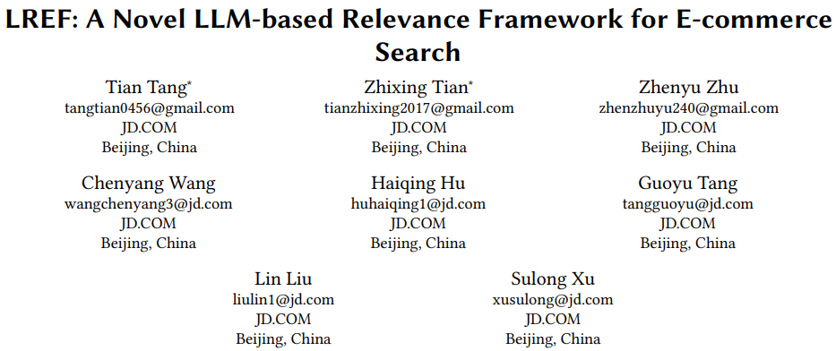
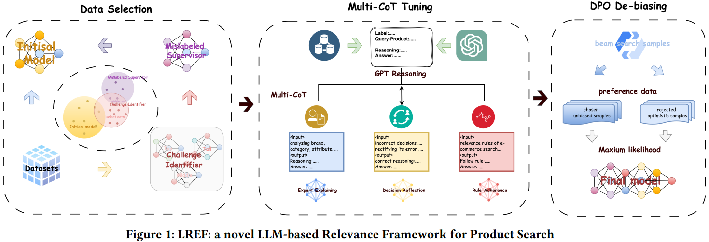
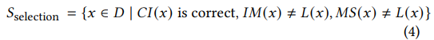
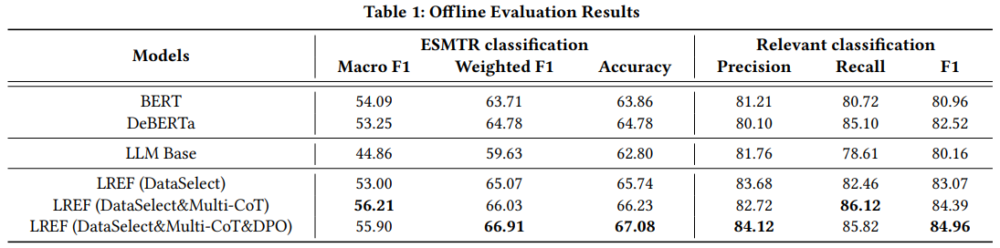
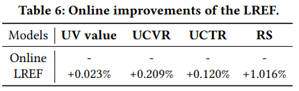

# 基本信息

* 论文标题：LREF: A Novel LLM-based Relevance Framework for E-commerce
* 作者单位：京东
* 论文链接：[https://arxiv.org/abs/2503.09223](https://arxiv.org/abs/2503.09223)
* 来源：WWW25

# Motivation：论文要解决的问题是什么

电商搜索相关性任务是指给定搜索词query和商品item，判断两者在语义上是否相关。针对这个问题，业界通常微调BERT来做判别式任务。随着LLM的兴起，大家都在尝试将LLM应用到搜索相关性任务上，但LLM做搜索相关性任务存在3个挑战：
* 如何获得高质量数据。对于大模型微调来说，开源大模型本身已经具备很强的世界知识了，针对常规的(q,i)相关性问题已经能比较好地处理。微调进一步提升大模型效果的关键在于如何准备高质量的(q,i)相关性数据。
* LLM微调的时候，如何增强LLM在电商场景下根据特定规则进行推理的能力，即如何激发大模型按一定规则进行推理，再判断相关性
* 大模型有时候过于仁慈，有时候倾向于把不相关的商品判断成很相关，如何纠正大模型的这种问题是个挑战

总之直接把LLM用到相关性判别问题上，有很多挑战，需要逐一解决。

# 数据筛选方法

首先需要认识到的是，电商相关性任务通常需要人工标注大量的(q,i,label)三元组数据来训练相关性模型。相关性label通常分为5档：Exact, Significant, Marginal, Trivial, and Irrelevant。

作者发现LLM本身已经具备比较强的通识的相关性判别能力，需要重点加强的是LLM针对难例的相关性判别能力，故需要从大量人工标注数据中筛选出难例进行微调。此外，人工标注数据中也存在一些噪声，需要把这些噪声过滤掉。总之，在数据筛选这个环节，核心目标就是如何从大量人工标注数据中筛选出高质量的难例样本。

如图Fig 1所示，作者微调了3个大模型来做数据筛选，3个大模型都是从开源的LLaMA-2-7B 开始微调：
* Initial Model (IM): 初始模型，从人工标注数据中随机采样(q,i,label)微调LLM得到。由于人工标注数据和线上曝光数据分布一致，即简单样本占大多数，故IM可识别常规简单的q-i相关性问题，但对长尾难例识别能力不足
* Challenge Identifier (CI): 把人工标注数据按照曝光分布划分成热门、腰部、尾部(q,i,label)，每一部分都采样等比例的样本，用来训练CI。其实本质上就是增加了腰尾部数据的占比，提升CI对中长尾样本（难例）的识别能力
* Mislabeled Supervisor (MS): 从人工标注数据中随机选一些样本(q,i,label)，问GPT当前标注结果label最有可能替换成哪个，如果GPT回答是label’，则说明label和label’都有可能是合理的。因此，进一步推测人工标注的时候，人类也可能出错，把label’误标成label（或反之）。故用(q,i,label’)数据微调MS，在后续数据筛选中，把MS预估结果作为潜在的错误结果

微调得到上述3个模型之后，最终筛选出来的样本如下，L(x)表示人工标注结果。下面的数据有两个含义：
* 难样本：IM预测错，CI预测对
* 去掉噪声样本：如上所述，MS预估结果是潜在的错误结果，所以对于MS(x)=L(x)的样本，人工标注的L(x)也是潜在错误样本，需要把这些样本去掉，即条件MS(x)≠L(x)

# 多CoT微调

经过上面的环节，我们已经拿到了高质量的难样本(q,i,label)，接下来开始正式微调LLM进行相关性判别任务了。由于LLM都是decoder-only架构，在相关性判别的时候，增加CoT能激发LLM的推理能力，提升判别效果。为此，作者设计了3个CoT微调任务：

* 专家解释：Expert Explaining Chain of Thought (EE-CoT)，把(q,i,label)喂给GPT，让GPT解释为什么q和i的相关性结果是label，得到EE-CoT，因此得到新的标注数据(q,i,label,EE-CoT)。微调相关性大模型的时候，喂给大模型(q,i)，让其输出EE-CoT和label。
* 遵守规则：Rule Adherence Chain-of-Thought (RA-CoT)，把(rule, q, i, label)喂给GPT，让GPT根据rule，推导出q和i的相关性是label的过程，得到RA-CoT，因此得到新的标注数据(rule, q, i, label, RA-CoT)。微调相关性大模型的时候，喂给大模型(rule, q, i)，让其输出RA-CoT和label。
* 决策反思：Decision Reflection Chain of Thought (DR-CoT)，对样本(q,i,label)随机生成错误结果incorrect decision，得到样本(incorrect decision,q,i,label)。把(incorrect decision,q,i,label)喂给GPT，让其分析incorrect decision为什么错误，并给出推导过程，得到DR-CoT，因此得到新的标注数据(incorrect decision,q,i,label,DR-CoT)。微调相关性大模型的时候，喂给大模型(incorrect decision,q,i)，让其输出DR-CoT和正确label。

简要总结一下，这个环节就是用GPT做CoT的伪标注，然后通过数据蒸馏的方式把CoT能力蒸馏到相关性大模型中。

# DPO纠偏

完成上面两步微调之后，作者发现相关性大模型仍然有9%的错误率，而且这些错误里面，有70%是乐观估计，即把不相关的预估成相关了。但是仔细分析LLM输出的beam search结果中，正确结果其实是在beam search路径中，只不过路径概率不是第一名。因此，作者设计了一个DPO纠偏环节，把这些错误样本，已经beam search中的正确样本，喂给DPO进行偏序学习。

这个环节感觉有点过拟合的意思了，针对测试集中出现错误的情况，不断调整策略，提升指标。虽然训练测试应该没过拟合，但优化过程有点这个意思。。。

# 实验结果

## 离线实验

离线实验结果如Table 1，把上面三个优化策略都用上的效果最好。有一个需要特别指出的是，BERT、DeBERTa、LLM Base都是用原始人工标注的所有样本进行微调的。结果发现LLM Base效果比BERT-based方法差很多，以此呼应introduction中说直接微调LLM效果甚至不如微调BERT。

## 在线实验

在线实验结果如Table 6所示，效率指标的提升比较小，重点是相关性满意度（Relevance Satisfaction）指标提升很大，这个指标是人工打标2万个base和test的q-i满意度评测出来的。

# 评论

* 可借鉴
    * 在大模型时代，数据质量很重要，本文前两个优化点本质上都和数据有关系，数据筛选直接关注高质量的难负例，CoT生成相当于借助了GPT的能力标注CoT过程。
    * 很多需要人工标注的事情也许都可以借助GPT来完成了。
* 可改进
    * 既然都以GPT作为金标准了，那还需要人工打标吗，直接用GPT标注数据然后蒸馏小LLM可以吗？
    * 第三个优化点具有普适性吗，为什么大模型会倾向于乐观？和前两步的数据分布有关系吗？

