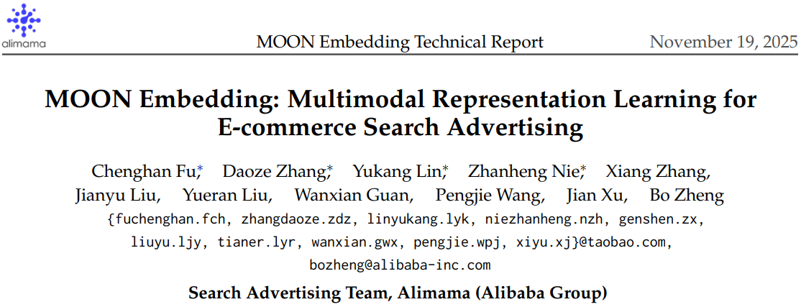
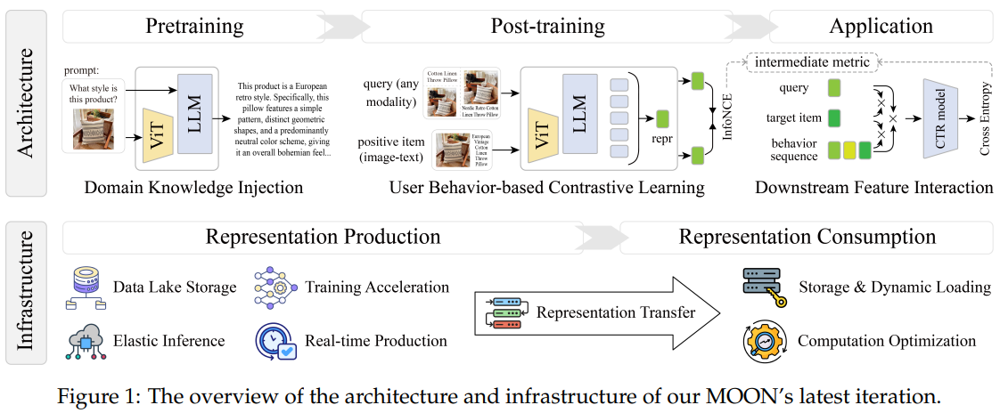
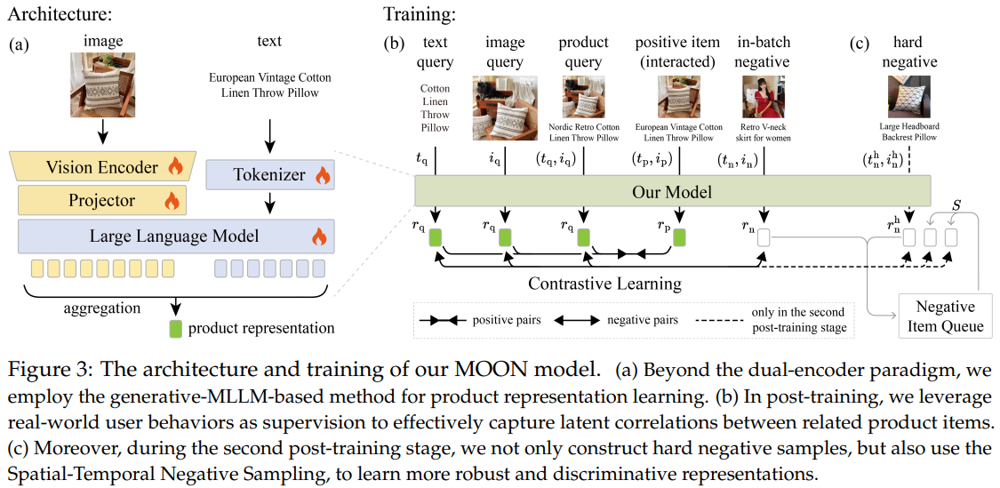
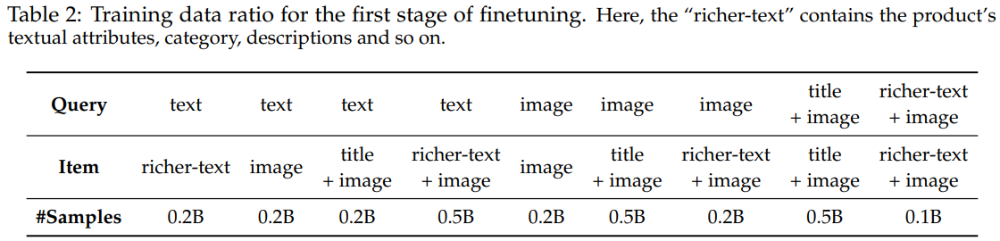
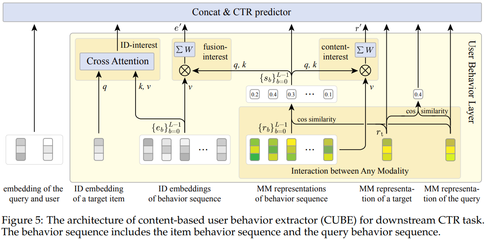
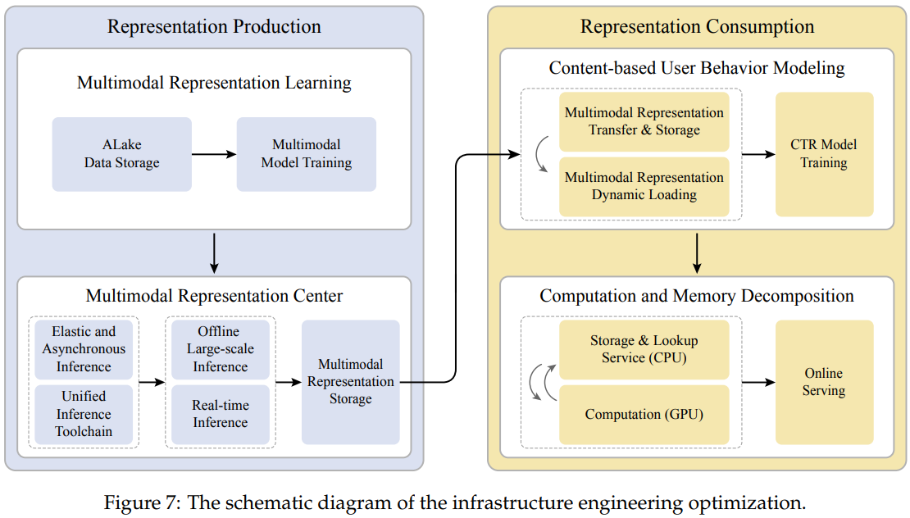

# 基本信息
* 论文标题：MOON Embedding: Multimodal Representation Learning for E-commerce Search Advertising
* 作者单位：阿里
* 论文链接：[https://arxiv.org/abs/2511.11305](https://arxiv.org/abs/2511.11305)
* 来源：arxiv

# Motivation：论文要解决的问题是什么
多模态信息在电商搜推系统中有很重要的作用，本文介绍了阿里在应用多模态信息过程中积累的实战经验，洋洋洒洒31页，介绍内容很多，核心围绕着多模态应用的三步走策略：“Pretraining, Post-training, and Application”，介绍了预训练方法、下游应用方法、工程架构优化等内容。

# 总体流程
总体流程如图Fig1所示，上面是算法流程，下面是工程架构。算法包括三个流程：MLLM预训练、多模态表征后训练、多模态表征下游应用。工程包括两个环节：表征生产、表征消费。

# MLLM预训练（Pretraining）
阿里并不是基于开源MLLM微调生产多模态表征，而是他们内部预训练了一个MLLM，叫TBStars-VL，是一个4B的模型。和通用MLLM一样，TBStars-VL也在通用数据集上进行过NTP的预训练，除此之外，TBStars-VL还在淘宝内部的电商数据上进行过预训练，预训练的任务主要是面向电商场景的QA任务，比如Fig1左上角展示的针对商品图片的描述、商品属性抽取、标题生成、图片主体识别等。这一阶段的预训练主要是给TBStars-VL注入电商领域知识。这部分论文介绍篇幅很短，没有具体细节。

# 多模态表征后训练（Post-training）
由于TBStars-VL是基于NTP任务训练好的生成式模型，没法直接产出多模态表征，故还需要进行多模态表征后训练，其实就是对比学习微调。

在这个环节，作者把TBStars-VL的生成式单向attention改成了双向attention，以输出层的mean pooling结果作为表征输出。训练任务是经典的对比学习+InfoNCE loss。

在正样本构造方面，本文使用了多种q2i数据，比如图搜图、文搜文、文搜商品（图文）等，协同信号使用了点击、加购、下单等信号。样本统计数据如Table 2所示。虽然本文挖掘了不同协同关系的q2i正样本，但没说这些数据具体怎么用的，是混在一起shuffle训的话，其实学了个四不像。不如每种q2i数据都单独训一套表征。

这一阶段对比学习训练的负样本就是in-batch负例。

完成上述后训练之后，作者后续还进行了一轮精调，即只用下单的q2i正样本，且对所有下单q2i进行了如下清洗：
* 相似度去重
    * 对于同一个item关联的多个正样本query，使用之前的模型产出q和i的表征，只保留(q,i)相似度最低的pair。作者认为相似度高的pair可能是热门的简单样本，所以只保留相似度最低即难度最大且长尾的(q,i)样本，加强对这部分数据的学习
    * 对训练集中的所有(q,i) pair，把属于同一个spu的sku样本合并，增加样本的多样性，同时避免batch内出现同spu的不同sku互为假负例的情况
    * 最后统计训练集中的(q,i)对应的类目分布，将训练样本的类目分布和线上曝光商品的类目分布对齐，对商品占比高的类目降采样
* NER去重
    * 对query和sku的标题文本进行NER，认为实体数量少于2个的文本蕴含信息太少，把这部分样本删掉

此外，这次精调还额外使用了负样本，包括2种负采样方法：
* 难负例采样。对于正样本(q,i) pair，把和i属于同一个类目的其他商品i’作为i的难负例。这一点我感觉难负例太强了，会出现很多假负例，比如搜“手机”，购买了“小米手机”，但并不意味着“华为手机”就和搜索词“手机”是负例关系。
* 时空负采样。听着很高级，但其实也是常规操作：时间负采样就是memory bank的思路，空间负采样就是把其他GPU上的emb gather到当前GPU作为负样本。

最后，这一阶段精调的loss也不再是InfoNCE loss了，而是circle loss，这个和InfoNCE loss有点类似，后续有空了研究清楚。

# 多模态表征应用（Application）
多模态表征在排序模型中的应用结构如图Fig 5所示，相对比较简单，就是用多模态表征和行为流的多模态表征计算相似度，然后用相似度对行为流进行加权求和。

# 工程架构优化
多模态应用的全链路周期很长，作者在每个环节都进行了很多工程优化，如下图Fig7所示。个人读下来这些优化也比较常规，大部分优化方法我们都用过。由于这部分不是算法关注的重点，不展开介绍了。

# 效果评估
在效果评估上，作者发现基于图像表征的搜索召回率可以作为优化表征模型的一个代理指标，能和下游排序任务的指标对应上。但是个人认为这个结论不具有普适性，而且这两个指标还是不太一样，搜索召回率本质上是一个召回任务，而下游是排序任务，对emb的细粒度区分能力要求更高。

# 评价
* 可借鉴
    * 最后精调使用的样本，使用(q,i)下单样本，并且进行了复杂的数据清洗，得到的数据质量很高，可以参考这些方法进行数据清洗
    * 最后精调使用了circle loss，说是能提升正负例的区分能力，后续可参考
* 可改进
    * 论文太长了，现在大厂都喜欢写很长的technical report，但是太长了可读性不太好，很多车轱辘话反复说，不够精简，而且重点不突出，创新性不突出
    * 对比实验严重不足，比如为什么需要用内部的TBStars-VL，电商数据pretraining的收益有多大，和直接微调开源MLLM的对比效果如何？
    * Q2I的难负例是否会造成很多假负例？
    * 最后精调的时候，为什么要用circle loss，和使用InfoNCE loss对比效果如何
    * 使用MLLM最后一层的mean pooling，这种和加特殊token的方法哪个更好？
    * 使用图像搜索召回率作为排序指标的代理指标，合理吗？具有普适性吗？
    * Table 3，recall@k指标，k越大recall@k越低，不合理吧，应该越高吧？

