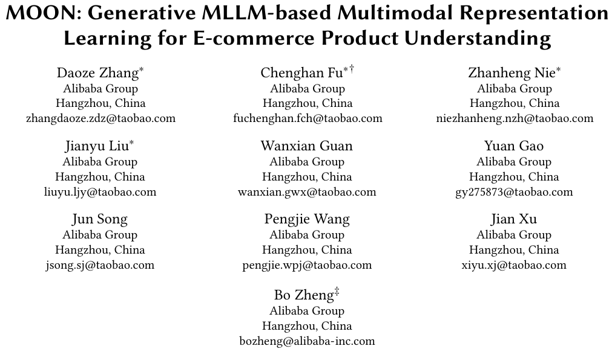
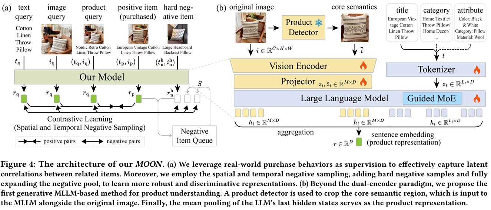
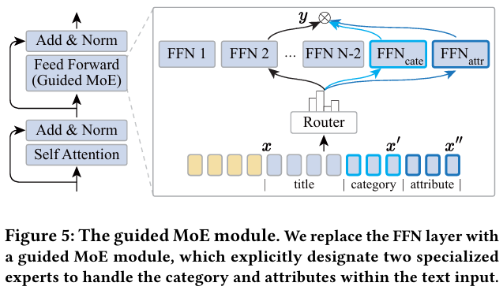
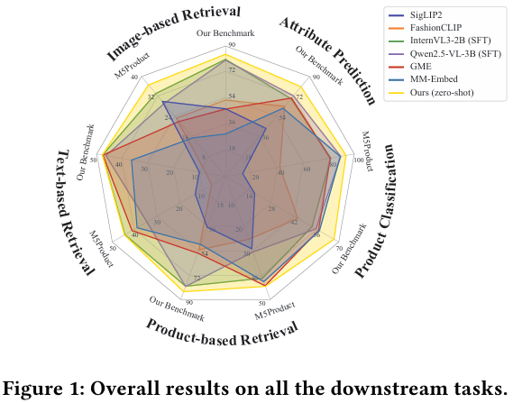

这篇文章和MOON技术报告有大量重复，建议先阅读[MOON技术报告读书笔记](https://bitjoy.net/posts/2026-04-18-taobao-moon-emb-technical-report-paper-reading/)。

# 基本信息
* 论文标题：MOON: Generative MLLM-based Multimodal Representation Learning for E-commerce Product Understanding
* 作者单位：阿里
* 论文链接：[https://arxiv.org/abs/2508.11999](https://arxiv.org/abs/2508.11999) 
* 来源：WSDM 2026

# Motivation：论文要解决的问题是什么
多模态信息在电商应用的挑战如下：
* 传统CLIP方法只能学习图片和文本的1对1关系，但是电商场景经常是一个商品标题对应多张商品图片，故传统CLIP已经不太能胜任这种场景，而MLLM可以
* 电商图片有很多噪声，比如背景、无关商品、促销信息等，需要去噪之后再进行表征学习
* 领域缺乏电商场景下通用多模态表征的benchmark数据集

# 对比学习预训练
如图Fig 4所示，整体模型结构和MOON技术报告中的基本一样：
* 样本构造：使用q2i下单信号构造正样本pair，使用同类目的其他商品作为难负例，使用时空负例采样扩大负例样本数量
* 训练任务：对比学习，InfoNCE loss
* 输入特征：包括标题、图片、类目、属性等特征
* 图片去噪：图片会先使用Qwen2.5-VL进行主体识别，主体识别时同时输入图片和商品标题，让模型提取出符合标题的图片主体。然后会把去噪前后的图片都输入到MLLM中进行表征学习
* 表征提取：使用MLLM最后一层所有token的hidden states进行mean pooling后得到

本文相比MOON技术报告的创新点在Fig 5，即作者把MLLM中的FFN改造成了MoE结构，作者认为输入给MLLM的特征太多，不同特征反应了商品在不同方面的特点，比如图片、标题、类目、属性等，因此这个MoE让模型能动态自适应关注商品的不同特征。

# 结果
因为本文的目标是训练通用多模态表征，为了验证通用表征的效果，作者在2个数据集的3个任务上进行了系统性评测，结果如图Fig 1所示，本文的方法比传统方法以及其他MLLM方法都要好。通过消融实验发现，主要提升来自3个创新点：1）图片主体识别；2）MoE；3）扩充负例。

# 评论
* 可借鉴
    * 使用MoE让emb关注商品不同特征，这个思路挺好的
* 可改进
    * 论文整体创新性不够，MLLM生产商品多模态表征的思路很多年前都有了，快手的QARM，小红书的NoteLLM很早就发表了，但本文完全没有引用
    * 电商图片使用主体识别进行去噪的思想之前沃尔玛也发表了，本文没有任何引用：[https://bitjoy.net/posts/2025-10-08-vl-clip-paper-reading/](https://bitjoy.net/posts/2025-10-08-vl-clip-paper-reading/)。而且图像去噪需要使用另一个MLLM大模型，会增加模型推理和部署的成本，有办法把这一步合并到主模型中吗？
    * 本文第三个创新点提出了通用多模态表征评测benchmark，但并没有提供数据和代码链接
    * 对比学习样本只有下单的Q2I信号，没有点击、加购信号，也没有I2I信号。难负例是同类目其他商品，有假负例的风险很高。比如Q=“手机”，I=“华为手机”，那用“小米手机”作为难负例肯定是不合适的。
    * MoE结构的Router输入的是商品的所有特征x，感觉不太合理，感觉可以只输入类目信息，因为不同类目的表征关注重点不同，比如服饰类目更多关注图片，而3C数码更多关注标题属性等
    * 离线对比实验的时候，并没有说明不同多模态模型输出的dimension是否一致，是否公平
    * 没有线上AB效果
