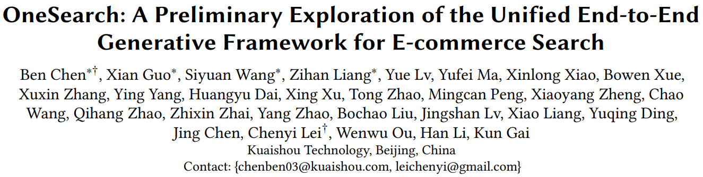
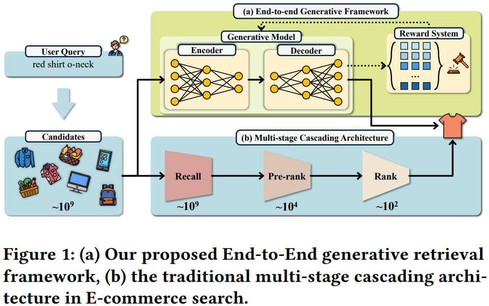
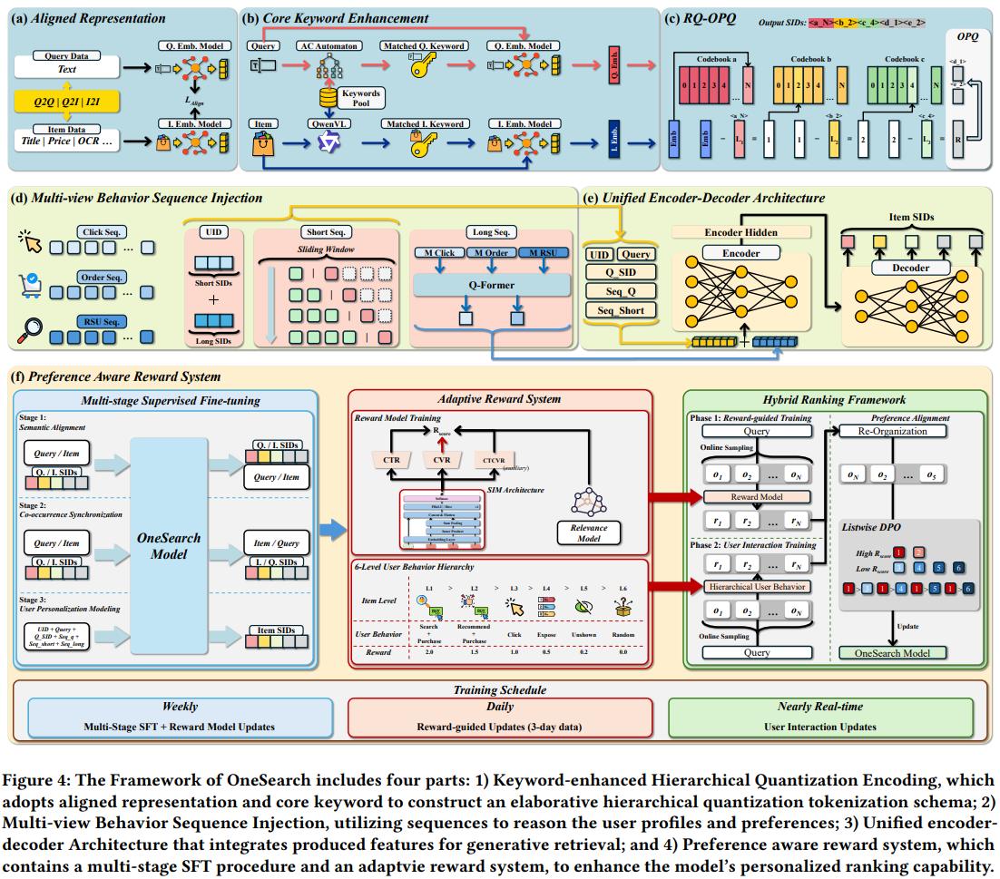
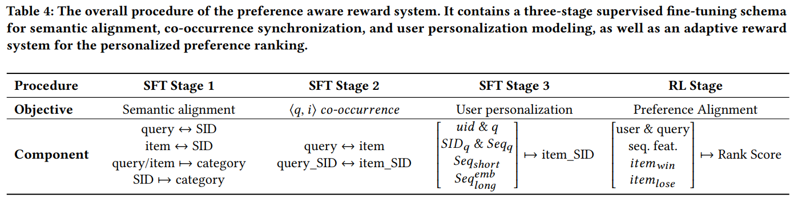
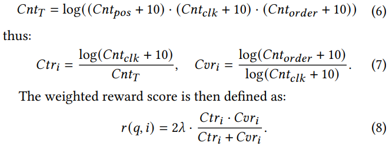

# 基本信息

* 论文标题：OneSearch: A Preliminary Exploration of the Unified End-to-End Generative Framework for E-commerce Search
* 作者单位：快手
* 论文链接：[https://arxiv.org/pdf/2509.03236](https://arxiv.org/pdf/2509.03236)
* 来源：arxiv
* ICLR2026被拒，审稿意见：[https://openreview.net/forum?id=eDh0K9YNoL](https://openreview.net/forum?id=eDh0K9YNoL)

# Motivation：论文要解决的问题是什么

如图Fig1所示，传统搜索系统需要依次经过召回、粗排、精排等多个级联环节，存在计算碎片化、且不同阶段目标不一致的问题，导致整个系统效率较低且上限较低。本文提出的OneSearch就是整个搜索系统只使用一个生成式模型，直接从用户请求端到端生成候选商品，从而取代召回-粗排-精排这种级联系统。

# 整体结构图

整体结构图如Fig4所示，整体思路如下：
* 表征体系，对应Fig4a-c：把庞大且稀疏的item id转换成紧凑且稠密的semantic id（SID），方便LLM模型做scaling up
* 特征体系，对应Fig4d：把电商中异构的用户、商品、搜索等各种特征统一到SID体系中，即统一LLM输入token
* 模型架构，对应Fig4e：有了统一的输入token表示，模型就是各种Transformer变种，因为是生成式，所以必须要有decoder
* 模型训练，对应Fig4f：训练生成式模型的步骤通常是先SFT预训练，再RL微调，重点关注本文设计的预训练和微调任务

# SID生成方法

如图Fig4a-c所示，SID生成通常需要两个步骤，一是预训练embedding模型，二是将产出的embedding通过量化方式压缩成SID。本文在基础方法上进行了若干优化，具体如下：

## 预训练表征模型

该步骤通常基于开源的表征模型，使用电商的协同信号进行微调，使得embedding既能表征语义含义，又能感知电商的协同信号。

具体来说，本文基于ItemCF、Swing等召回模型，从线上日志中收集了大量相似的q2q、i2i、q2i的二元组作为正样本pair，然后如图Fig4a所示，使用对比学习的方式微调开源的BGE表征模型。本文做的几点改进如下：
* 特征层面，使用的特征包括：query text, item title, item price, keywords, OCR (image-to-text), as well as the statistical business characteristics, such as the number of clicks, add-to-cart, and purchases during a certain time。既有文本特征，也有数值统计特征，虽然没有用原始图片，但是有图片的OCR特征
* 样本层面，用开源的BGE对所有的正样本pair先进行粗过滤，把相似度<0.6的pair去掉，只保留高质量正样本pair
* 微调任务层面，包括q2q、i2i、q2i，这三个是常规的对比学习任务，另外还新增了2个特殊任务
    * rank任务：q2i分为show、click、order不同级别，且使用margin loss区分三者重要层度：show<click<order
    * relevance任务：使用LLM打标query和item的相关性分，然后让BGE微调学习这个相关性分，增强表征的相关性判别能力
* 最后所有loss融合如下：

$$\mathcal{L}_{\text{align}} = \lambda_1 \cdot \mathcal{L}_{\text{q2q}} + \lambda_2 \cdot \mathcal{L}_{\text{i2i}} + \lambda_3 \cdot \mathcal{L}_{\text{q2i}} + \lambda_4 \cdot \mathcal{L}_{\text{rank}} + \lambda_5 \cdot \mathcal{L}_{\text{rel}}, \quad (1)$$

## 关键词增强的query和item表征

作者认为query和item的文本描述中存在大量堆砌甚至冲突的属性，为了去噪且提取核心关键属性，作者使用Qwen-VL提取商品的核心关键词k，然后把这些关键词输入到上一步微调的BGE模型中，产出多个关键词的表征\(e_k^j\)，然后将多个关键词表征求平均，最后再和商品原始表征\(e_i\)求平均，得到关键词增强的商品表征\(e_i^o\)。流程见图Fig4b，公式如下：

$$e_q^o = \frac{1}{2} \Big( e_q + \frac{1}{m} \sum_{i=1}^m e_k^i \Big), \quad e_i^o = \frac{1}{2} \Big( e_i + \frac{1}{n} \sum_{j=1}^n e_k^j \Big). \qquad (2)$$

对于query，为了支持在线快速提取关键属性，作者直接使用AC自动机从关键词库中进行快速匹配，然后产出关键词的表征，求平均之后再和原始query表征平均。

通过上述方法，作者得到了关键词增强的query和item表征。

## RQ-OPQ量化

为了支持GR生成式的范式，需要把query和item都转换成token形式，所以需要把query和item的表征通过量化方式转换成semantic id，即SID。

如图Fig4c所示，本文在标准的3层RQ-KMeans基础上，做了如下改进
* 把每层均等的码表大小改成梯度减小的形式，例如把[1024, 1024, 1024]改成[2048, 1024, 512]，作者发现前面的层emb携带信息更重要，所以需要更大的码表。这个点我们之前也发现了，而且离线分析发现，越往后层，emb的区分度越小，极端情况下甚至和均匀分布类似了，所以越往后层，信息密度越低，需要的码表也越小。
* 考虑到KMeans聚类不均匀的问题，OneRec实现了balanced-KMeans。本文发现强制在所有层都进行balance，会破坏语义相似关系。因此本文只在最后一层进行balance操作。
* 标准的RQ-KMeans执行完最后一层的量化之后，把最后一个残差丢掉了，导致相似表征的SID冲突率比较高，本文把最后一层的残差用OPQ量化成2个SID，最终SID长度为3+2=5。作者发现加上OPQ之后，SID的独立编码率显著提升，即SID冲突率显著下降，且Recall和MRR指标显著提升。

本文评估SID的指标包括：码本利用率CUR、SID独立编码率ICR、使用SID表征进行召回和排序的Recall和MRR指标。

# GR输入特征构造

如图Fig4d所示，GR输入特征及构造方法如下：
* UID：用户ID。传统的UID使用随机hash的id来表示用户，存在hash冲突且不同UID没有语义相似关系。本文使用用户的短期流short（近期点击行为）和长期流long（长期下单行为）的SID加权求和来表示，权重\(\lambda_i\)和\(\mu_j\)是随时间衰减的归一化公式，越靠近当前请求时间，权重越大。由于前面的RQ-OPQ，单个SID的长度是5，所以把\(SID_{short}\)和\(SID_{long}\)拼接起来的UID长度是10。通过这种方法，UID融入了用户的长短期语义特征

$$\begin{equation}
\begin{aligned}
SID_{\text{short}} &= \lceil \sum_{i=1}^m \lambda_i \cdot SID_{s_i} \rceil, \quad \text{where } \lambda_i = \frac{exp(\sqrt{i})}{\sum_{i}^m exp(\sqrt{i})}, \\
SID_{\text{long}} &= \lceil \sum_{j=1}^n \mu_i \cdot SID_{l_i} \rceil, \quad \text{where } \mu_j = \frac{exp(\sqrt{j})}{\sum_{j}^n exp(\sqrt{j})}.
\end{aligned}
\tag{3}
\end{equation}$$

* 显式短期行为：直接把用户近期的搜索query和点击item转换成SID输入到GR。这个模块还对短期行为流进行了滑动窗口处理，这个操作没明白什么意思。
* 隐式长期行为：包括用户的点击click、订单order、搜索RSU行为流，每一个行为流都使用RQ-KMeans转换成3层SID，注意这里没有用OPQ。然后把3层SID的每一层SID的聚类中心表征相加，得到每种行为流的长期表征。然后使用QFormer压缩提取出\(N_M\)个代表表征。

$$
\begin{equation}
\begin{aligned}
\mathbf{M}_{click} &= \left\{ \sum_{i=1}^m \text{Item}_{emb}^{L_1}, \sum_{i=1}^m \text{Item}_{emb}^{L_2}, \sum_{i=1}^m \text{Item}_{emb}^{L_3} \right\} \\
\mathbf{M}_{order} &= \left\{ \sum_{i=1}^n \text{Item}_{emb}^{L_1}, \sum_{i=1}^n \text{Item}_{emb}^{L_2}, \sum_{i=1}^n \text{Item}_{emb}^{L_3} \right\} \\
\mathbf{M}_{RSU} &= \left\{ \sum_{i=1}^k \text{Item}_{emb}^{L_1}, \sum_{i=1}^k \text{Item}_{emb}^{L_2}, \sum_{i=1}^k \text{Item}_{emb}^{L_3} \right\} \\
\mathbf{Q} &= \text{QFormer}(\mathbf{M}_{click}, \mathbf{M}_{order}, \mathbf{M}_{RSU})
\end{aligned}
\tag{4}
\end{equation}
$$

通过上述操作，作者把异构的输入特征转换成统一的SID token，如图Fig4e左边，包括UID、Query词本身、Query的SID（Q_SID）、短期搜索流的SID（Seq_Q）、短期点击流的SID（Seq_Short）、隐式长期流。此外在开头结尾加了特殊[BOS]、[EOS]，在长短期特征之间加了[SEP]等。

# GR主干模型

如图Fig4e，GR主干模型是一个经典的Transformer encoder-decoder结构。通过上述输入特征，生成用户感兴趣的候选商品的SID。是一个生成式的模型。

# 偏好对齐过程

有了输入特征和模型结构，接下来看一下本文的训练过程。主要包括三阶段SFT和一个RL微调，如下Table 4。

## 多阶段SFT

SFT目的是让GR具备基本的生成能力，如图Fig4f左图，包括3类任务：
* 语义对齐：query生成query的SID、item生成item的SID、以及由SID生成原始的query或item文本、query或item生成类目，最后一个相当于类目预测任务，为模型注入相关性判别能力
* 协同对齐：根据线上挖掘出来的query和item的共现pair，让query生成共现的item，或者让item生成共现的query
* 用户个性化对齐：这是SFT的核心任务，就是根据GR的输入，生成用户感兴趣的商品SID，但是这一步没有说用点击还是下单的商品SID

## 奖励模型

SFT只是让GR具备了基本的生成能力，为了提升生成的质量，在RL微调阶段，本文设计了2个奖励模型来指导微调过程
* 基于传统精排模型的奖励信号：如图Fig4f中图的上半部分，这里包含一个基于SIM结构的传统精排多目标模型，和一个相关性模型，在RL微调GR模型时，以传统精排模型和相关性模型的融合分作为奖励信号，公式如下，其中的\(S_{Rel}\)就是相关性得分。因为相关性在搜索系统中很重要，为了确保生成的结果符合相关性约束，特地把\(S_{Rel}\)的权重放大了10倍，即\(10\cdot\lambda_4\)

$$Rscore = \lambda_1 \cdot CTR + \lambda_2 \cdot CVR + \lambda_3 \cdot CTCVR + 10 \cdot \lambda_4 \cdot S_{Rel}, \quad (10)$$

* 基于用户交互行为的奖励信号：如图Fig4f中图的下半部分，这里定义了L1~L6的六档奖励打分，比如商品在搜索域下单得2分，在推荐域下单得1.5分等。作者基于一个假设，如果一个商品的CTR和CVR比较高，那么它的奖励也应该比较高。综合前面两者，作者用一个融合公式同时把奖励打分、CTR、CVR融合得到一个最终的偏好打分，如下，其中的\(\lambda\)就是六档打分权重。

## RL微调

基于前面SFT得到的基础模型，和奖励模型，作者使用DPO进行RL微调，公式如下：
$$
\begin{equation}
\begin{split}
\mathcal{L} = -\mathbb{E} \Bigg[ & \log \sigma \bigg( \log \sum_{i_l \in \mathcal{I}_l} \exp \Big( rw_{\Delta} \\
& \max \big(0, \hat{r}_{\theta}(x_u, i_w) - \hat{r}_{\theta}(x_u, i_l) - \delta \big) \Big) \bigg) + \alpha \log \pi_{\theta} (i_w | x_u) \Bigg],
\end{split}
\tag{11}
\end{equation}
$$

具体的训练过程是，天级别使用基于传统精排模型的奖励信号，在线流式更新的时候使用基于用户交互行为的奖励信号。

# 评价

* 优点
    * RQ-KMeans的阶梯码表大小有道理
    * 提供了一个完整的搜索场景的GR框架，主要包括：query/item量化成SID，所有异构输入特征通过SID全部统一成token输入GR主干，模型训练包含SFT和RL微调。
    * 针对搜索场景进行了专门的优化：考虑了Query，有大量Query和Item的对齐任务，SFT和奖励信号中都考虑了相关性约束。
    * 论文一作在小红书提到Onesearch在快手已经推全，已经取代了传统排序系统中召-粗-精的多级级联模式，线上只有这一个模型了，已经没有老的精排模型了* 
* 不足&疑问
    * 表征预训练的正样本pair由ItemCF和Swing模型产出，是否受到召回模型的上限限制？
    * 用的表征模型BGE比较弱，而且没有用原始图片特征，只用了图片的OCR特征。
    * BGE微调任务太多了，不同任务会不会互相影响，没有讨论和消融
    * 是否有对表征预训练的query和item先提取关键词然后预训练呢？如果觉得商品属性有堆砌的问题，按理说对表征预训练的样本进行前置的清洗，比现有的后置加关键属性表征的方法更合理？
    * 加一个OPQ，相当于多加2层SID，独立编码率ICR肯定会提升，应该和多加2层的原始RQ-KMeans比较，到底最后2层是用OPQ还是直接增加RQ-KMeans更好？
    * 没有说明Onesearch的参数量，1B？也没讨论scaling law？为什么效果好不知道。
    * GR SFT的时候，用点击还是下单的商品SID作为监督信号，这个没说。
    * 使用传统精排模型作为奖励信号，导致GR的效果被传统精排模型锁死？如何超越传统精排模型？
    * 文中的两个奖励信号，哪个更好？
    * 文章篇幅太长，内容太多，导致很多细节描述不清楚；以及创新点不明确，不知道哪些是已有方法的应用，哪些是本文提出的新方法。OpenReview上的审稿意见说得最多的一点就是论文写作太差了。。。
