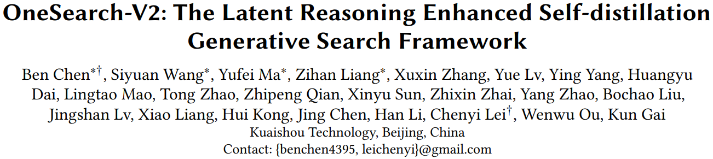
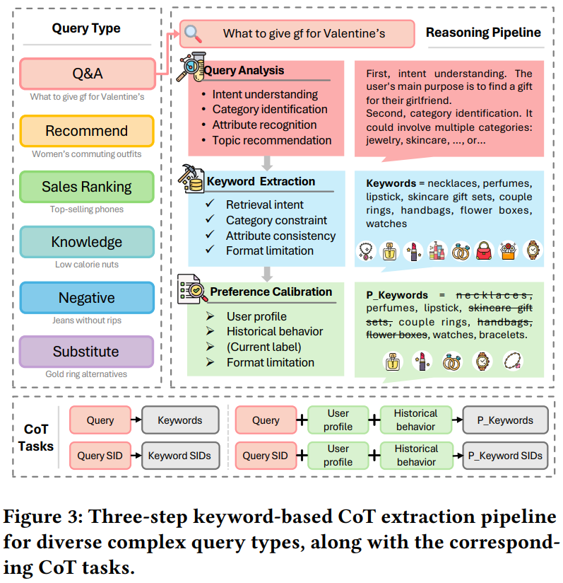
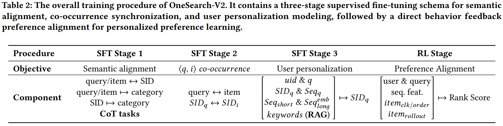
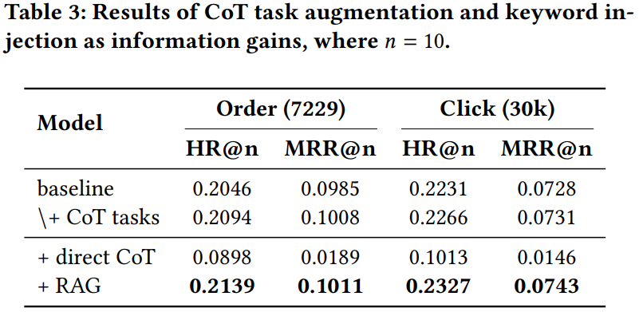
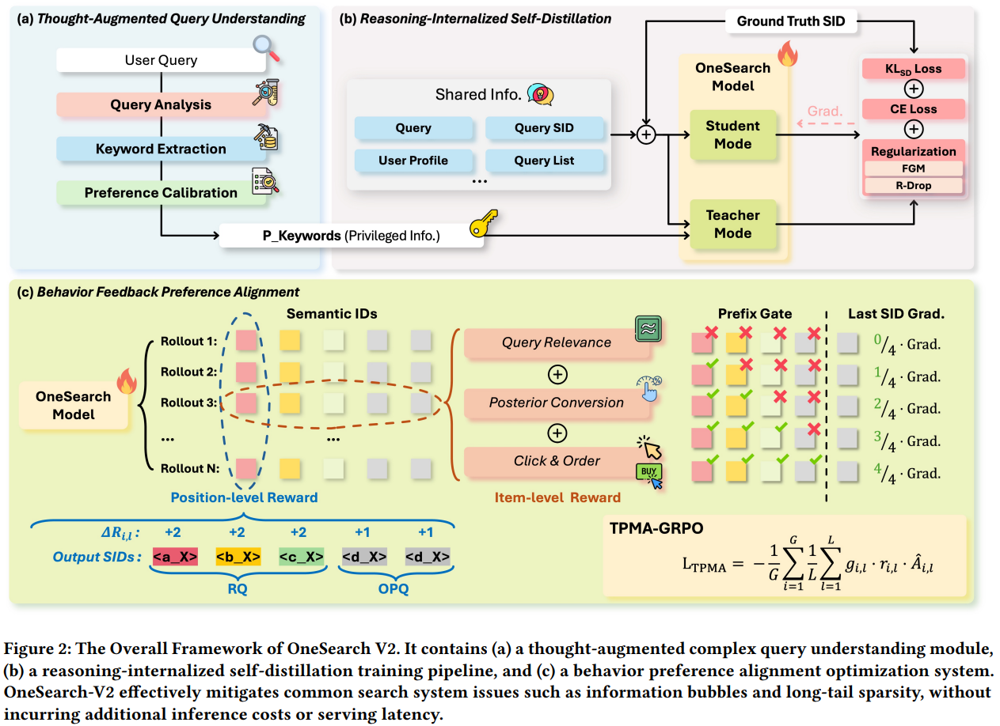
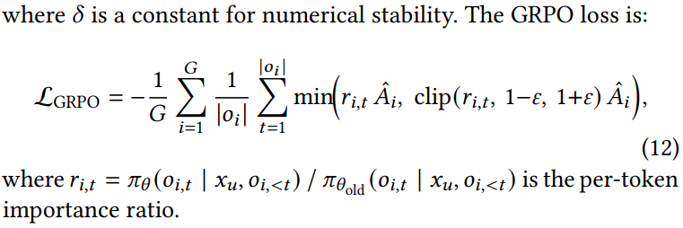
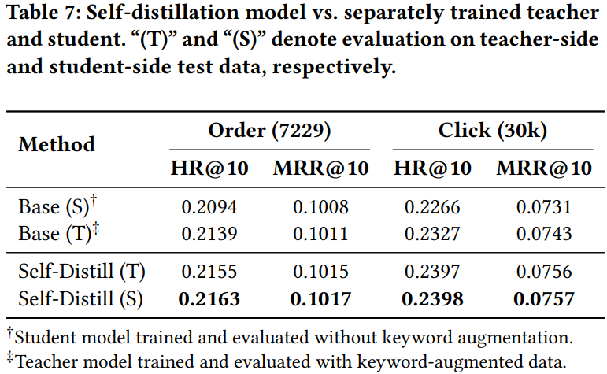

这篇论文是OneSearch-V1的升级版，建议先看[OneSearch-V1的论文解读](https://bitjoy.net/posts/2026-05-24-kuaishou-onesearch-v1-paper-reading/)。

# 基本信息
* 论文标题：OneSearch-V2: The Latent Reasoning Enhanced Self-distillation Generative Search Framework
* 作者单位：快手
* 论文链接：[https://arxiv.org/abs/2603.24422](https://arxiv.org/abs/2603.24422) 
* 来源：arxiv

# Motivation：论文要解决的问题是什么

OneSearch-V1上线之后，存在如下三个问题：

* 对复杂query的理解能力不够。复杂query包括两部分，一部分是头部泛词query，比如“室内健身器材”，这种query太泛了，query可能和很多商品都有关联，导致GR不知道召回哪个（which to retrieve）。另一部分是尾部稀有query，比如“没有破洞的牛仔裤”，这种query很长有很多约束条件，比如有否定、有问句等，导致GR难以理解，不知道该召回什么（what can be retrieved）。
* 个性化推理能力不足。如果说上一个问题是对复杂query本身的理解，那么这个问题就是结合用户个性化的query理解。比如某用户对特定品种的鲜花过敏，当该用户搜索“当季鲜花”时，需要首先推理出现在的季节，然后推理出这个季节流行的鲜花，最终判断这种鲜花和用户过敏的鲜花是否同品种。如果是同品种，即使这种鲜花是当季热销，也不能展示给用户。因此，这一问题考验GR结合用户个性化的推理能力。
* 奖励模型性能不足。OneSearch-V1的奖励模型依赖传统精排模型，效果受限。此外常规的奖励模型对item整体一个奖励得分，但是item是通过SID序列组成的，对item整体进行奖惩的话，相当于对所有位置的SID都一视同仁，无法区分不同位置SID的难度和重要性。

所以小结一下，OneSearch-V2重点要增强的是GR的reasoning推理能力，无论是对query的理解，还是对user的理解，都需要强大的推理能力。另外奖励模型的更新就是常规操作肯定要升级的。

# 思考增强的Query理解
为了增强GR对复杂query的理解能力，本文首先利用LLM（Qwen3-32B）对query进行理解和分析，把分析结果存成CoT；然后构造CoT SFT微调任务，通过CoT微调GR，把LLM对复杂query的理解能力注入到GR中。

具体来说，如图Fig3所示，利用LLM对query进行如下3个步骤的分析：
1.	Query分析（Query Analysis），包括四个维度：意图理解、类目预测、属性识别、主题推荐，其中意图理解需要分析本次搜索的意图是商品搜索、店铺搜索、还是短视频直播这些。
2.	对于意图理解是商品搜索的query，再次进行关键词抽取（Keyword Extraction）：通过LLM推理出和query相关的关键词，需要考虑检索意图、类目约束、属性一致性和格式约束等。
3.	偏好校准（Preference Calibration）：基于用户的基础信息和历史行为流，对上一步推理出来的关键词进行增删改，只保留和用户相关的关键词

上述三个步骤是依次串行进行的，上一步的输出作为下一步的输入，一步步不断细化分析扩展得到与Query相关的个性化的关键词。其中第二步得到的是非个性化的关键词，即<query, keywords>元组；第三步得到的是个性化的关键词，即<query, user, keywords>。通过这些数据就可以构造query→keywords的四类CoT任务，如图Fig3底部。进一步地，在SFT微调GR的第一阶段，加入这些CoT微调任务，得以显著增强GR对复杂query的理解能力，如下表Table2的stage1加粗部分。

小结一下，这个模块的核心是利用更大的LLM标注出一些与query/user相关的keywords，然后通过CoT SFT的方式把LLM的推理能力蒸馏到GR中。

# 自蒸馏赋予GR内生推理能力

## 预实验

作者在OneSearch-V1（即下表Table 3中的baseline）的基础上，新增了上一节介绍的CoT微调任务（即\\+CoT tasks），结果表明各项指标都有提升，说明增强GR的推理能力是有帮助的。但是CoT tasks中的CoT毕竟来源于LLM离线打标，耗时很长，不可能进行在线实时推理。如果能将LLM对query的推理能力内化到GR模型中，则可以省掉LLM对query的推理打标，显著节省链路耗时。

为此，作者首先做了两个预实验，如表Table 3所示：
* +direct CoT：即直接用baseline做推理，然后基于推理CoT进行生成式搜索
* +RAG：在baseline基础上，把LLM对query推理出来的keywords作为额外特征输入到GR中，再进行生成式搜索

作者发现，直接让GR进行CoT推理的+direct CoT效果很差，说明现有GR缺乏推理能力。而把LLM推理出来的keywords作为额外特征的+RAG效果很好，说明LLM推理能力对GR很有帮助。

\\+CoT tasks有效果已经说明通过CoT SFT的方式能够提升GR的效果，本节进一步利用自蒸馏的方式增强GR的推理能力。

## 自蒸馏

自蒸馏的思想也比较简单，简单理解就是优势特征蒸馏。如图Fig2a所示，这部分就是上一节介绍的利用LLM推理出扩展keywords的过程。Fig2b的Shared Info就是OneSearch-V1的输入特征，而Fig2a产出的扩展keywords相比于Shared Info就是优势特征。

如图Fig2b所示，教师模型和学生模型共享相同的模型参数，他们都有Shared Info作为公共的特征输入，但是教师模型还多包含扩展keywords作为优势特征输入。根据上面Table 3的结果，+RAG就是教师模型，它的效果明显好于学生模型。自蒸馏的过程就是把包含优势特征的教师模型蒸馏到学生模型上。

形式化描述如下。学生模型输入：

$$
x^{(S)} = (\text{uid}, q, \text{SID}_q, \text{Seq}_q, \text{Seq}_{\text{short}}, \text{Seq}_{\text{long}}^{\text{emb}}). \tag{2}
$$

教师模型输入：

$$
x^{(T)} = (\text{uid}, q, \text{SID}_q, \text{Seq}_q, \text{Seq}_{\text{short}}, \text{Seq}_{\text{long}}^{\text{emb}}, \mathbf{kw}), \tag{1}
$$

学生模型和教师模型的输出：

$$
z^{(T)} = \mathcal{M}_{\theta}(y \mid x^{(T)}), \quad z^{(S)} = \mathcal{M}_{\theta}(y \mid x^{(S)}). \tag{3}
$$

通过KL loss拉近学生模型和教师模型的输出，从而达到教师模型对学生模型的蒸馏：

$$
\mathcal{L}_{\text{KL}} = \frac{1}{|\mathcal{V}|} \sum_{t \in \mathcal{V}} \text{KL} \left( \text{softmax}(z_t^{(T)} / \tau) \parallel \text{softmax}(z_t^{(S)} / \tau) \right) \cdot \tau^2, \tag{4}
$$

此外，学生模型和教师模型各自都有基本的对齐label的交叉熵损失。对于学生模型，汇总的loss如下，第一项是对齐label的loss，第二项是蒸馏loss：

$$
\mathcal{L}_{\text{base}} = \mathcal{L}_{\text{CE}}(z^{(S)}, y) + \alpha_{\text{KL}} \cdot \mathcal{L}_{\text{KL}}, \tag{5}
$$

## 辅助loss增强蒸馏训练稳定性

由于学生模型相比教师模型缺少重要的优势特征（keywords），但是蒸馏loss又强迫两者输出分布一致，导致学生模型的训练很困难，稍有扰动就会导致训飞，因此作者对蒸馏训练施加了多个辅助loss，以增强训练的稳定性。

* R-Drop正则增强输出一致性。Dropout的思想是随机mask一些网络参数，增强模型的泛化能力。但是前面提到学生模型训练不稳定，一些微小的扰动会导致输出很不一样。所以R-Drop的思想也很简单，就是让相同的输入过两次前向，则由于Dropout的存在，模型输出是不一样的。R-Drop通过对两次输出施加对称的KL loss，强制拉近两次输出的分布，让模型对dropout扰动更加鲁棒，增强输出结果的一致性。

$$
\mathcal{L}_{\text{R-Drop}} = \frac{1}{2} \left[ \text{KL}(P_1 \parallel P_2) + \text{KL}(P_2 \parallel P_1) \right], \tag{6}
$$

* FGM正则增强输入鲁棒性。加上R-Drop的loss之后，学生模型的loss变成了：\(\mathcal{L}_{\text{base}} = \mathcal{L}_{\text{CE}} + \alpha_{\text{KL}} \cdot \mathcal{L}_{\text{KL}} + \alpha_{\text{R}} \cdot \mathcal{L}_{\text{R-Drop}}\)。FGM是指在第一次前向反向传播用\(\mathcal{L}_{\text{base}}\)，然后基于下面公式算出\(\mathcal{L}_{\text{base}}\)对embedding的梯度，然后用\(e+r_{\text{adv}}\)（e是指emb参数）更新emb参数，再算一遍模型输出。\(\mathcal{L}_{\text{adv}}\)就是计算两次输出的KL loss。相当于对emb做微小扰动，然后拉近扰动前后的输出分布，降低模型对emb扰动的感知。High-level理解R-Drop是减小对Dropout模型参数的影响，FGM是减小对emb参数扰动的影响。

$$
r_{\text{adv}} = \epsilon \cdot \frac{\nabla_e \mathcal{L}_{\text{base}}}{\left\| \nabla_e \mathcal{L}_{\text{base}} \right\|_2}, \tag{7}
$$

* 最终的优化目标即把上述loss相加如下：

$$
\mathcal{L}_{\text{SDFT}} = \mathcal{L}_{\text{CE}} + \alpha_{\text{KL}} \cdot \mathcal{L}_{\text{KL}} + \alpha_{\text{R}} \cdot \mathcal{L}_{\text{R-Drop}} + \mathcal{L}_{\text{adv}}, \tag{8}
$$

# 基于行为反馈的偏好对齐
OneSearch-V1在偏好对齐阶段有两个主要的问题：一是依赖传统精排模型作为奖励模型；二是奖励得分是item-level的，不是position-level的。针对第二点展开介绍，item-level的奖励是例如：预测出来item 1错误得0分，item 2正确得1分，item 3错误得0分…是针对item整体的奖励分数。但是GR是基于SID进行position-level的生成过程，而且一个item的SID seq长度较长为5。如果item 1是前4个SID正确，只在最后一个SID错误；而item 3在第一个SID就已经错误了。在这种情况下，item 1的得分不应该完全是0分，而且应该比item 3的分数更高。因此，position-level的奖励是针对生成的每一个position位置设计奖励，更加细粒度地区分不同的生成结果的优劣。具体策略如下。

## 复合奖励设计
这个奖励模型仍然保留item-level的，但是取消对传统精排模型的依赖，而是直接来源于用户反馈行为。具体来说，复合奖励包括如下三个来源：
* 相关性奖励\(R_{\text{Rel}}\)，使用现有的相关性模型对query和生成的item判断相关性，用相关性打分作为这部分奖励。快手的相关性分4档：3-Excellent, 2-Related, 1-Mismatch and 0-Irrelevant.
* 后验转化奖励\(R_{\text{CTR}}\)，这部分和OneSearch-V1中基于用户交互行为的奖励信号一致，可以理解为item单边的效率指标
* 点击&订单分\(R_{\text{C&O}}\)，这部分是用户与生成商品的交叉奖励分数，如下公式9，如果生成的商品在用户历史订单行为中，则得分\(V_o\)；如果生成的商品在用户历史点击行为中，则得分\(V_c\)；否则得分为0。

$$
R_{\text{C&O}}(o_i) = 
\begin{cases} 
V_o, & \text{if } o_i \in \mathcal{S}_{\text{order}}, \\ 
V_c, & \text{if } o_i \in \mathcal{S}_{\text{click}} - \mathcal{S}_{\text{order}}, \\ 
0, & \text{otherwise}, 
\end{cases} \tag{9}
$$

最后，生成商品的最终奖励分是上述三个得分的加和：

$$
R_{\text{item}}(o_i) = R_{\text{C&O}}(o_i) + R_{\text{CTR}}(o_i) + R_{\text{Rel}}(o_i), \tag{10}
$$

简单理解：\(R_{\text{Rel}}\)表示商品与query的相关性奖励，\(R_{\text{CTR}}\)表示商品本身的效率奖励，\(R_{\text{C&O}}\)表示商品和用户的个性化匹配奖励。

## 标准的GRPO优化

标准的GRPO优化对同一个输入采样G次，得到G个输出\(\{o_i\}^G_{i=1}\)，然后计算每个输出结果相比G个输出结果的平均情况的优势得分：

$$
\hat{A}_i = \frac{R_i - \text{mean}_{j \in [G]}(R_j)}{\text{std}_{j \in [G]}(R_j) + \delta}, \tag{11}
$$

最后计算GRPO loss如下：

可以看到，在公式12中，不同token位置t的偏好得分\(\hat{A_i}\)是一样的。但是正如前面提到的，SID序列包含5个token，从前到后是对该item由粗到细的定位过程。因此对不同位置的token预测的难度各不相同，且不同token的重要性也各不相同。通常来说，前面的token预测难度更大，重要性更高。因此优势得分也应该是position-level的，而不是item-level的。

## 位置感知的偏好奖励

**前缀奖励（prefix reward）**

根据前面的描述，不同位置的优势得分应该不同，故首先定义第l层的优势得分如下，其中[·]是指示函数，说明前2层预测对的得分为2，后3层预测对的得分为1。

$$
\Delta R_{i,l} = [l < 3] \cdot 2 + [3 \le l < L] \cdot 1, \quad R_{i,0} \triangleq 0. \tag{14}
$$

然后，对于第i次采样结果\(o_i\)，定义前l层的前缀奖励如下，其中\(\mathcal{T} = \mathcal{S}_{\text{click}} \cup \mathcal{S}_{\text{order}}\)表示所有ground truth集合。也就是说对于一条输入样本（搜索query及用户历史行为），其label可以是用户点击或者下单过的所有商品集合。那么下面的公式就表示生成的l层前缀SID和任意一个ground truth商品的SID的前l层一致的得分之和的最大值。由于公式中有\(\Delta R_{i,l}\)项，故前缀奖励也是不同位置的优势得分不同。

$$
R_{i,l} = \max_{t \in \mathcal{T}} \sum_{k=1}^{l} [o_i^k = t^k] \cdot \Delta R_{i,l}, \quad l = 1, \dots, L, \tag{13}
$$

有了每一层的前缀奖励之后，就可以定义每个采样结果\(o_i\)在每一层l的相对优势，如下。

$$
\hat{A}_{i,l} = \frac{\Delta R_{i,l} - \text{mean}_{j \in [G]}(\Delta R_{j,l})}{\text{std}_{j \in [G]}(\Delta R_{j,l}) + \delta}. \tag{15}
$$

上面的公式15我直接copy原文的公式，但是感觉原文有误，△R应该改成R？即用公式13的结果，而不是公式14的结果。

**前缀门控（prefix gate）**

通常情况下，在NTP任务中，对每个token的loss都需要梯度反传。但是在SID的NTP任务中，只有在前序SID预测对的情况下，后续的SID的梯度反传才有意义；如果前一层的SID预测错了，那么后一层的SID预测对错就没有意义。因此，作者又设计了一个控制梯度生效的门控机制，如下公式16。 

$$
g_{i,l} = [l = 1] \cdot 1 + [l \ge 2] \cdot \frac{R_{i,l-1}}{l-1} \tag{16}
$$

其含义是，l=1第一层SID的预测无论对错都需要梯度反传；l>=2层的梯度反传系数是\(\frac{R_{i,l-1}}{l-1}\)，也就是说，只有当\(R_{i,l-1}>=l-1\)即前缀预测对的情况下，这个系数才>=1，即梯度才完全反传；如果前缀预测效果不佳，则会导致系数<1，极端情况下系数=0，导致梯度不反传。

通过上述设计，可以让模型优先预测对前面的层，然后逐步由粗到细预测后续的层。

**组合优势**

组合优势把公式10的item-level的优势和公式15的position-level的优势组合起来。

首先根据公式10定义item-level的组内归一化优势如下：

$$
\hat{A}_i^{\text{item}} = \frac{R_{\text{item}}(o_i) - \text{mean}_{j \in [G]}(R_{\text{item}}(o_j))}{\text{std}_{j \in [G]}(R_{\text{item}}(o_j)) + \delta}, \tag{17}
$$

然后组合公式17和公式15得到位置l的组合优势如下，其中\(w_{\text{item}}\)控制item-level优势的权重。

$$
\hat{A}_{i,l}^{\text{final}} = \hat{A}_{i,l} + w_{\text{item}} \cdot \hat{A}_i^{\text{item}}, \tag{18}
$$

有了上述组合优势之后，定义GRPO loss如下：

$$
\mathcal{L}_{\text{TPMA}} = -\frac{1}{G} \sum_{i=1}^{G} \frac{1}{L} \sum_{l=1}^{L} g_{i,l} \cdot r_{i,l} \cdot \hat{A}_{i,l}^{\text{final}}, \tag{19}
$$

公式19的优势\(\hat{A}_{i,l}^{\text{final}}\)相比公式12的优势\(\hat{A}_i\)考虑了位置l，且公式19使用了前缀门控\(g_{i,l}\)。

# 结果
文中有大量的消融实验，其中有一个实验特地验证了自蒸馏确实把LLM的推理能力内化到GR的模型参数中了。

如下Table7所示：
* Base(S): 训练和测试都不带keywords
* Base(T): 训练和测试都带keywords
* Self-Distill(T): 自蒸馏的教师模型，测试带keywords
* Self-Distill(S): 自蒸馏的学生模型，测试不带keywords

由Table7的结果可以推测出：
* Base(T)优于Base(S)，说明优势特征对任务有帮助
* Self-Distill(S)优于Base(S)，而且两者测试时的输入都不带keywords，说明Self-Distill(S)确实学习到了推理能力，把推理能力内化到模型参数中了
* Self-Distill(S)甚至优于Self-Distill(T)，作者推测在自蒸馏训练模式下，教师模型和学生模型共享参数，但学生模型的loss占了绝大部分loss，因此整体的学习方向偏向学生模型，使得学生模型反而学习得比教师模型还好，因此效果最好

# 评价

* 优点
    * OneSearch-V1和V2两篇论文的工作量都很大，信息密度很高，还是挺佩服他们团队的，即便在有很大业务压力的工业界，也能写出这么高密度的论文
    * OneSearch-V2相比V1，问题更聚焦，因此创新点更凝练，也更容易看懂，这是V2写作相比V1更好的地方
    * LLM打标，然后蒸馏到小模型，这是一个通用的蒸馏范式，可以借鉴
        * 一种方式是通过构造CoT SFT任务将大模型能力蒸馏到小模型
        * 另一种是把CoT作为优势特征，通过自蒸馏的方式提升小模型的效果
    * 针对SID生成任务，不仅考虑item-level的奖励，而且考虑position-level的奖励，很有道理
* 不足&疑问
    * 3.1节对比单模态和多模态的SID的效果，作者发现多模态的效果反而不如单模态。首先，这个结论在大多数场景都不成立，我们自己内部试了也是多模态比单模态更好。如果Table 1的效果是直接用开源模型做的，没有经过领域数据微调，那有可能多模态比单模态差，但是经过领域微调之后肯定是多模态比单模态更好。其次，这个实验和本文的主题没太大关系，不明白为什么需要放在这里。
    * 公式8的SFT loss和公式19的GRPO loss，都太复杂了，loss项很多，如何平衡不同loss的权重系数是个问题，而且多loss训练也会增加不稳定的问题
    * 本质上使用更大模型对query进行理解，然后生成keywords的过程，相当于一个qp模块；GRPO奖励信号中有相关性打分，需要用到相关性模型。因此，OneSearch即使统一了召回、粗排、精排，仍然需要维护qp和相关性模型，有办法把这两个也整合了吗？
    * 写作细节还是有很多问题，比如公式15的\(\Delta R\)疑似有误；图fig2c是前3层为2分，但是公式14是前2层为2分，因为公式13的l从1开始。

