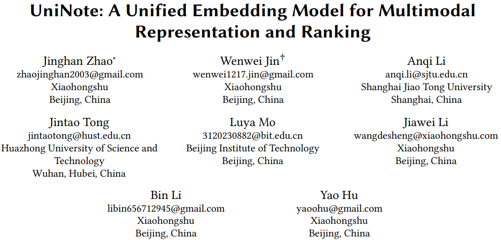
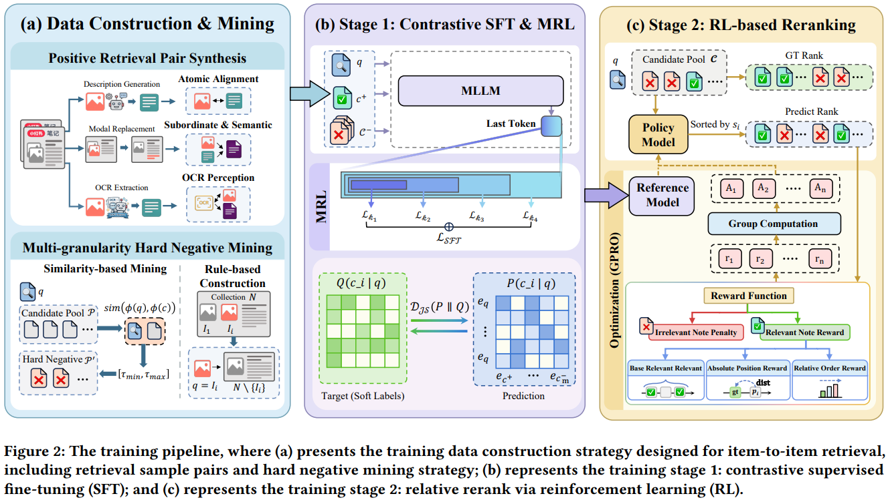
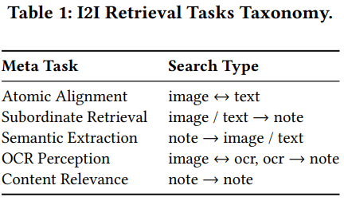
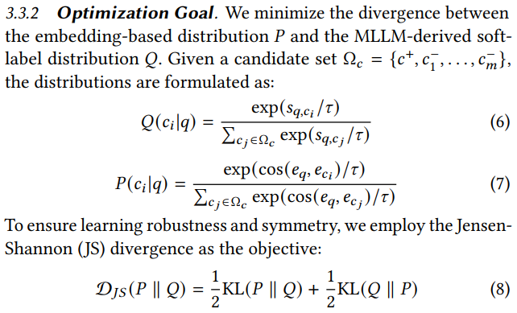
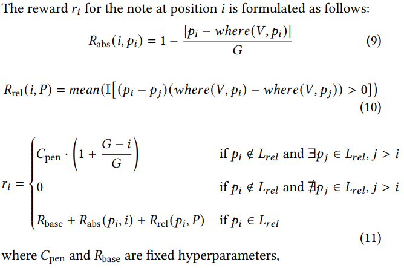
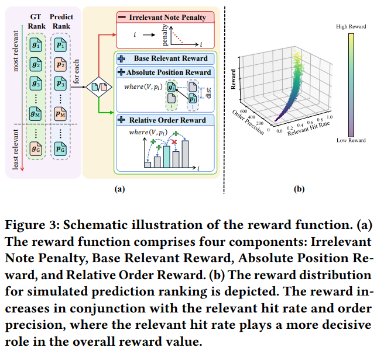

# 基本信息

* 论文标题：UniNote: A Unified Embedding Model for Multimodal Representation and Ranking
* 作者单位：小红书
* 论文链接：[https://arxiv.org/abs/2605.29287](https://arxiv.org/abs/2605.29287)
* 来源：KDD Ads Track 2026

# Motivation：论文要解决的问题是什么

小红书的笔记是一个非常典型的多模态item，一篇小红书笔记通常包括多张图片、标题、主题文字等，有的甚至还有视频。小红书使用传统多模态emb做I2I召回时，遇到如下几个问题：

* 传统基于CLIP的方法学习的是item整体的表征，缺乏对模态细节的学习。而且这种方法多模态特征是晚交互的late interaction，多模态融合的效果不佳。
* 基于MLLM的方法在item全局表征上的效果还可以，但是细粒度表征效果不佳。特别是小红书场景用一张图片检索整个笔记的情况，即local-to-global的检索场景。
* 现有基于对比学习微调的多模态emb（例如小红书之前的NoteLLM-2），融入了协同信号，已经不能完全客观反应I2I的语义相似性了，虽然这些emb的召回效果还可以，但是排序效果较差，后续还需要很复杂的单塔排序模型。即这种retrieve-then-rerank需要两个模型，维护成本较高。

针对上述小红书场景的复杂I2I召回问题，本文设计了一个同时适用于表征和排序的emb模型，重点解决了多粒度模态对齐的问题（比如local-to-global的问题）以及增强了emb的排序能力。

# 整体流程
整体流程如图Fig2所示：
* 首先根据业务需求设计对齐任务，构造预训练数据
* 然后进行对比学习预训练
* 最后使用RL微调模型的排序能力
其中前两步是常规操作，只不过根据小红书的业务需求进行了特定的设计，第三步的RL微调是比较重要的创新点。

# 对齐任务及预训练数据
如下表Table 1所示，本文共设计了5类10个对齐任务：
* 原子对齐：笔记中单张图片和笔记文字的对齐
* 从属召回：笔记中单张图片或文字片段与笔记整体的对齐
* 语义抽取：笔记整体召回笔记中单张图片或文字片段
* OCR能力：图片和OCR，OCR和笔记整体
* 内容相关性：笔记和笔记整体的对齐
可以看到对齐任务非常多，包括不同模态的对齐、local和local的对齐、local和global的对齐、global和global的对齐。这10个任务前9个任务都可以从同一个笔记中挖掘出训练样本，唯独最后一个笔记和笔记的对齐，需要业务知识进行构造，文中没有介绍如何构造笔记正样本pair的。

在从属召回任务中，通常可以把笔记中的一张图片\(I_i\)和笔记整体\(\mathcal{N}\)作为正样本二元组\((I_i,\mathcal{N})\)，但是因为\(I_i\in \mathcal{N}\)，作者担心这么训练可能让模型学习到捷径，所以把\(I_i\)从\(\mathcal{N}\)中剔除掉，但加上了\(I_i\)的文本描述\(\{S_{\text{desc}}^i\}\)，作为一个新的正样本\(\mathcal{N}'\)：

$$
(I_i, \mathcal{N}'), \quad \text{where} \quad \mathcal{N}' = \{S_{\text{desc}}^i\} \cup \mathcal{N} \setminus \{I_i\} \tag{2}
$$

在负样本构造方面，作者重点介绍了两种负样本构造方法：

第一种方法是中等难度的负例。对于锚点\(q\)，从全部候选商品池\(\mathcal{P}\)中，圈一部分与\(q\)相似度在\([\tau_{\min},\tau_{\max}]\)之间的子集\(\mathcal{P}'\)，作为\(q\)的难负例。在算相似度时，这一步使用一个基础版的emb模型\(\phi\)，可能是开源的或者比较弱的emb模型。

$$
\mathcal{P}' = \{c \in \mathcal{P} \mid \tau_{\min} \le \text{sim}(\phi(q), \phi(c)) \le \tau_{\max}\}, \tag{3}
$$

第二种方法是高难度负例，文中称为heuristic rules based方法。特别是针对local-to-global对齐任务，下面公式5给的是负例，负例是直接把\(I_i\)从\(\mathcal{N}\)中剔除就是负例；上面公式2给的是正例，相当于在负例基础上增加了\(I_i\)的文本描述\(\{S_{\text{desc}}^i\}\)。公式5的负例感觉过于难了。

$$
(q, c_{\text{rule}}^{-}) = (I_i, \mathcal{N} \setminus \{I_i\}). \tag{5}
$$

# 预训练目标
本文的预训练目标并没有使用标准的InfoNCE loss，而是使用了对称KL loss。具体来说，正负样本的label并不是严格的1和0，而是用上面提到的基础模型\(\phi\)计算emb，然后再用MLLM单塔模型（根据论文推测的？）计算相似度\(s=\text{sim}(\phi(q), \phi(c))\)，作为软标签，得到锚点和所有正负样本的打分分布\(Q\)。然后用当前模型本次前向的emb计算的相似度分布为\(P\)。最后使用对称的KL loss拉进分布\(P\)和\(Q\)，loss见公式8。示例见Fig2b下面的Target和Prediction分布。

# RL微调提升排序能力
上面的预训练只是保证了emb模型的基础能力，为了进一步提升emb对不同笔记的细粒度的排序能力，作者设计了第二阶段的强化学习微调环节。

在样本构造方面，一篇小红书笔记由文本标题\(T_{\text{title}}\)、文本主体\( T_{\text{body}}\)、\(m\)张图片\(I_i\)、以及\(m\)张图片的OCR信息\(OCR_i\)组成，如下公式1。

$$
\mathcal{N} = (\{I_i\}_{i=1}^m, \{OCR_i\}_{i=1}^m, T_{\text{title}}, T_{\text{body}}) \tag{1}
$$

作者把一篇笔记\(\mathcal{N}\)拆分成2个不相交的新笔记\(\mathcal{N}_A\)和\(\mathcal{N}_B\)，使得：

$$
\mathcal{N}_A \cap \mathcal{N}_B = \emptyset \quad \text{and} \quad \mathcal{N}_A \cup \mathcal{N}_B = \mathcal{N},
$$

然后把\(\mathcal{N}_A\)当做锚点\(q\)，构造如下候选笔记，其中前\(M+1\)个笔记相当于与\(\mathcal{N}_A\)的重叠内容逐渐减少的笔记序列，然后再随机采样若干个不相关的噪声笔记\(\mathcal{N}^{\text{noise}}\)。则下面的笔记序列与\(\mathcal{N}_A\)的相似度应该是逐渐递减的。

$$
L_{\text{rank}} = [\mathcal{N}_B \cup \{I_1^A, I_2^A, \dots, I_M^A\}, \dots, \mathcal{N}_B \cup \{I_1^A\}, \mathcal{N}_B, \mathcal{N}_1^{\text{noise}}, \mathcal{N}_2^{\text{noise}}, \dots].
$$

然后，使用之前预训练产出的基础emb模型的emb从上述候选中根据ann搜索采样处\(\text{top-}G\)个笔记，其中\(G>M\)，得到按相似度排序的笔记\(P=[p_1,p_2,…,p_G]\)。根据上面的样本构造方法，可以知道这\(G\)个笔记的ground truth排序顺序是\(V=[g_1,g_2,…,g_G]\)。

根据\(P\)和\(V\)的排序差异，定义如下奖励函数：
* 不相关笔记的惩罚：如果\(p_i\)是不相关笔记，则这个笔记排序越靠前（\(i\)越小），则惩罚越大，即下图公式11第一项，其中的\(C_{pen}\)应该是一个负数
* 基础相关奖励：如果\(p_i\)是相关笔记，则给一个基础奖励\(R_{base}\)，即下图公式11第三项的\(R_{base}\)
* 绝对位置奖励：如果\(p_i\)在\(P\)中的绝对位置与其在\(V\)中的ground truth位置越接近，则奖励越大，即公式9
* 相对位置奖励：如果\(p_i\)在\(P\)中与其他笔记\(p_j\)的相对位置与在\(V\)中与其他笔记的相对位置相同，则获得奖励，对应公式10，两项相乘>0表示两项同方向，即相对位置相同

奖励函数的设计见图Fig3：

有了每个采样结果的奖励，则可以计算其在组内的相对优势：

$$
A_i = \frac{r_i - \text{mean}(r)}{\text{std}(r) + \epsilon} \tag{12}
$$

然后使用GRPO进行优化：

$$
\mathcal{L}_{\text{GRPO}} = \mathbb{E} \left[ \frac{1}{G} \sum_{i=1}^G \left( A_i \cdot \log \pi_\theta(\text{sim}(q, p_i) \mid q, p_i) - \beta \mathbb{D}_{\text{KL}}(\pi_\theta \parallel \pi_{\text{ref}}) \right) \right] \tag{13}
$$

# 评价
* 优点
    * 针对现有emb在不同粒度的相似度召回效果不好的问题，设计了10种多粒度对齐预训练任务，增强了多粒度对齐效果
    * 针对现有emb排序效果不佳的问题，设计group采样策略，使用GRPO进行优化，观点新意有道理，值得借鉴
* 不足
    * 预训练对齐任务有10个之多，这么多任务会互相影响吗，哪些任务是必要的？能对其他场景有借鉴意义吗？
    * 第一阶段对比学习的时候，使用已有的rereank模型进行相似度打分作为soft label，也就是是rerank模型就是本文emb模型的上限？万一rerank模型本身效果不佳怎么办？需要增加和常规InfoNCE loss的对比实验？
    * GRPO构造样本的时候，样本分布只有比较像的\(\mathcal{N}_B\)和很不像的\(\mathcal{N}^{\text{noise}}\)，缺少比\(\mathcal{N}^{\text{noise}}\)更像，但比\(\mathcal{N}_B\)更不像的中间地带的样本，分布有偏可能会导致emb效果出bad case

