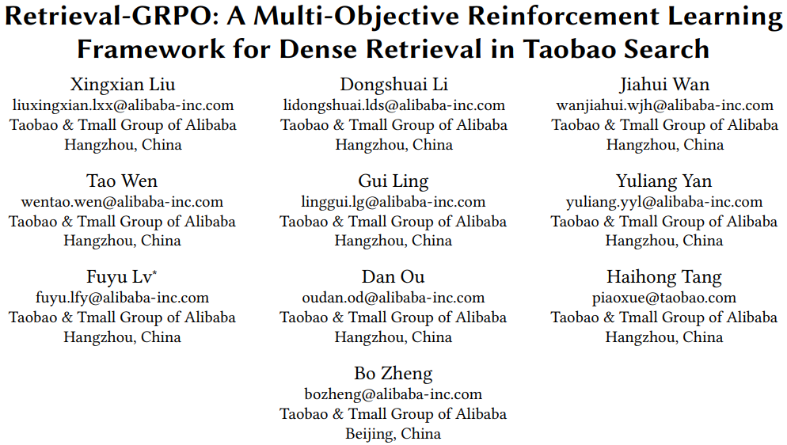
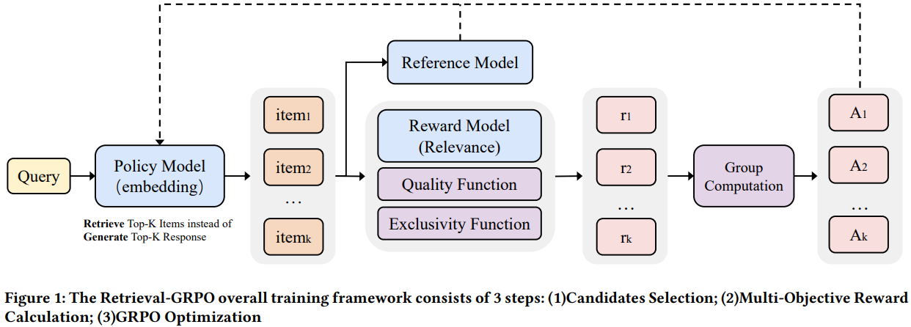
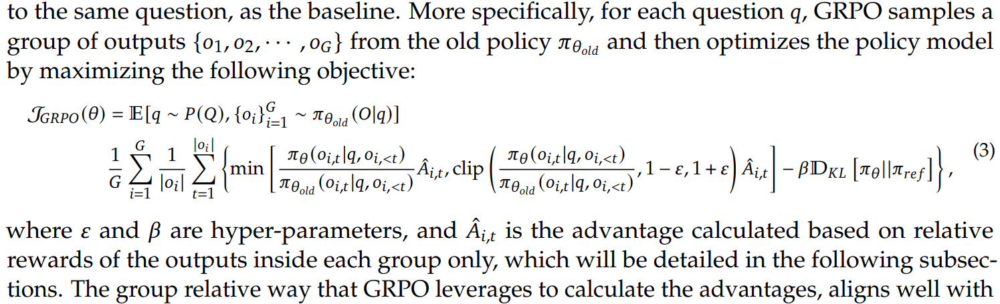
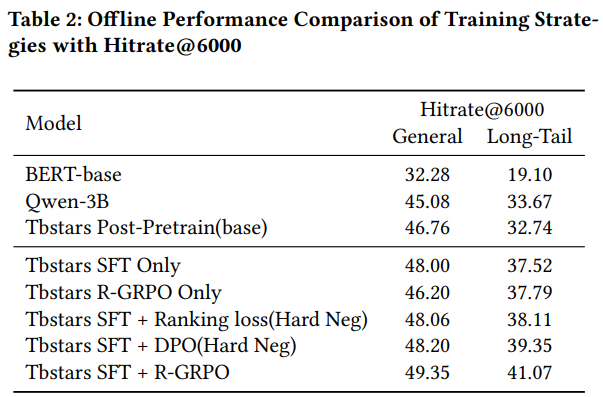

# 基本信息
* 论文标题：Retrieval-GRPO: A Multi-Objective Reinforcement Learning Framework for Dense Retrieval in Taobao Search
* 作者单位：阿里
* 论文链接：[https://arxiv.org/abs/2511.13885](https://arxiv.org/abs/2511.13885)
* 来源：Arxiv

# Motivation：论文要解决的问题是什么

在emb召回场景，之前的范式基本上是q2i对比学习训练，在此基础上会做难负例的挖掘，以及在loss中融入多种业务目标。例如，通过人工先验构造难负例；在loss中融入相关性等其他loss任务。

这种范式存在两个问题，一是难负例挖掘依赖人工先验知识，效率太低；二是loss融入多目标之后，训练过程存在跷跷板效应，即A目标变好之后可能导致B目标变差等。

本文在传统对比学习预训练的基础上，引入了Retrieval-GRPO对齐，通过检索TopK相似item，然后进行GRPO训练，一是可以自动挖掘难负例，二是将多种业务目标融合成一个reward，避免了跷跷板效应。

# 整体流程

整体流程包括两个部分，一是常规的对比学习预训练，让emb模型具备基本的相似度判别能力；二是在预训练基础上，进行Retrieval-GRPO对齐，让emb模型对齐不同的业务目标。

# 对比学习预训练（SFT）

这部分比较常规，就是从线上日志中挖掘出一批正样本二元组：query \(q_i\)和item \(d_j^+\)，然后通过InfoNCE loss进行对比学习预训练

$$
\mathcal{L}_{\text{InfoNCE}} = -\log \frac{\exp(s(q_i, d_j^+) / \tau)}{\sum_{d_j \in \mathcal{B}} \exp(s(q_i, d_j) / \tau)} \qquad (4)
$$

本文的重点就是说不需要手动挖掘难负例，通过后面的Retrieval-GRPO自动挖掘难负例，所以上述公式中只有in-batch负例，没有人工构造难负例。

但是，作者认为，in-batch只包含有行为的负例（即其他query的正例），大量无行为的item被忽略了，导致对中长尾商品的效果不佳。因此，作者在in-batch负例基础上，又从全局商品池随机采样了一些作为全局负例，新的公式如下：

$$\mathcal{L} = -\log \frac{\exp(s(q_i, d_j^+) / \tau)}{\underbrace{\sum_{d_j \in \mathcal{B}} \exp(s(q_i, d_j) / \tau)}_{\text{positive and in-batch negatives}} + \underbrace{\sum_{d_k^- \in \mathcal{G}} \exp(s(q_i, d_k^-) / \tau)}_{\text{global negatives}}} \qquad (5)$$

其中\(\mathcal{B}\)是in-batch负例，\(\mathcal{G}\)是全局随机采样的负例。

总体来说，预训练阶段比较简单，属于常规操作，重点看后续的Retrieval-GRPO。

# Retrieval-GRPO后训练

Retrieval-GRPO的流程图如图Fig1所示，核心思想是：以上一阶段SFT的emb模型初始化Policy Model和Reference Model，其中Reference Model冻结不训练，而Policy Model需要训练更新。对于每一个Query，根据当前的Policy Model去商品池中动态检索出TopK相似商品。然后根据设定的Reward Functions对TopK商品进行打分，从而计算出组内相对优势。最后使用GRPO Loss更新Policy Model。

## TopK相似商品检索

Retrieval-GRPO中的Retrieval就是TopK相似商品检索。在每一步前向中，使用搜索词\(q_i\)从商品池全集\(\mathcal{D} = \{d_1, \dots, d_n\}\)中ANN搜索出TopK相似商品：

$$
\mathcal{D}_{q_i} = \operatorname*{TopK}_{d_j \in \mathcal{D}} s(\mathbf{q}_i, \mathbf{d}_j) \tag{3}
$$

在具体实现中，由于每次都从商品池全局进行ANN搜索的效率太低了，所以作者做了一个简化，收集当前iterator中所有GPU上的item embeddings作为一个近视的商品池\(\hat{B}\)，然后从中ANN检索出TopK，由于\(K<<\hat{B}\)，所以效果近似从全局商品池中采样。

## 多目标奖励及融合
本文设计了三个奖励函数，如下：
* 相关性奖励：在训练emb模型时，同时加载了淘宝内部的相关性模型TaoSR1-42B-MoE，实时对\((q,d)\)进行相关性打分
* 商品质量分奖励：根据商品的历史交易数据和用户满意度评价，融合成的一个商品质量分奖励。这个奖励相当于融合了商品的效率指标
* 排他性奖励：由于本文是为emb召回服务的，作者希望emb召回能尽可能多的提升独占召回的比例，所以设计了这个指标。如果独占的比例越高，则奖励越大。为了简化，作者只和倒排召回进行了比较，倒排召回又可以进一步简化成字面term匹配，故这个奖励就变成：如果item和query的term overlap越高，则越有可能被倒排召回，故排他性奖励越低

$$
r = f_{\text{relevance}}(q, d) + g_{\text{quality}}(d) + h_{\text{exclusivity}}(q, d) \tag{6}
$$

将上述三个奖励得分累加，得到每个item的绝对奖励\(r_i\)，再在K个item内部进行归一化，得到归一化的组内相对优势\(A_i\)。

## GRPO Loss
得到每个item的组内相对优势\(A_i\)之后，就可以计算GRPO Loss了，公式如下：

$$
\begin{aligned}
\mathcal{J}_{\text{GRPO}}(\theta) = \mathbb{E} & \left[ \frac{1}{G} \sum_{i=1}^G \left\{ \min \left[ \frac{\pi_\theta(s(q, d_i)|q, d_i)}{\pi_{\theta_{\text{old}}}(s(q, d_i)|q, d_i)} \hat{A}_{i,t}, \right. \right. \right. \\
& \left. \left. \left. \text{clip} \left( \frac{\pi_\theta(s(q, d_i)|q, d_i)}{\pi_{\theta_{\text{old}}}(s(q, d_i)|q, d_i)}, 1-\epsilon, 1+\epsilon \right) \hat{A}_{i,t} \right] - \beta \mathbb{D}_{\text{KL}} [\pi_\theta || \pi_{\text{ref}}] \right\} \right]
\end{aligned} \tag{7}
$$

上述公式实际上不是loss，而是需要最大化奖励的期望。更规范的公式可以参考DeepSeek-Math论文，如下公式3，包括两项：
* 前面方括号中的一大项就是奖励的期望，原本是等于概率\(\pi_{\theta_{i,t}}\)乘以奖励\(\hat{A}_{i,t}\)，但是有两点改动：
    * 一是\(\frac{\pi_\theta}{\pi_{\theta_{old}}}\)，是重要性采样，因为样本是通过老模型参数\(\pi_{\theta_{old}}\)采样得到的，但是我们希望最大化在新模型参数\(\pi_\theta\)上的期望奖励，所以需要用重要性采样转换一下；
    * 二是把重要性采样的比值截断到\([1-\epsilon,1+\epsilon]\)，对于超过这个范围的比值变成常数\(1-\epsilon\)或\(1+\epsilon\)，梯度为0使得模型不更新，即这种样本不起作用，其实就是希望\(\pi_\theta\)不要偏离\(\pi_{\theta_{old}}\)太远。
* 后面的\(\mathbb{D}_{\text{KL}}\)就是约束\(\pi_\theta\)不要偏离参考模型\(\pi_{ref}\)太远。

# 实验结果
核心结果如下Table2：
* Qwen和Tbstars base比BERT-base高很多：大参数量的LLM比小参数量的BERT效果好
* Tbstars SFT Only比Tbstars base高很多：加上SFT能明显提升效果
* Tbstars R-GRPO Only比Tbstars SFT Only差：只有RL没有SFT，效果差，说明基础的SFT不能少
* Tbstars SFT+Hard Neg两种方式都比Tbstars SFT Only好：增加难负例有帮助
* Tbstars SFT+R-GRPO效果最好

# 评价
* 优点
    * 本文在[小红书的UniNote方法](https://bitjoy.net/posts/2026-06-14-xiaohongshu-uninote-paper-reading/)之前发布，小红书论文也明确引用了这篇论文，应该是业界用GRPO优化emb模型的第一篇工作。打破了之前对比学习+难负例挖掘的emb预训练范式，创新点很明确，也很有道理
* 不足&疑问
    * 虽然整个R-GRPO方法很有道理，但是训练难度是否会比较大，需要同时加载三个模型：\(\pi_\theta\)、\(\pi_{\theta_{old}}\)和\(\pi_{ref}\)，以及一个相关性大模型TaoSR1-42B-MoE，有办法提前把\(q_i\)和商品池\(\mathcal{D}\)中的所有商品的各维度奖励提前算好吗？这样即使训练过程中ANN检索的TopK商品不一样，也只需要查表得到奖励就行，不用同时加载那么多模型了？
    * 更进一步地，假设如上所述提前把所有item的奖励都算好了，那其实能得到\(q_i\)对应K个item的相对顺序，那么，直接用listwise loss是否也能微调模型，那么GRPO Loss的优势在哪里？
    * 论文切入点太小了。本文虽然在小红书论文之前就发布了，但两者的目的不同，本文切入点是难负例挖掘，而小红书切入点是emb的分层排序能力。很明显小红书的立意更高。从难负例挖掘角度，本文把跨设备gather的item作为负例，之前是直接作为in-batch负例，则所有负例item一视同仁，没有区别；但是现在有奖励函数，能算相对优势，所以in-batch负例也有负的相对程度了。所以本质上是负例的分层，而不仅仅是难负例的问题。有了负例的分层效果之后，emb的排序能力也就有了，这会在很多场景有大用处，所以感觉只用难负例作为切入点太小了。
    * 图Fig4-6没有在正文引用
